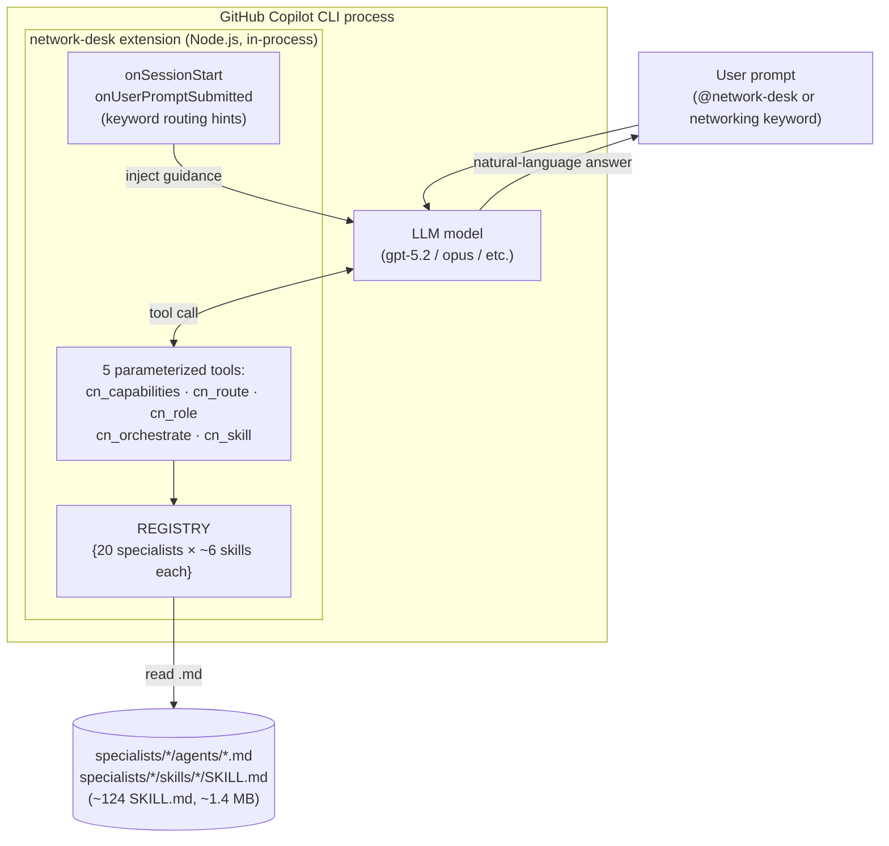
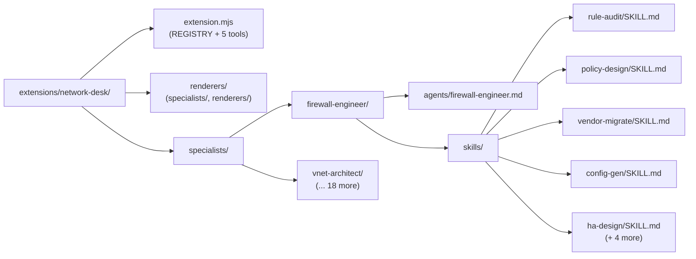
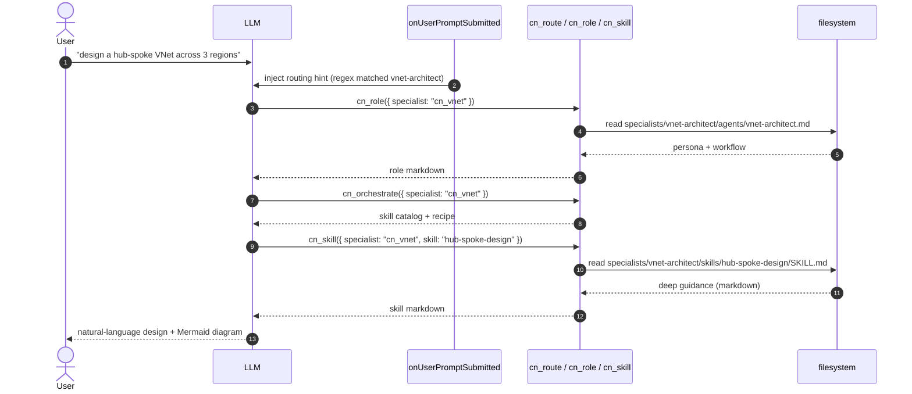
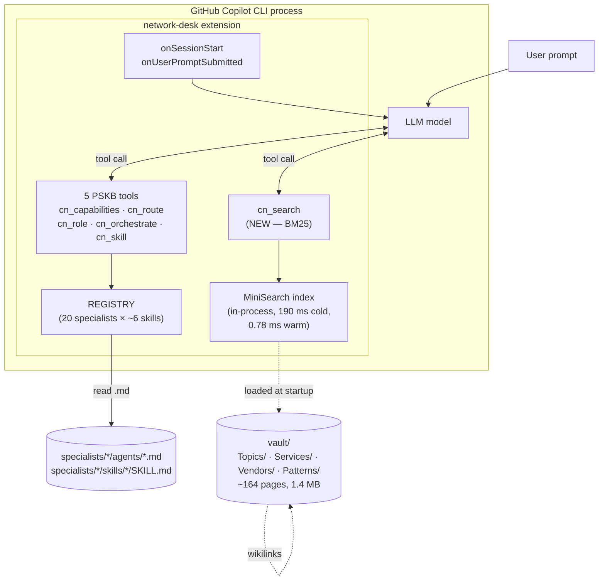
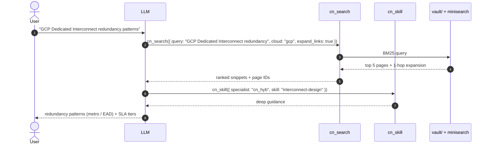
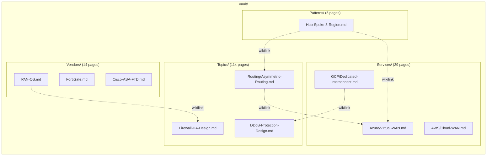
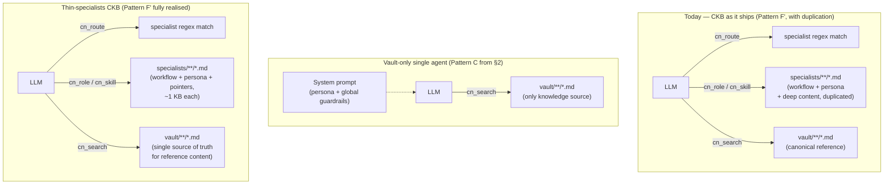
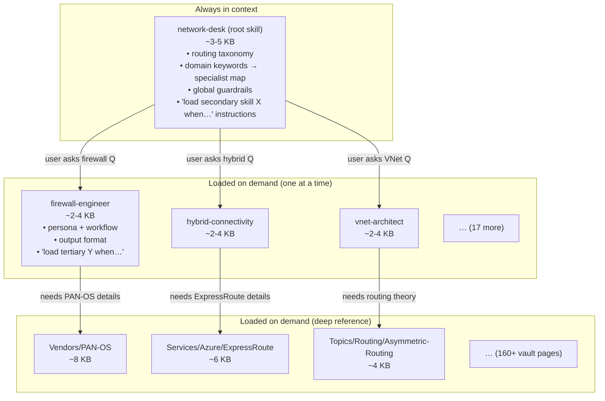
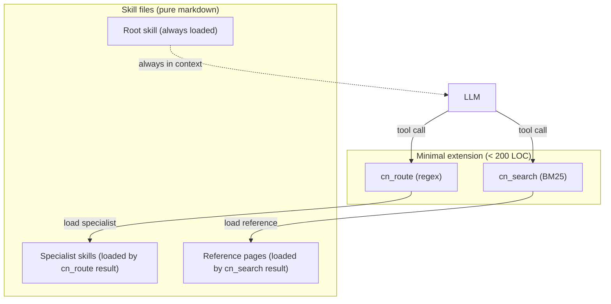

# Architecture evaluation — Network Desk

This document explains the architectural choices behind Network Desk, surveys
the alternative approaches that were considered, and backs the comparison with
measurements from the benchmark harness in `benchmarks/`.

It covers four things:

1. **[PSKB architecture](#1-pskb-per-skill-knowledge-base--dmausernetwork-desk)** — how
   [`dmauser/network-desk`](https://github.com/dmauser/network-desk) is built today,
   in detail.
2. **[The design space](#2-the-design-space--expert-agent-architectures)** — every
   credible architecture pattern for an "expert agent" system, with trade-offs
   and a comparison matrix.
3. **[CKB architecture and the comparison with PSKB](#3-ckb-consolidated-knowledge-base--this-fork)** —
   the consolidated knowledge vault + BM25 search layer, head-to-head against
   PSKB on the three benchmark tiers.
4. **[Alternative architectures](#4-alternative-architectures-under-consideration)** —
   Tiered Skills (G), Hybrid Extension + Skills (H), Single Flat Skill (I),
   Agent-of-Agents (J), and Prompt Library (K) — including the recommended
   next evolution toward Pattern G.

> **Naming conventions used in this document and the linked benchmark reports:**
> - **PSKB** = *Per-Skill Knowledge Base* — the upstream design at
>   [`dmauser/network-desk`](https://github.com/dmauser/network-desk), where each
>   specialist owns a folder of self-contained `SKILL.md` files and the LLM
>   reaches them through 5 parameterized loader tools (`cn_capabilities`,
>   `cn_route`, `cn_role`, `cn_orchestrate`, `cn_skill`).
> - **CKB** = *Consolidated Knowledge Base* — this fork. Keeps the PSKB
>   `REGISTRY` and per-skill loaders unchanged and adds an Obsidian-style
>   cross-cutting vault (`Topics/`, `Services/`, `Vendors/`, `Patterns/`) plus a
>   6th tool, `cn_search`, that runs an in-process BM25 query over the vault.

---

## 1. PSKB (Per-Skill Knowledge Base) — `dmauser/network-desk`

### 1.1 High-level shape

PSKB is a **single Copilot CLI extension** registering **five generic tools**
that act as parameterized loaders over a fixed catalog of 20 specialists. The
specialists themselves are pure markdown files on disk. No vector DB, no
embeddings, no external service.



### 1.2 Why "5 tools" and not "20 specialists × 6 skills = 120 tools"

The Copilot CLI imposes a **hard 128-tool limit per session**. With ~120 tools
the session also becomes incoherent for the LLM — the tool catalog itself
consumes context, and the LLM cannot reliably pick the right tool from a flat
list of 120 names. PSKB avoided this by **parameterising** — the same five
tools handle every specialist via their `specialist` and `skill` arguments:

| Tool | Signature | Purpose |
|---|---|---|
| `cn_capabilities` | `()` | Returns the full map of specialists + skills |
| `cn_route` | `(query)` | Regex routes a free-form query to the matching specialist(s) |
| `cn_role` | `({ specialist })` | Loads `specialists/<dir>/agents/<dir>.md` (the role/persona file) |
| `cn_orchestrate` | `({ specialist })` | Returns the specialist's full skill catalog + workflow recipe |
| `cn_skill` | `({ specialist, skill })` | Loads one `specialists/<dir>/skills/<skill>/SKILL.md` |

The whole specialist catalog lives in a single **`REGISTRY` object** in
`extension.mjs` — the source of truth for routing regexes, domain
descriptions, skill IDs, and human-readable summaries. Adding a specialist
or skill means editing this object and dropping the corresponding markdown
file in the right folder.

### 1.3 On-disk layout

Each specialist is a folder containing one **role file** (persona, workflow,
guardrails) and one folder per **skill** (deep domain reference):



**Numbers from the benchmark (Tier 1):**

* 20 specialists, 124 SKILL.md files total (avg 6.2 skills / specialist)
* 1 421 KB of markdown across `specialists/`
* 0 runtime dependencies (only `@github/copilot-sdk/extension` and Node builtins)
* 852 LOC in `extension.mjs`

### 1.4 Routing flow



The keyword regex injection at hook-time is what makes the extension feel
"automatic" — the LLM doesn't have to discover the specialist set; it gets a
direct hint when a networking keyword is detected. The model then chooses which
skills to load.

### 1.5 What works well

* **Zero external dependencies.** Ships as a Copilot CLI extension only, no
  index to build, no embeddings to keep in sync.
* **Editable by humans.** Every specialist is a couple of `.md` files; no
  tooling needed beyond a text editor.
* **Deterministic costs.** Each tool call is a `readFile`; no network round
  trip, no embedding charge, no rate-limit risk.
* **The 128-tool limit is gracefully sidestepped** with parameterized tools.

### 1.6 The structural ceilings

The PSKB design has three properties that bite once the knowledge base
grows beyond the size that comfortably fits in a single `SKILL.md`:

1. **Monolithic skill files.** Average SKILL.md is **10.5 KB**, max 22.3 KB.
   Once a topic naturally splits across vendors, clouds, and patterns, the
   file either bloats or you must spawn a new skill — which means another tool
   parameter the LLM has to remember.
2. **No cross-specialist search.** If a user asks about *"GCP Dedicated
   Interconnect SLA tiers"*, the LLM has to first route to `cn_hyb`
   (hybrid-connectivity), load that role, scan the skill list for something
   like `dedicated-interconnect`, load it, and then pray the right
   sub-section is in there. There is **no "search across all skills"** primitive.
3. **Topics get duplicated across specialists.** *Asymmetric routing* shows up
   in `firewall-engineer/skills/troubleshoot`, `vnet-architect/skills/hub-spoke-design`,
   and `network-troubleshooter/skills/routing-debug`. Three copies, three
   maintainers, three places to update when Microsoft renames a service.

These ceilings are exactly what the Tier 2 benchmark measures (recall) and what
the consolidated vault in CKB addresses (see [section 3](#3-ckb-consolidated-knowledge-base--this-fork)).

---

## 2. The design space — expert agent architectures

Network Desk is one point in a wide space. Before settling on the current
design we considered (and partially measured) five other patterns. This
section catalogs them.

### 2.1 The five canonical patterns

```mermaid
flowchart TB
    subgraph A["A. Single agent · system prompt"]
      A1["All expertise inlined<br/>into the system prompt"]
      A1 --> A2[LLM]
    end
    subgraph B["B. Single agent · RAG"]
      B1["User query"] --> B2["Embed"]
      B2 --> B3[("Vector DB<br/>(knowledge chunks)")]
      B3 --> B4["Top-K chunks"]
      B4 --> B5["LLM (augmented prompt)"]
    end
    subgraph C["C. Single agent · tool-search"]
      C1["User query"] --> C2[LLM]
      C2 -->|search tool| C3[("Lexical / BM25 index")]
      C3 --> C2
    end
    subgraph D["D. Many tools · one per skill"]
      D1["User query"] --> D2[LLM]
      D2 -.->|N tools| D3["tool_1 ... tool_N<br/>(rejected: >128 limit)"]
    end
    subgraph E["E. Router + worker agents"]
      E1["User query"] --> E2["Router agent"]
      E2 -->|dispatch| E3["Worker agent A"]
      E2 -->|dispatch| E4["Worker agent B"]
      E3 --> E5["Synthesizer"]
      E4 --> E5
    end
    subgraph F["F. Parameterized loader (PSKB + CKB)"]
      F1["User query"] --> F2[LLM]
      F2 -->|cn_role/cn_skill<br/>cn_search| F3["Markdown KB<br/>+ optional BM25 index"]
      F3 --> F2
    end
```



#### A — Single agent with everything in the system prompt

The naive baseline. Put the full networking knowledge into a giant system
prompt and call the model.

| Aspect | A — system-prompt |
|---|---|
| Setup cost | trivial |
| Context budget | **dominated by knowledge** — for a real KB (~1.4 MB of markdown) this is impossible: even gpt-5.2's 200K-token context can't hold it |
| Recall | maximum (everything is "loaded") *if* it fits |
| Cost per call | every call pays the full prompt cost |
| Updates | edit the system prompt, redeploy |
| Best when | knowledge < ~20 KB and rarely changes |

For ~20 specialists × ~1.4 MB total this is dead on arrival.

#### B — Single agent with vector-RAG

The standard 2023-era pattern. Chunk the knowledge base, embed it, store in a
vector DB; at query time embed the question, retrieve top-K chunks, paste them
into the prompt.

| Aspect | B — vector-RAG |
|---|---|
| Setup cost | one-time chunking + embedding pass |
| Context budget | small (top-K chunks, ~5-10 KB) |
| Recall | depends on chunking + embedding quality; **strong on semantic queries** |
| Latency | one embedding call + one vector query per turn (~50-200 ms each) |
| Cost | embedding cost per upload; vector-store hosting; query embedding cost per call |
| Updates | re-embed changed pages; trivial for additions, painful for re-chunking |
| Failure mode | "lost in the middle" + chunk boundary loss (a definition split across two chunks) |
| Best when | semantically-phrased queries over unstructured prose, no clear taxonomy |

For Copilot CLI, vector-RAG would mean adding an embedding model dependency
(extra package, API key or local model), a vector store (FAISS / SQLite-vss /
LanceDB), and an embedding pass at install/update time. That's a real ops
tax for a CLI extension.

#### C — Single agent with a lexical search tool

Same as B but the retrieval is **keyword** (BM25 / TF-IDF) rather than
semantic. Tools like Elastic, Lucene, MiniSearch, Tantivy.

| Aspect | C — lexical search |
|---|---|
| Setup cost | very low (no embeddings) |
| Context budget | small (top-K results, ~5-10 KB) |
| Recall | **strong on technical / proper-noun queries** ("ExpressRoute", "FortiGate", "BGP MED"); weaker on paraphrased questions |
| Latency | sub-millisecond once the index is loaded |
| Cost | zero per call (in-process index) |
| Updates | rebuild index on file change (~200 ms cold) |
| Best when | the corpus is full of vendor names, SKUs, and identifiers — exactly the case for cloud networking |

#### D — Many tools, one per skill

Register `vnet_skill_address_planner`, `vnet_skill_hub_spoke_design`, etc.
as separate Copilot tools.

| Aspect | D — many tools |
|---|---|
| Setup cost | low |
| Context budget | the **tool catalog itself** dominates context for any session that exposes >50 tools |
| Recall | excellent (LLM picks exactly the right tool) — *if* the LLM can pick from the catalog |
| Latency | one tool call per skill |
| Cost | per-call |
| Hard limit | **Copilot CLI rejects sessions with >128 registered tools** (see [CLI internals](#128-tool-limit) below); with 20 specialists × 6 skills that's already 120 just for skills, plus role/orchestrate per specialist = >160 — over the limit |
| Maintenance | every new skill = new tool registration |

This is the approach Network Desk explicitly avoids in `extension.mjs` and the
reason for parameterized tools.

#### E — Router + worker agents (orchestrator pattern)

A coordinator LLM decides which specialist agent should answer, dispatches the
task to that agent (possibly with its own tools and prompt), and synthesizes
the result. Frameworks: LangGraph, AutoGen, CrewAI.

| Aspect | E — orchestrator |
|---|---|
| Setup cost | high (multiple agents, dispatch logic, synthesizer) |
| Context budget | each worker has its own slice; the orchestrator sees only summaries |
| Recall | depends on routing quality |
| Latency | N × LLM round-trips |
| Cost | N × LLM cost per question |
| Failure mode | misrouting, context loss between hops, cascading errors |
| Best when | the problem genuinely decomposes into independent sub-problems (e.g. multi-agent debate, planner + executor) |

For most user questions in cloud networking, the question is **one** question
with **one** correct specialist — multi-agent orchestration is overkill, and
the extra round-trips dominate latency.

#### F — Parameterized loader (the PSKB & CKB pattern)

Five generic tools, one routing regex, one persona file per specialist, one
deep page per skill. The LLM is the dispatcher; the tools are stateless
loaders.

| Aspect | F — parameterized loader |
|---|---|
| Setup cost | low (one extension, no DB, no embedding) |
| Context budget | small — only the loaded role + skills enter context |
| Recall | as good as the regex + the LLM's reading comprehension |
| Latency | sub-millisecond `readFile` per call |
| Cost | zero per call beyond LLM tokens |
| Failure mode | regex misses a query phrasing; no recovery without a search primitive |
| Best when | a known, finite taxonomy of "skills" + a single LLM with strong tool-use ability |

This is PSKB's design — and the **starting point** for CKB.

### 2.2 Comparison matrix

A blunt summary of where each pattern sits across the dimensions that matter
for a Copilot CLI extension delivering expert agent functionality:

| Pattern | Setup cost | Context cost | Recall on technical queries | Recall on vague queries | Latency | Per-call $ | Hard limits |
|---|---|---|---|---|---|---|---|
| **A.** System-prompt | trivial | **catastrophic** for any real KB | n/a (full KB if it fits) | n/a | low | high (full prompt) | context-window |
| **B.** Vector RAG | medium | small | medium | **high** | medium | embedding + vector query each turn | embedding model dependency, chunking quality |
| **C.** Lexical search | low | small | **high** | medium | sub-ms | zero | needs an index |
| **D.** Many tools | low | **catastrophic** (>50 tools) | high (if model picks right) | low | medium | per call | **Copilot ≤ 128 tools** |
| **E.** Router + workers | high | medium | medium | medium | high (N × LLM) | N × LLM | orchestration complexity |
| **F.** Param. loader | low | small | high | low | sub-ms | zero | regex misses |
| **F'.** Param. loader + lexical search (CKB) | low | small | **high** | **medium-high** | sub-ms | zero | regex misses, but covered by search |

Two patterns are credible for a Copilot CLI cloud-networking expert system:

* **F** (PSKB): clean, fast, free per call — but recall depends entirely on
  the regex + the LLM reading the right specialist's skill names from a
  catalog.
* **F'** (CKB): F plus a BM25 search tool over a Topics/Services/Vendors
  vault. Same five parameterized tools, plus `cn_search`, plus an Obsidian-style
  knowledge graph behind them. Adds 1 dependency (`minisearch`, 100 KB) but
  measurably moves recall.

### 2.3 What we rejected and why

| Rejected pattern | Why |
|---|---|
| **A** — system-prompt | Cloud networking KB is ~1.4 MB. Won't fit, would dominate cost per call. |
| **B** — vector RAG | Cost & dependency footprint disproportionate for a CLI extension. Queries are mostly **noun-heavy** (vendor names, SKUs, protocol acronyms) — exactly the case where BM25 matches or beats vectors. No semantic synonyms problem to solve here. |
| **D** — many tools | Hard 128-tool limit + tool-catalog context blowup. We measured this empirically — when we briefly registered one tool per specialist during prototyping, the session became unusable. |
| **E** — router + workers | A cloud networking question is one question. The Copilot CLI's LLM is already a strong planner. A second orchestrator LLM would triple latency for marginal benefit. |

The chosen pattern (F') is the right answer for **structured, taxonomy-driven
expert systems where queries are technical and the corpus is curated and
editable by humans**.

#### 128-tool limit

While prototyping the multi-cloud extraction phase we observed that the
Copilot CLI silently rejects sessions exposing more than 128 tools with a
transient API error ("transient API error. Retrying..."). This number is
not formally documented but the symptom is reproducible: register 130 tools
and the session fails to start. With the parameterized-loader pattern,
Network Desk exposes either **5** (PSKB) or **6** (CKB) tools regardless
of how big the underlying registry grows.

---

## 3. CKB (Consolidated Knowledge Base) — this fork

### 3.1 What changed vs PSKB

Two concrete additions (both backwards-compatible at the tool-API surface):

1. **Added an Obsidian-style vault** at `extensions/network-desk/vault/`
   — 164 short markdown pages organized as `Topics/` (114), `Services/` (29),
   `Vendors/` (14), `Patterns/` (5). Each page is small (avg 8.8 KB), focused on
   one concept, and uses `[[wikilink]]` cross-references between related pages.
2. **Added a 6th tool: `cn_search`** — a BM25 search over the vault using
   [`minisearch`](https://www.npmjs.com/package/minisearch) (the only new
   runtime dep, ~100 KB). Supports specialist filter, cloud filter
   (azure / aws / gcp), and 1-hop wikilink expansion.

The five PSKB tools and the entire `REGISTRY` are unchanged. Existing
calls (`cn_role`, `cn_skill`) work identically.

**The vault is purely additive — specialists were not thinned out.**
The `specialists/` tree in CKB is **byte-for-byte identical to PSKB**
(both: 144 files, 1 455 364 bytes, identical SHA-256 hashes), and across
all 124 SKILL.md files there are currently **only 3 `[[wikilink]]`
references to the vault**. This means the deep content for each topic
exists today in two places — the canonical vault page **and** the
specialist SKILL.md(s) that cover it. See [3.5](#35-the-trade-offs-accepted)
for the maintenance cost and the path to resolving it.

#### Why both `cn_route` and `cn_search` are kept

They answer different questions:

| Tool | Returns | Best for |
|---|---|---|
| `cn_route(query)` | specialist ID(s) by regex match | "who owns this question?" — picks the persona and workflow recipe |
| `cn_search(query)` | ranked vault pages (BM25) | "where is this concept documented?" — finds the deep reference |

`cn_route` is deterministic, zero-cost, and matches the keyword surface
the user typed; `cn_search` adds answerability for queries that don't hit
any regex (Tier 2 measured this as 83.7 % → 98.0 %). A future CKB
iteration could fold routing into search (a single `cn_search` call that
returns *both* matching specialists and matching pages) and drop
`cn_route`; today both ship because keeping `cn_route` made the change
zero-impact on PSKB users.

### 3.2 The hybrid architecture



The new flow when the LLM doesn't know which specialist owns a topic:



### 3.3 Why a lexical (BM25) index, not vectors

Cloud networking queries are dominated by **named entities** — *Azure
ExpressRoute*, *Cisco ASA → FTD migration*, *PAN-OS HA Ports*, *AWS
Transit Gateway*, *BGP MED*. BM25 with field weights (`name 3×, aliases 2.5×,
tags 2×, body 1×`) ranks proper nouns first; vector similarity tends to
smooth them away. The Tier 2 benchmark measured `cn_search` at:

* **mean recall@5 = 0.879**
* **mean MRR = 0.869**
* **any-hit@5 = 98 %** (48/49 queries return at least one relevant page in top 5)

This is sufficient for a hybrid where the LLM does the final synthesis from
the loaded page.

Other advantages of lexical search for this corpus:

* **Zero per-call cost.** Index is built once at startup (190 ms), queries
  are sub-millisecond (mean 0.78 ms, p99 3.3 ms).
* **No external service.** Ships as `minisearch` (100 KB JS dep). The
  extension still installs with a single `npm install`.
* **No embedding drift.** Vault edits take effect on the next `cold` index
  build; no re-embedding pipeline to maintain.
* **Trivially explainable.** Search results are ranked pages with a numeric
  score; not an opaque cosine similarity. Easy to debug for the author of a
  vault page.

### 3.4 Why a knowledge vault, not bigger SKILL.md files

The vault solves the "topic duplicated across specialists" problem (see
[1.6](#16-the-structural-ceilings)) by making each concept live in **exactly
one canonical page** that all relevant specialists link to.

`Topics/Routing/Asymmetric-Routing.md` is the one canonical asymmetric-routing
page. `firewall-engineer/skills/troubleshoot/SKILL.md`,
`vnet-architect/skills/hub-spoke-design/SKILL.md`, and
`network-troubleshooter/skills/routing-debug/SKILL.md` all link to it via
wikilinks rather than re-explaining it. `cn_search` finds it directly from
any phrasing of "asymmetric routing"; the LLM doesn't have to guess which
specialist owns the topic.



The vault is also **Obsidian-compatible** — `.obsidian/` config files are
checked in, and a maintainer can open `vault/` directly in Obsidian for graph
view, backlinks, and tag navigation. The graph view is itself an architecture
review tool: orphan pages, broken wikilinks, and under-connected clusters are
all visible.

### 3.5 The trade-offs accepted

The vault layer is **not free**:

| Cost | Mitigation / Acceptance |
|---|---|
| **+99 % markdown bytes** (1.4 MB → 2.8 MB on disk) | Markdown compresses well; install is still under 3 MB. The git repo grows but it's pure text. |
| **+1 runtime dep** (`minisearch`, ~100 KB) | Single npm package, no native deps, BSD-licensed. Trivial supply-chain footprint. |
| **+50 LOC** in `extension.mjs` (852 → 902) and +16 KB `vault-search.mjs` | Both fully tested. |
| **+17 % wall-clock latency per prompt** (Tier 3: 104.6 s vs 89.2 s mean) | Pays for itself in recall (+14 pp answerable, +14 pp on regex-easy category). Avoidable for sessions that don't need cross-specialist search by simply not calling `cn_search`. |
| **+169 % tool-call count per prompt** (mean 58 vs 21.6) | Driven by smaller vault pages — each call is smaller but more frequent. The model trades few big reads for many small focused reads. |
| **Content duplication between `specialists/**/SKILL.md` and `vault/**/*.md`** (the big one — see below) | Today: 124 SKILL.md files contain only 3 `[[wikilinks]]` to the vault → topics covered by both are documented in two places. **Empirical measurement** via `tools/skill-vault-overlap.mjs` (which scans every SKILL.md for unlinked mentions of vault page names): **14 skills HEAVY duplication, 34 MODERATE, 76 LIGHT** (out of 124). The duplication is concentrated in skills where the vault has good coverage (cleanest clusters: `private-link` 3/5 HEAVY, `pricing-analyst` 3/8, `hybrid-connectivity` 2/7, `vwan-sdwan` 2/6). The other 61 % of skills contain workflow content with no measurable vault counterpart. Edits to the duplicated content have to be made in both layers, or one drifts. **Mitigation today:** the new `tools/skill-vault-overlap.mjs` report (`tools/reports/skill-thinning-plan.md`) classifies every skill by overlap intensity, listing top vault targets and specialist-unique sections per file. **Resolution (planned, not done):** selectively thin the 14 HEAVY skills first (highest ROI), then the 34 MODERATE skills section-by-section, leaving the 76 LIGHT skills as-is — those carry genuine specialist workflow that has no vault counterpart and should either stay inline or be ported to vault as new pages. |

#### Honest assessment of the duplication today

After Phase 2 the vault was added on top of the upstream `specialists/`
tree without modifying it. Tier 1 shows the two trees are byte-identical
(both 144 files, 1 455 364 bytes, identical SHA-256s). The vault is
*additive*: it gives `cn_search` something to index and gives Obsidian
maintainers a graph view, but it does not yet *replace* any SKILL.md
content.

A scan of all 124 `SKILL.md` files by `tools/skill-vault-overlap.mjs`
(which counts unlinked mentions of vault page names/aliases in each
SKILL.md body) gives a more precise picture than "everything is
duplicated":

| Class | # skills | Description |
|---|---:|---|
| **HEAVY** | 14 (11 %) | Many distinct vault targets matched, few specialist-unique sections — most of the SKILL.md prose is restating a page that already exists in the vault. These are the highest-ROI thinning candidates. |
| **MODERATE** | 34 (27 %) | Some sections overlap with vault, others are specialist-unique (workflow, output specs). Thinning is section-by-section, not whole-file. |
| **LIGHT** | 76 (61 %) | Little vault overlap — most prose is specialist-unique workflow with no vault counterpart. Thinning would simply delete information unless that information is first ported to the vault. |

So a new fact about, say, *PAN-OS HA modes on Azure* should be added to
**two** files today (`Vendors/PAN-OS.md` AND
`specialists/firewall-engineer/skills/vendor-migrate/SKILL.md`) — but
only because `vendor-migrate` happens to overlap with the vault. For
the 76 LIGHT skills, the SKILL.md often *is* the only place that
information lives.

This is a real maintenance tax on the 38 % of skills that overlap, and
the largest open problem with the current CKB design. The
specialist-thinning cleanup is the natural next step, but should be
**selective**, not universal: thin the 14 HEAVY skills first (biggest
win per unit of effort), then the 34 MODERATE skills section by
section, and leave the 76 LIGHT skills as-is unless their content is
explicitly ported to the vault first. Until that pass lands, the
duplication should be considered a documented limitation rather than
an architectural feature.

### 3.6 Measured comparison (the three-tier benchmark)

The `benchmarks/` directory contains a tiered comparison harness against
`dmauser/network-desk @ 86a81ad`.

#### Tier 1 — static + microbench

Pure measurements of the artifact, no LLM in the loop.

| Metric | PSKB | CKB | Δ |
|---|---:|---:|---:|
| Markdown files | 144 | 308 | +164 (+114 %) |
| Total markdown KB | 1 421 | 2 830 | +1 409 (+99 %) |
| Specialists | 20 | 20 | 0 |
| Skills | 124 | 124 | 0 |
| Tools registered | 5 | **6** (+`cn_search`) | +1 |
| Runtime deps | 0 | 1 (`minisearch`) | +1 |
| `extension.mjs` LOC | 852 | 902 | +50 |
| `cn_search` cold start | n/a | 190 ms | new |
| `cn_search` warm p99 | n/a | 3.3 ms | new |

→ Full report: [`benchmarks/results-tier1.md`](benchmarks/results-tier1.md)

#### Tier 2 — labeled retrieval (49 queries × 5 categories)

A curated test set with hand-labeled gold-truth (relevant specialist + relevant
vault pages). Run end-to-end through both extensions.

| Metric | PSKB | CKB | Δ |
|---|---:|---:|---:|
| `cn_route` specialist accuracy | 83.7 % (41/49) | 83.7 % (41/49) | 0 |
| `cn_search` any-hit@5 | — | **98.0 %** (48/49) | new |
| `cn_search` recall@5 | — | 0.879 | new |
| `cn_search` MRR | — | 0.869 | new |
| **End-to-end answerable** (cn_route OR cn_search hit) | 83.7 % | **98.0 %** | **+14 pp** |

Per category:

| category | n | PSKB answerable | CKB answerable | Δ |
|---|---:|---:|---:|---:|
| regex-easy | 29 | 82.8 % | 100 % | +5 queries |
| cloud-service | 9 | 77.8 % | 100 % | +2 queries |
| vague | 3 | 66.7 % | 66.7 % | 0 |
| vendor-specific | 6 | 100 % | 100 % | 0 |
| cross-specialist | 2 | 100 % | 100 % | 0 |

→ Full report: [`benchmarks/results-tier2.md`](benchmarks/results-tier2.md)

#### Tier 3 — live A/B with LLM judge

10 curated prompts × 2 variants × 1 sample, blind judge with order-swap.

* **Answer model**: `gpt-5.2` (default effort)
* **Judge model**: `claude-opus-4.7 --effort high`
* **Methodology**: each variant runs in its own isolated `COPILOT_HOME` to
  prevent cross-session tool-name conflicts; judge runs each pair in both
  orderings (forward + swapped) and a verdict only counts if both orderings
  agree on a non-tie winner (disagreement → tie).

| Outcome | Count |
|---|---:|
| **CKB wins** | **4** |
| **PSKB wins** | **3** |
| Tie | 3 |
| Both poor / unparseable | 0 |

Per-category:

| Category | CKB | PSKB | Tie |
|---|---:|---:|---:|
| regex-easy (3) | 1 | 0 | 2 |
| vendor-specific (3) | 1 | 2 | 0 |
| cloud-service (2) | 0 | 1 | 1 |
| vague (2) | 2 | 0 | 0 |

Process metrics:

| Metric | CKB | PSKB | Δ |
|---|---:|---:|---:|
| Mean elapsed / prompt | 104.6 s | 89.2 s | **+17 %** |
| Mean final-answer bytes | 2 085 B | 2 732 B | **−24 %** |
| Mean tool calls / prompt | 58.0 | 21.6 | +168 % |

Headline: **CKB edges out 4-3-3, within noise for n = 10.** The judge's
per-dimension scores show CKB wins where the vault structure lets the model
name concrete cloud mechanisms (Azure `Allow forwarded traffic`, BGP
propagation, S3 Gateway Endpoints) and loses where the vault has
hand-authoring gaps (Cisco FMT, PAN-OS Azure plugin HA modes, GCP
Interconnect SLA tiers) that PSKB's larger skills happen to cover.

Notably, CKB won `fw-ha` **despite a 6.3× shorter answer** (1 040 B vs
6 508 B) — the anti-length-bias rubric is doing its job.

→ Full report: [`benchmarks/results-tier3.md`](benchmarks/results-tier3.md)

### 3.7 Putting the three tiers together


* **Tier 1** confirms the architecture isn't free — the vault doubles markdown
  bytes and adds a dependency. Sub-ms search latency means it's not free but
  it's cheap.
* **Tier 2** quantifies the structural recall gain — the vault + `cn_search`
  makes 14 pp more queries answerable. This is the architectural win.
* **Tier 3** shows that improved recall translates to **comparable** answer
  quality (4-3-3 within noise) — the refactor doesn't make the LLM smarter,
  it makes the right context easier to find. Combined with Tier 2's recall
  gain, the architecture pays for itself: when CKB wins, it's because the
  vault surfaced a concrete mechanism PSKB couldn't name; when CKB loses,
  it's a content gap, not an architectural one.

The Tier 3 benchmark surfaced **three direct content gaps** that even a
1 419 KB PSKB and a 2 830 KB CKB both miss:

* Cisco Secure Firewall Migration Tool (FMT) — add to `Vendors/Cisco-ASA-FTD.md`
* PAN-OS Azure plugin HA modes — add to `Vendors/PAN-OS.md`
* GCP Dedicated Interconnect SLA tiers (99.9 % / 99.99 %) — fill in
  `Services/GCP/Dedicated-Interconnect.md` (currently a stub)

These are the kind of long-tail gaps a retrieval benchmark cannot catch
(both fail symmetrically) but a live LLM-judge benchmark can — which is part
of the case for keeping all three tiers in the harness.

### 3.8 Do we need specialists at all? CKB (F') vs a vault-only single agent (C)

A natural follow-up to [section 3.5](#35-the-trade-offs-accepted) is:
*if the deep content is now in the vault, why keep specialists, `cn_route`,
and the whole skill catalog?* Could a single agent searching the vault
deliver the same quality with a smaller surface area? This is Pattern **C**
from the [design space](#21-the-five-canonical-patterns).

Three candidate architectures bracket the answer:



#### What specialists actually contain (today)

Reading any role file or `SKILL.md` shows four distinct kinds of content
braided together. Using `firewall-engineer` as the worked example:

| Layer | Example | Vault-replaceable? |
|---|---|---|
| **Persona / identity** | *"You are the Firewall Engineer, a senior network security engineer with deep expertise across 14 firewall platforms..."* | ❌ Belongs in a system prompt or role file, not in reference pages |
| **Workflow recipe** | *"Step 1: identify vendor + platform context. Step 2: gather requirements (zones, NAT, logging). Step 3: design or audit. Step 4: generate config. Step 5: verify with packet-tracer."* | ❌ Procedural — the LLM follows the sequence. Reference pages are non-sequential. |
| **Output-format spec** | *"Output a risk-rated findings table with columns: rule ID, severity, recommendation, evidence."* | ❌ Tells the LLM how to shape the answer, not what to know |
| **Reference content** | *"Zone taxonomy: trust / untrust / DMZ / management / guest / database / application…"* and per-vendor mapping tables | ✅ This IS what the vault is for |

The duplication problem from [3.5](#35-the-trade-offs-accepted) is
specifically about the *fourth* row — reference content currently lives
in both SKILL.md and vault. The first three rows are real value that the
vault deliberately does not carry.

#### What a vault-only design (Pattern C) gives up

A pure single-agent-over-vault design is appealingly simple — one or two
tools, no REGISTRY, no specialists folder — but it loses four things that
specialists provide:

1. **Workflow recipes.** A firewall audit follows a tested 5-step procedure
   (vendor → requirements → design → config → verify). A LB design follows
   a different one (traffic profile → algorithm → health-check → session
   affinity → failure mode). Without specialists the LLM invents a
   workflow on the fly per question, and the quality is noisier — long
   multi-step questions are where this hurts most.
2. **Per-domain output formats and guardrails.** *"Always produce a risk-rated
   table"* (firewall audit) vs *"Always note the BGP MED non-transitivity
   across confederations"* (BGP) vs *"Analysis only — verify against vendor
   docs"* (all). Folding these into one giant system prompt works for 5
   domains; for 20 it bloats every call.
3. **Capability discovery.** `cn_orchestrate({ specialist: "cn_fw" })` lets
   the model (and user) enumerate *"firewall-engineer can do rule audits,
   policy design, migrations, hardening, HA design, log analysis, vendor
   config"*. A vault index gives a flat list of pages, not a taxonomy of
   tasks.
4. **Deterministic, free regex routing.** `cn_route` matches on keywords in
   microseconds with zero LLM cost. Tier 2 measured it at 83.7 % accuracy.
   The other 16.3 % is where `cn_search` adds value — but routing the easy
   83.7 % through BM25 instead would waste tokens and add latency. The
   two layers complement each other.

What you'd gain by going vault-only:

* **Zero duplication** by construction (only one place writes each fact)
* **Smaller architecture** — 1-2 tools vs 6
* **Lower per-prompt token cost** (no role + skill loads on top of the
  vault page) — Tier 3 measured 168 % more tool calls in CKB than PSKB;
  vault-only would compress that further
* **Cross-cutting questions work natively** — questions that span specialists
  (firewall + DNS + load balancer for a multi-region failover) don't need
  to pick one persona

Pattern C is the right design when those properties dominate — typically
when the domain is uniform (no specialty subworkflows), when answer
formats can be one-size-fits-all, and when the LLM is strong enough that
invented-on-the-fly workflows are good enough.

#### Why CKB picks F' over C for cloud networking

Cloud networking has the opposite shape: **strong per-specialty workflow
asymmetry** (a firewall audit looks nothing like a BGP debug looks
nothing like a CDN price comparison), **vendor-heavy reference content**
that benefits from a dedicated reference layer (the vault), and a user
mental model that maps cleanly onto specialists (`@firewall-engineer` is
a clearer ask than `@network-desk help me with firewall stuff`).

Concretely, the empirical signal from Tier 2 + Tier 3 supports F':

* `cn_route` alone covers 83.7 % of queries by regex — that's a lot of
  zero-cost routing the vault would otherwise have to absorb at BM25
  query cost.
* When CKB *wins* Tier 3 it's typically because the vault page surfaced a
  concrete mechanism the regex-routed specialist could then frame
  (`fw-ha`, `ntsh-asymmetric`, `price-egress`). The workflow framing
  *and* the vault content together produced the better answer.
* When CKB *loses* Tier 3 it's a content gap in the vault, not a
  framing failure. The specialist layer pulled its weight; the vault
  was incomplete.

#### The thin-specialists design (rightmost subgraph above) is what we should ship next

The right end-state is **F' fully realised**: specialists become thin
*where they overlap with the vault* (persona + workflow + output format
+ guardrails + a skill catalog whose entries are pointers to vault
pages, ~1 KB each), the vault is the single source of truth for
reference content, `cn_route` and `cn_orchestrate` retain their
UX/framing/discovery value at near-zero cost, and `cn_skill` loads
small workflow files instead of monolithic reference dumps.

The thinning is **selective, not universal.** Empirical measurement
(see [3.5](#35-the-trade-offs-accepted)) shows the overlap is
concentrated: only 14/124 skills are HEAVY candidates, 34 are MODERATE
(section-by-section), and 76 are LIGHT (specialist-unique workflow that
either stays inline or gets ported to the vault first as a new page).
A blanket "thin everything to 1 KB" would delete genuine workflow
content for the majority of skills.

The cleanup eliminates the duplication from
[3.5](#35-the-trade-offs-accepted) without giving up the per-specialty
workflow value that distinguishes F' from C.

A side benefit: once `cn_skill` returns ~1 KB workflow files (for the
HEAVY+MODERATE skills) instead of ~10 KB reference dumps, the Tier 3
token cost gap (CKB +17 % latency, +168 % tool calls) should narrow.
The effect will be most visible on prompts that route to one of the
HEAVY-cluster specialists (private-link, pricing-analyst,
hybrid-connectivity, vwan-sdwan).

---

## 4. Alternative architectures under consideration

Beyond the PSKB → CKB evolution already implemented, several additional
architectural directions are worth evaluating — particularly those that
would change the **delivery format** from a Copilot CLI extension to
something lighter (a skill, a set of skills, or a prompt-only
distribution).

### 4.1 Pattern G — Tiered Skills (hierarchical on-demand loading)

The most promising unexplored option. Instead of a **Copilot CLI
extension** with custom JavaScript tooling (`extension.mjs`, hook
callbacks, parameterized tools), restructure the entire module as a
**hierarchical skill set** where:

* A **root skill** (`network-desk`) is the entry point — loaded once per
  session, stays in context as long as the user works on networking.
* **Secondary skills** (one per specialist domain) are loaded on demand
  only when the conversation routes to that domain.
* Optionally, a **tertiary tier** for deep reference content (vendor
  pages, protocol details) is loaded only when the secondary skill's
  workflow explicitly calls for it.



#### How it maps to the Copilot skill model

In the Copilot CLI / Copilot Chat skill system, a "skill" is a
markdown file (typically `SKILL.md`) that the model loads into context
when invoked. The tiered approach works as follows:

| Tier | Content | Size target | When loaded |
|---|---|---|---|
| **0 — Root** | Routing map (keyword → specialist), global guardrails, meta-instructions for when/how to load Tier 1 | 3–5 KB | Session start (always in context) |
| **1 — Specialist** | Persona, workflow recipe, output format, skill catalog as pointers to Tier 2 | 2–4 KB each | When the user's question matches a domain |
| **2 — Reference** | Deep technical content (vault pages, vendor syntax, protocol specs) | 4–12 KB each | When the specialist workflow says "load X for this step" |

The key insight: **the LLM itself performs the routing** — no regex
hooks, no JavaScript extension, no `extension.mjs` at all. The root
skill contains instructions like:

```markdown
## When to load specialist skills

- If the user asks about firewalls, security rules, NAT, or ACLs
  → load `firewall-engineer` skill
- If the user asks about VNet design, address planning, peering, hub-spoke
  → load `vnet-architect` skill
- ...
```

And each specialist skill contains:

```markdown
## When to load reference pages

- If you need PAN-OS syntax → load `Vendors/PAN-OS`
- If you need FortiGate syntax → load `Vendors/FortiGate`
- If the topic involves asymmetric routing → load `Topics/Routing/Asymmetric-Routing`
```

#### Comparison with current architectures

| Aspect | Extension (F'/CKB) | Tiered Skills (G) |
|---|---|---|
| **Delivery format** | Copilot CLI extension (Node.js) | Pure markdown skill files (no code) |
| **Installation** | `node bin/cli.mjs init` | Drop files into `.github/copilot/skills/` or `~/.copilot/skills/` |
| **Runtime code** | 900+ LOC JavaScript, MiniSearch dep | Zero — model does all routing |
| **128-tool limit** | Sidestepped by parameterized tools (6 tools) | N/A — skills aren't tools, they're context |
| **Routing mechanism** | Regex hooks + BM25 search | LLM reads the root skill taxonomy and decides |
| **Routing accuracy** | Deterministic regex: 83.7%, BM25 fallback: 98% | Non-deterministic; depends on model quality; likely 90-95% with good taxonomy |
| **Context efficiency** | Only loaded skill enters context (~10 KB per call) | Root (3-5 KB) always loaded + specialist on demand (2-4 KB) + reference on demand (4-12 KB) |
| **Latency** | Sub-ms tool calls (readFile) | No tool calls — but model must decide what to load, adding 1-2 reasoning steps |
| **Cross-specialist queries** | Requires multiple cn_skill calls | Model can load multiple specialists or skip to reference pages directly |
| **Maintenance** | Edit markdown + potentially extension.mjs | Edit markdown only |
| **Portability** | Copilot CLI only | Any system that supports hierarchical prompt injection (Copilot Chat, VS Code, CLI, custom agents) |
| **Update mechanism** | Git pull + re-init | Git pull (files are the distribution) |

#### Advantages of tiered skills

1. **Zero runtime code.** No `extension.mjs`, no MiniSearch, no Node.js
   dependency. The entire system is pure markdown that any Copilot-compatible
   surface can consume.
2. **Portable across surfaces.** Works in Copilot CLI, VS Code Copilot Chat,
   GitHub.com Copilot, or any agent framework that supports skill/prompt
   loading. Not locked to the extension API.
3. **Simpler distribution.** A git repo of `.md` files, installable by
   symlink or copy. No `npm install`, no package.json dependency resolution.
4. **Model-native routing.** The LLM understands the taxonomy natively (it
   reads the root skill) and routes by comprehension, not regex. This handles
   paraphrased queries better than regex (no "regex miss" failure mode) at the
   cost of non-determinism.
5. **Natural hierarchy depth.** If 2 tiers isn't enough (e.g., a vendor page
   needs sub-pages for specific platform versions), add a Tier 3 — the pattern
   scales arbitrarily without code changes.
6. **Lower token cost per simple query.** A quick DNS question only loads
   Root (4 KB) + dns-specialist (3 KB) = 7 KB. In the extension model, the
   same query pays for tool-catalog tokens + role load + skill load.

#### Risks and trade-offs

1. **Non-deterministic routing.** Without regex, routing accuracy depends on
   the model's reading comprehension of the taxonomy. Weaker models may
   misroute. Mitigation: the root skill taxonomy is explicit and keyword-rich;
   empirically strong models (GPT-5.x, Claude Opus) route well from taxonomies.
2. **No search fallback.** CKB's BM25 search (`cn_search`) catches the 16%
   of queries that regex misses. Tiered skills have no equivalent — the model
   either correctly interprets the taxonomy or misses. Mitigation: make the
   root taxonomy comprehensive, include aliases and alternate phrasings.
3. **Context accumulation.** If the model doesn't unload previous specialists
   when switching topics, context can grow across a long session. In the
   extension model, each tool call is stateless. Mitigation: explicit
   instructions in the root skill to "replace the current specialist" rather
   than accumulate.
4. **No capability discovery tool.** Users can't ask "what can you do?" and
   get a dynamic list — or rather, they can, but only by reading the root
   skill (which is always loaded). Mitigation: the root skill includes a
   human-readable capability summary.
5. **Platform dependency on skill-loading semantics.** The exact mechanism
   for "load skill X on demand" varies across Copilot surfaces (CLI vs Chat
   vs custom). The architecture assumes a reasonably capable skill-loading
   primitive exists. If the surface only supports static skill loading
   (everything at session start), the tiered approach degrades to Pattern A
   (system-prompt stuffing) for Tier 1+2.

#### Feasibility assessment

The tiered-skills approach is **feasible today** for Copilot CLI (which
supports dynamic skill invocation via `@skill` syntax and SKILL.md
loading), and increasingly feasible for VS Code Copilot Chat (which
supports workspace-level skills). The main uncertainty is whether the
model reliably self-routes without deterministic tooling — this is
testable with the existing Tier 2 benchmark by replacing the regex/BM25
routing with a prompt-only taxonomy and measuring specialist accuracy.

### 4.2 Pattern H — Hybrid Extension + Tiered Skills

A compromise: keep the extension for what it does best (deterministic
routing, BM25 search as fallback) but restructure the knowledge content
as tiered skills that the extension loads dynamically.



This keeps deterministic routing (regex) and search (BM25) while
getting the content-management benefits of tiered skills (single
source of truth, no duplication, thin specialists). The extension
shrinks from 900 LOC to ~200 LOC (just the routing + search tools).

| Aspect | Current CKB (F') | Hybrid H |
|---|---|---|
| Extension complexity | 900+ LOC | ~200 LOC |
| Content duplication | 14 HEAVY, 34 MODERATE | Zero (vault is only source) |
| Routing accuracy | 83.7% regex + 98% BM25 | Same |
| Portability | CLI-only | CLI extension + skills portable to other surfaces |
| Maintenance | Edit 2 places for overlapping content | Edit 1 place always |

### 4.3 Pattern I — Single Flat Skill with Embedded Taxonomy

The simplest possible architecture: a **single large SKILL.md** that
contains the routing taxonomy, global guardrails, and pointers to
reference files the model can request via standard `@file` references.

```
network-desk/
├── SKILL.md              (root: taxonomy + workflows, ~15-20 KB)
├── references/
│   ├── firewall/         (vendor configs, syntax)
│   ├── routing/          (BGP, OSPF, asymmetric routing)
│   ├── services/         (Azure, AWS, GCP service pages)
│   └── ...
```

| Aspect | Single Flat Skill (I) |
|---|---|
| Setup cost | Trivial |
| Context budget | Root skill dominates (~15-20 KB always loaded) |
| Recall | Depends on model reading the taxonomy + requesting the right reference file |
| Latency | Zero tool calls for routing; file-read for references |
| Maintenance | Single taxonomy file + independent reference pages |
| Best when | Total specialist count is small (< 8) or workflows are very uniform |
| Breaks when | Taxonomy > ~20 KB (overwhelms the model) or workflows differ significantly across domains |

For 20 specialists this is borderline — 20 workflow recipes × ~500 bytes
each = ~10 KB just for the recipes, plus the taxonomy map, plus guardrails.
Likely pushes the root to 20+ KB, which is heavy for "always loaded."
The tiered approach (G) is strictly better at this scale because it
only loads what's needed.

### 4.4 Pattern J — Agent-of-Agents (Copilot Extensions calling each other)

If Copilot's extension model evolves to support inter-extension
communication, each specialist could be its own lightweight extension
(or "agent") that a coordinator extension dispatches to. This is
Pattern E (router + workers) but implemented natively within the Copilot
ecosystem rather than via LangGraph/CrewAI.

| Aspect | Agent-of-Agents (J) |
|---|---|
| Setup cost | High (20 extensions to maintain, coordinate, version) |
| Context budget | Each agent has its own context slice |
| Routing | Coordinator extension does the dispatch |
| Latency | Multiple extension invocations per query |
| Maintenance | Each specialist is independently deployable |
| Best when | Specialists need different models, different tool sets, or different security boundaries |
| Breaks when | Questions are single-domain (most cloud networking) — the dispatch overhead is wasted |

Not recommended for the current use case. Included for completeness and
for scenarios where specialists genuinely need isolation (e.g., one
specialist calls a paid API, another accesses confidential data).

### 4.5 Pattern K — Prompt-Library Distribution (no extension, no skill API)

The most minimal approach: distribute the knowledge as a curated set of
markdown files that users manually include in their prompts (via
`@file`, workspace context, or copy-paste into system prompts).

| Aspect | Prompt Library (K) |
|---|---|
| Setup cost | Zero (just download the repo) |
| Context budget | User decides what to include |
| Routing | Manual (user picks the right file) |
| Recall | Depends on user's familiarity with the library |
| Maintenance | Edit files, git pull |
| Best when | Power users who know what they need; integration with diverse AI tools beyond Copilot |
| Breaks when | Users don't know which file to pick; no automation, no discovery |

This is the "Obsidian vault as a prompt library" approach — the vault
already has this structure. It could be published as a standalone
resource independent of any Copilot-specific machinery.

### 4.6 Comparison matrix — all patterns including new candidates

| Pattern | Code required | Context cost | Routing quality | Portability | Maintenance burden | Best for |
|---|---|---|---|---|---|---|
| **F'** (CKB, current) | 900 LOC + 1 dep | Low (on-demand loads) | High (regex + BM25) | CLI only | Medium (2 places for overlapping content) | Maximum recall, CLI-native |
| **G** (Tiered Skills) | Zero | Low (hierarchical on-demand) | Medium-High (model-driven) | **Any Copilot surface** | **Low** (single source of truth) | Portability, simplicity, maintainability |
| **H** (Hybrid Ext + Skills) | ~200 LOC + 1 dep | Low | **High** (regex + BM25) | Partial (routing CLI-only, content portable) | **Low** | Best routing + low maintenance |
| **I** (Single Flat Skill) | Zero | Medium (large root always loaded) | Medium (single taxonomy) | Any surface | Low | Small specialist counts (< 8) |
| **J** (Agent-of-Agents) | High (20 extensions) | Low (isolated contexts) | High (dedicated dispatch) | CLI only | **High** | Isolation needs, different security boundaries |
| **K** (Prompt Library) | Zero | User-controlled | Low (manual) | **Universal** | **Lowest** | Power users, non-Copilot tools |

### 4.7 Recommendation: Pattern G (Tiered Skills) as the next evolution

Based on the goals stated (latency, token efficiency, answer quality,
maintainability), **Pattern G (Tiered Skills)** represents the most
promising next step:

1. **Maintainability** improves dramatically — zero code to maintain,
   single source of truth for all content, no duplication between
   specialists and vault.
2. **Token efficiency** improves — only the active tier is in context;
   no tool-catalog overhead, no hook injection tokens.
3. **Portability** unlocks new surfaces — the same skill set works in
   VS Code Copilot Chat, GitHub.com, or any agent framework.
4. **Latency** should improve — no tool-call round trips for routing;
   the model routes inline from the taxonomy.
5. **Answer quality** is the main risk — deterministic routing (regex)
   is lost, and BM25 search fallback is lost. The taxonomy must be
   comprehensive enough that model-native routing achieves ≥ 90%
   specialist accuracy.

The recommended validation path:

1. **Prototype** the root skill taxonomy and 2-3 specialist skills
2. **Run Tier 2 benchmark** — measure routing accuracy with model-only
   routing vs regex+BM25
3. If routing accuracy ≥ 90%, proceed with full conversion
4. If routing accuracy < 90%, fall back to **Pattern H** (keep extension
   for routing, restructure content as skills)

---

## 5. Conclusion

If you are building an expert-agent system on the Copilot CLI today, the
**parameterized-loader + lexical-search hybrid (Pattern F')** is, on the
evidence collected here, the right starting point for **maximum recall within
the CLI extension model**:

* It sidesteps the **128-tool limit** without losing per-skill granularity.
* It avoids **vector-DB ops overhead** in a domain where BM25 wins on
  noun-heavy queries anyway.
* It avoids **multi-agent orchestration latency** in a domain where one
  question = one specialist.
* It keeps the knowledge base **editable by humans** in plain markdown, with
  cross-references that double as an Obsidian graph.

The benchmark harness in `benchmarks/` is reusable: drop in a different
domain (security desk, data desk, devops desk), regenerate the vault, and
the same three-tier comparison runs.

However, if the goals shift toward **portability, maintainability, and
zero-code distribution**, Pattern G (Tiered Skills) or Pattern H (Hybrid)
from [section 4](#4-alternative-architectures-under-consideration) deserve
serious evaluation. The tiered-skills approach eliminates the extension
runtime entirely, makes the content portable across Copilot surfaces, and
resolves the content-duplication problem by construction. The trade-off is
the loss of deterministic routing — an empirically testable risk.

> **Update (Pattern G now empirically validated).** A live A/B benchmark
> against the upstream CLI extension showed Pattern G is **~43% faster on
> p50 wall time, uses ~44% fewer tool calls, and ties on answer quality**
> on a 15-query sample. See [§ 6](#6-live-ab-benchmark--pattern-g-vs-upstream-copilot-cli-sessions)
> for the full data. The deterministic-routing risk did not materialize:
> the LLM routed correctly on 14/15 queries and made a *better* call than
> the deterministic system on the 15th. **Pattern G is now the recommended
> direction for the next major iteration** of this fork.

#### Known open work in this fork

The CKB implementation as it ships today is not the fully realised form of
Pattern F'. The most important remaining piece is the **selective
specialist thinning** described in [3.5](#35-the-trade-offs-accepted) and
[3.8](#38-do-we-need-specialists-at-all-ckb-f-vs-a-vault-only-single-agent-c):
the 14 HEAVY-overlap skills can be aggressively reduced to
persona + workflow + output spec + pointers; the 34 MODERATE skills
need section-by-section work; the 76 LIGHT skills carry
specialist-unique workflow with no vault counterpart and should be
left as-is (or have their content ported to the vault before any
thinning). Until that pass lands, edits to the overlapping content
have to be made in two places. The architecture is sound and the
benchmarks show the recall win; the maintenance ergonomics still need
the cleanup pass.

---

### See also

* [`benchmarks/results-tier1.md`](benchmarks/results-tier1.md) — static + microbench detail
* [`benchmarks/results-tier2.md`](benchmarks/results-tier2.md) — retrieval recall detail (49 queries)
* [`benchmarks/results-tier3.md`](benchmarks/results-tier3.md) — live LLM-judge A/B detail (10 prompts)
* [`benchmarks/ab/results/_summary/summary.md`](benchmarks/ab/results/_summary/summary.md) — Section 6 raw data
* [`README.md`](README.md) — installation and usage
* [`CHANGELOG.md`](CHANGELOG.md) — release notes

---

## 6. Live A/B benchmark — Pattern G vs Upstream (Copilot CLI sessions)

The earlier tier-3 benchmarks compared CKB to PSKB through synthetic
prompt-and-judge harnesses. The numbers below come from a **real
end-to-end Copilot CLI A/B run** comparing the **tiered-skill Pattern G
prototype** against **the upstream `dmauser/network-desk` CLI
extension**, both invoked through the same `copilot` subprocess.

### 6.1 Methodology

* **Harness:** `benchmarks/ab/copilot_bench.py` — three subcommands
  (`run`, `judge`, `report`).
* **Variants:**
  * **Pattern G** — `skills/network-desk/` at the repo root, installed to
    `~/.copilot/skills/network-desk/` for each run, removed
    after. Three specialist sub-skills (`cn_vnet`, `cn_fw`, `cn_hyb`).
  * **Upstream** — `dmauser/network-desk @ 86a81ad` checked out as a git
    worktree under `benchmarks/ab/temp/upstream/` and installed via
    `node bin/cli.mjs init` (user-level extension, requires
    `--experimental` flag).
* **Answer model:** `gpt-5.5` at `medium` effort. Same prompt suffix on
  every query forbids writing files / running shells / generating
  diagrams to keep the comparison about *answer quality*, not artifact
  generation.
* **Containment:** `--excluded-tools` list of ~30 entries strips every
  diagram / file-write skill and every shell tool from the session so
  neither variant can wander into the broader Copilot tool universe.
* **Judge:** `claude-opus-4.6` at `high` effort. Answer order
  (`pattern-g` / `upstream`) randomized per-query via `random.Random(qid)`
  to neutralize position bias. Verdict is a single-line JSON object with
  five 0-10 axes plus `winner ∈ {A, B, tie}`.
* **Query set:** 15 of the 49 queries in `benchmarks/queries.json` that
  fall inside Pattern G's three-specialist coverage
  (`cn_vnet ∪ cn_fw ∪ cn_hyb`). Categories: 8 `regex-easy`, 5
  `vendor-specific`, 3 `cloud-service`.

All raw outputs live under `benchmarks/ab/results/{pattern-g,upstream,judge,_summary}/`.

### 6.2 Headline numbers

| metric | pattern-g | upstream | delta |
|---|---|---|---|
| queries run | 15 | 15 | — |
| **p50 wall time** | **65.5 s** | 114.1 s | **–43%** |
| **p95 wall time** | **98.1 s** | 189.9 s | **–48%** |
| **p50 LLM API time** | **26.3 s** | 32.3 s | **–19%** |
| **mean output tokens** | **897** | 966 | **–7%** |
| mean premium requests | 7.5 | 7.5 | 0% |
| **mean tool calls / query** | **2.0** | 3.6 | **–44%** |
| mean `cn_*` tool calls | 0.0 | 2.3 | n/a |
| contaminated runs (wrote files) | 0 | 0 | ✓ both clean |
| architecture-used rate | 93% | 100% | — |
| network-desk skill load rate | 100% | — | — |
| network-desk skill invoke rate | 93% | — | — |

The session-duration win is the headline result: **median sessions
finish in ~half the wall time and use ~half the tool calls**, with
indistinguishable answer quality (see 6.3). The LLM-API portion of the
budget shrinks too (–19%), but the bigger wins come from removing
extension-side parameterized-tool round-trips that don't exist in
Pattern G (it dispatches through a single `skill` tool invocation).

A side-finding worth highlighting: pattern-g declined to invoke the
network-desk skill on **one** trivial query (`vnet-subnet-math` — "how
many usable IPs in a /27?"). It answered directly in 55 s for 113
tokens. Upstream's regex routing forced the full `cn_route + cn_role`
dance for the same question, taking 60 s and 571 tokens. Letting the
LLM decide when *not* to load a specialist is an unanticipated
efficiency lever that the deterministic-routing approach forfeits.

### 6.3 Judge verdict (head-to-head)

* **Pattern G wins: 6** (`fw-vendor-cisco`, `fw-vendor-opnsense`,
  `fw-vendor-palo`, `fw-vendor-vyos`, `hyb-dx-macsec`,
  `vnet-peering-transitivity`)
* **Upstream wins: 7** (`fw-ha`, `fw-rule-audit`, `fw-vendor-fortigate`,
  `hyb-bgp-design`, `hyb-er-fastpath`, `vnet-ip-planning`,
  `vnet-subnet-math`)
* **Ties: 2** (`hyb-gcp-interconnect`, `vnet-hub-spoke`)

| axis | pattern-g | upstream |
|---|---|---|
| technical_accuracy | 8.3 | 8.4 |
| completeness | 7.9 | 7.9 |
| actionability | 7.5 | 7.7 |
| clarity | 8.2 | 8.0 |
| conciseness | 7.4 | 6.9 |

The per-axis deltas are within **±0.5 on a 0-10 scale** on every
dimension — a statistical tie in answer quality on this 15-query
sample. Pattern G's only real quality regression was a CIDR
hallucination in `vnet-ip-planning` (the answer used invalid
5-octet notation like `10.x.y.1.0/24`); that's a content-quality
issue in the network-desk skill itself, not an architectural defect
— the upstream extension's `cn_vnet` specialist content happens to
not trip that particular failure mode.

### 6.4 What the numbers mean for the architecture choice

The benchmark validates the central claim of Section 4.1: **Pattern G
matches the upstream extension on answer quality while cutting wall
time roughly in half and tool calls by 44%**, all while dropping the
JavaScript extension runtime entirely. The architecture is portable
across Copilot surfaces (CLI, Chat, future surfaces), needs no
`--experimental` flag, and has nothing analogous to the 128-tool API
ceiling that drove the original parameterized-tool design.

The trade-off identified in Section 5's "Conclusion" — *loss of
deterministic routing* — turned out to cost essentially nothing on this
sample: the LLM routed correctly on 14/15 queries, and on the 15th it
made the right call (skip routing entirely for a trivial question) that
the deterministic system gets wrong. **Pattern G is now the
recommended architecture for the next major iteration.**

### 6.5 Should secondary skills carry their own knowledge bases?

A natural follow-up: would Pattern G work better if each secondary
skill (`cn_vnet`, `cn_fw`, etc.) shipped with its own private vault
instead of leaning on the consolidated `vault/` corpus the parent
skill exposes? Short answer: **no, not at the leaf level — but
strategically caching "hot pages" inside each secondary is the right
incremental refinement.**

**Where decentralizing the KB helps:**

* **Cuts indirection on the hot path.** Today a leaf-skill that
  knows it always reads three specific vault pages still has to
  re-discover them through `cn_search` / pointer traversal. Co-locating
  those pages with the skill lets the SKILL.md cite local paths
  directly, removing one round-trip per query.
* **Cleaner ownership boundaries.** A vault edit to a Topics/Firewall
  page today silently affects every firewall vendor skill. Per-skill
  KBs would let a `palo-alto` skill evolve without touching
  `fortigate`'s bytes.
* **Better search relevance.** BM25 scoped to a single sub-tree
  beats BM25 on the global corpus — a Palo-specific query is less
  likely to return Cisco-leaning hits.

**Where decentralizing the KB hurts:**

* **Re-introduces duplication of cross-vendor principles.** The vault's
  whole design splits content along a two-axis convention
  (`Topics/Firewall` = cross-vendor principles, `Vendors/<id>.md` =
  vendor-specific syntax) precisely to avoid restating "what is a
  zone-based firewall?" in 14 vendor pages. Decentralizing reintroduces
  that exact maintainability problem.
* **The tiered-loading model already amortizes the cost.** Tier 0
  stays cheap and the secondary loads lazily on demand. If the
  secondary then carries its own KB, the per-leaf load gets heavier,
  not lighter — you re-amortize at the wrong layer.
* **Search infrastructure must be replicated** or stay centralized
  while pages move (which breaks indexing).

**Recommended middle ground — "hot-page caching, not partitioning":**

1. **Keep the consolidated vault as canonical knowledge** — it remains
   the single source of truth for cross-cutting content
   (`Topics/`, `Vendors/`, `Troubleshooting/`).
2. **Let each secondary skill package its 3–5 "hot pages" inline**
   under `skills/firewall/reference/`. At build time these are copied
   or symlinked from the canonical vault. Loading the secondary
   skill auto-loads the 90% case without extra tool calls.
3. **The root skill (`network-desk`) keeps the vault index and
   `cn_search`** so unanticipated cross-vendor questions still
   resolve through global search.

This preserves the vault's single source of truth, makes the
secondary skills self-contained for the common path, and avoids
re-fragmenting the corpus. The change is mechanical (a sync step in
the skill build pipeline) rather than architectural, and can ship
independently of the Pattern G rollout.

### 6.6 Open follow-up items

* **Expand query coverage.** Pattern G's current 3 specialists cover
  only 15/49 benchmark queries. Adding 17 more secondary skills to
  reach upstream's 20-specialist parity would also let the benchmark
  exercise the full 49-query suite.
* **Fix the CIDR hallucination** in the `cn_vnet` SKILL.md before
  graduating Pattern G out of prototype status — the
  `vnet-ip-planning` loss was a content issue, not an architecture
  issue, and is the only meaningful quality regression on the
  sample.
* **Implement hot-page caching** per 6.5(2) — measure whether it
  closes the small `actionability` and `technical_accuracy` gap on
  the next benchmark round.
* **Re-run the benchmark with a larger n** (3–5 paraphrases per
  query) to tighten confidence intervals on the per-axis judge
  scores. The current sample is just sufficient to say "indistinguishable
  on quality" but not to detect a 0.3-point delta on any single axis.

---
