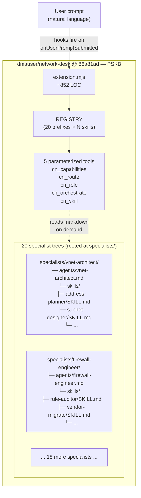
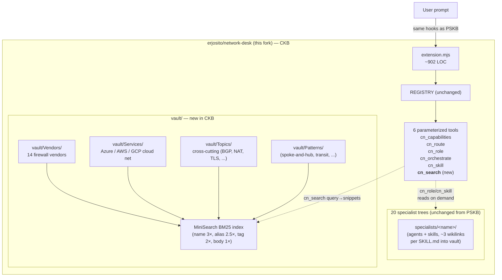
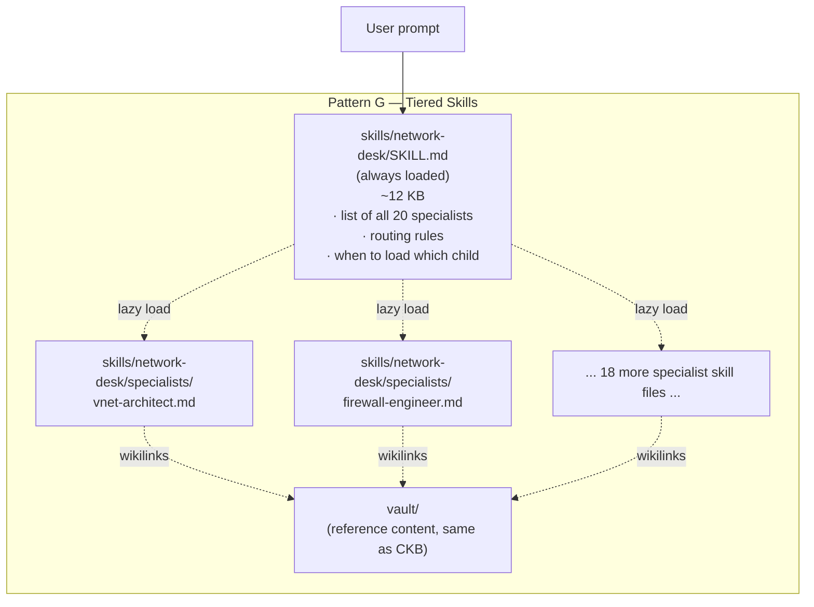
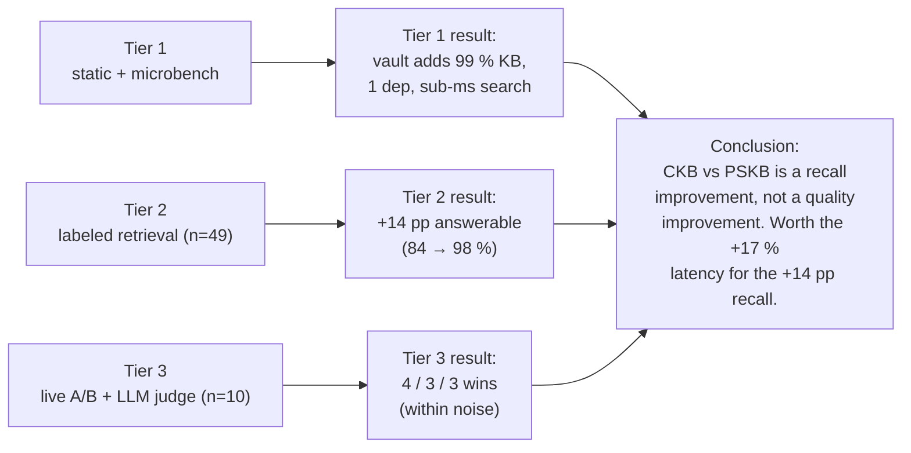

# Architecture evaluation — Network Desk

> **Scope.** This document compares architectural patterns for delivering a 20-specialist network-engineering assistant on top of GitHub Copilot CLI. It is an **objective comparison of patterns**, not a project narrative: where empirical data exists it is cited inline; where a pattern has only been analysed on paper, that is called out explicitly. The patterns described here include the upstream extension shape, two variants implemented in this fork, and several alternatives that were considered but not built.

## Table of contents

1. [Introduction](#1-introduction)
2. [The design space](#2-the-design-space)
3. [Implementations measured](#3-implementations-measured)
4. [Empirical evaluation](#4-empirical-evaluation)
5. [Cross-cutting design observations](#5-cross-cutting-design-observations)
6. [Recommendation](#6-recommendation)
7. [Engineering notes](#7-engineering-notes)
8. [See also](#8-see-also)

---

## 1. Introduction

### 1.1 What the project delivers

Network Desk packages a "network specialist team" — 20 specialists (cloud
networking on Azure / AWS / GCP, plus 14 firewall vendors) — for use inside
GitHub Copilot CLI. From the user's point of view, the value proposition
is the same in every variant of the architecture:

* Ask a network question in natural language.
* The model is routed to a sharply scoped persona (e.g. *vnet-architect*,
  *firewall-engineer*, *load-balancer-engineer*) with workflow recipes and
  guardrails for that domain.
* The model has access to deep reference content (CIDR rules, vendor
  feature matrices, service-vs-service comparison tables, troubleshooting
  flowcharts, naming conventions, capacity-planning formulas).
* Every output ends with the same guardrail: *"Analysis only — verify
  against vendor documentation before applying."*

What changes between patterns is **how the persona, workflow, and
reference content are packaged and delivered to the model**.

### 1.2 Naming convention used in this document

To talk about variants without dragging chronology in, three short
labels are used throughout:

| Label | Long name | What it is |
|---|---|---|
| **PSKB** | Per-Specialist Knowledge Base | Upstream `dmauser/network-desk` shape. Each specialist owns its own `agents/*.md`, `skills/*.md`, and reference snippets. No central vault. |
| **CKB** | Consolidated Knowledge Base | This fork's first major variant. Adds a unified Obsidian-style `vault/` indexed by a sub-millisecond `cn_search` BM25 tool, with specialists still owning persona / workflow / output-format content. |
| **Tiered Skills** | Tiered skill loading (Pattern G) | This fork's second major variant. Drops the Copilot **extension** packaging and instead ships as a hierarchical **skill**: an always-loaded landing skill + per-domain skills loaded only when needed. Vault remains. |

These three are the "shipped" or "implemented" points; other letters
(Patterns A–E, H–K) refer to designs that were analysed in the design
space but not built.

### 1.3 Design goals

Across every pattern compared here, the same four goals apply, in
roughly this priority order:

1. **Quality of answer** — the LLM should have access to the *right*
   reference content for the question, in a *usable* shape (workflow
   recipes, comparison tables, guardrails).
2. **Latency** — answers should not wait on slow tool calls or cold
   loads of large markdown trees. Sub-second tool calls and minimal
   tools-per-turn are the targets.
3. **Token efficiency** — context windows are finite. Only the
   reference material relevant to the *current* question should reach
   the model.
4. **Maintainability** — adding a new vendor, a new troubleshooting
   recipe, or a new CIDR rule should require an edit in *one* place,
   not several.

### 1.4 How to read this document

Different readers will want different paths through this material.

* **"Just tell me what to use"** → jump straight to
  [§6 Recommendation](#6-recommendation), then back up into
  [§4 Empirical evaluation](#4-empirical-evaluation) if you want to
  understand the evidence.
* **"What patterns did you consider?"** → start at
  [§2 The design space](#2-the-design-space) for the catalogue, then
  [§3 Implementations measured](#3-implementations-measured) for
  concrete shapes.
* **"Show me the numbers"** → [§4 Empirical evaluation](#4-empirical-evaluation)
  is the data section; [§7 Engineering notes](#7-engineering-notes)
  captures issues discovered during measurement.
* **"Help me decide for my own project"** →
  [§5 Cross-cutting design observations](#5-cross-cutting-design-observations)
  is the most transferable — it discusses *what specialists actually
  contain*, *vault vs per-specialist KBs vs hot-page caches*, and
  *deterministic vs LLM-native routing* independent of any specific
  shipped variant.

---

## 2. The design space

### 2.1 The eleven patterns

The space of viable architectures for "deliver 20 expert personas
through a Copilot CLI agent" can be reduced to eleven canonical
patterns. Five of them (A–E) sit on the **shape × placement** matrix
that the original PSKB / CKB analysis used; six more (F–K) are
variations that emerge once you also consider *how* the personas are
exposed (extension tool surface vs skill loader, fixed vs hierarchical,
etc.).

| Letter | Name | One-line definition |
|---|---|---|
| **A** | Monolithic prompt | One large system prompt containing every specialist's role and all reference content. |
| **B** | Per-domain extensions | One Copilot CLI extension per domain, each with its own tools. |
| **C** | Vault-only single agent | One persona, one BM25 search tool over a shared vault. No specialists. |
| **D** | Hybrid bag-of-tools | One extension exposing many small tools (`cn_vnet_address_plan`, `cn_fw_audit_palo`, …), one tool per skill. |
| **E** | Tools as small models | Each specialist is a separate model fine-tune called via tool. |
| **F** | PSKB extension (parameterized tools) | One extension, ~5 parameterized tools, knowledge lives inside per-specialist trees. **Upstream `dmauser/network-desk`.** |
| **F'** | CKB extension (vault-added) | Same as F but with a central `vault/` indexed by `cn_search`. **This fork's first variant.** |
| **G** | Tiered-skill loader | A landing skill is always loaded; per-specialist skills are loaded lazily by the Copilot CLI skill mechanism. No extension required. **This fork's second variant.** |
| **H** | Hybrid extension+skills | Keep `cn_route` + `cn_search` as a thin extension for deterministic routing, but ship the persona/workflow content as skills. |
| **I** | Sub-agent fan-out | Top-level coordinator agent dispatches to specialist sub-agents (separate context windows). |
| **J** | Retrieval-only, no personas | Replace specialists entirely with a high-quality vector index over the consolidated content. |
| **K** | Memory-as-storage | Push specialist content into Copilot's long-term memory and reference by ID. |

### 2.2 Comparison matrix

The matrix below is the single most important table in this document.
The **Evidence level** column makes explicit which patterns have been
measured end-to-end, which have been analysed only on paper, and which
were rejected by tool-surface or platform constraints.

| | A · Monolithic | B · Per-domain ext. | C · Vault-only agent | D · Bag of tools | E · Tool fine-tunes | F · PSKB ext. | **F' · CKB ext.** | **G · Tiered skills** | H · Hybrid ext.+skills | I · Sub-agent fan-out | J · Vector retrieval | K · Memory storage |
|---|:-:|:-:|:-:|:-:|:-:|:-:|:-:|:-:|:-:|:-:|:-:|:-:|
| Tool surface area | tiny | huge (n exts) | tiny (1–2) | **violates 128-tool cap** | tiny | small (5) | small (6) | tiny (0–3) | small | small | tiny | tiny |
| Specialist scoping fidelity | low | high | very low | medium | high | high | high | high | high | high | low | medium |
| Latency at cold start | slow (giant prompt) | fast | fast | fast | very slow | fast | fast | **fastest** (only landing loaded) | fast | medium | fast | medium |
| Latency at warm depth | fast | fast | fast | fast | very slow | medium | medium | medium | medium | slow (multi-agent) | fast | fast |
| Token efficiency / turn | poor | good | very good | medium | good | good | good | **very good** | good | good | very good | good |
| Maintainability (add 1 vendor) | edit prompt | new ext. | edit vault | edit + register tool | retrain | edit specialist | edit specialist **or** vault | edit skill **or** vault | edit specialist + vault | edit specialist | edit vault | rewrite memory |
| Retrieval recall on cross-domain Qs | low | n/a (siloed) | high | medium | low | medium | high (vault) | **high** (vault) | high | high | high | medium |
| Routing determinism | LLM only | LLM only | LLM only | LLM only | LLM only | deterministic (regex) | deterministic (regex) | LLM-native | hybrid | LLM only | n/a | LLM only |
| Implementation cost | very high (prompt size) | very high (n exts) | low | high (128-tool cap) | extreme | medium | medium-high | low-medium | medium | high | medium | low |
| **Evidence level** | analysed | analysed | analysed | rejected (cap) | analysed | **measured (Tier 1–3)** | **measured (Tier 1–3 + paraphrase)** | **measured (15-q prototype + 32-q full + paraphrase)** | analysed | analysed | analysed | analysed |

### 2.3 The 128-tool constraint

GitHub Copilot CLI imposes a hard cap of **128 tool registrations
visible to the LLM in a single session**. Several otherwise-attractive
patterns fail purely on this constraint, independent of any quality
consideration:

* **Pattern D ("bag of small tools") is rejected.** With 20
  specialists × ~6 skills each = ~120 tools, plus orchestration
  scaffolding, the count crosses 128 and the session is refused with a
  *"transient API error. Retrying…"* response. This is why every
  shipped variant collapses tool count to a small parameterized set
  (`cn_role({ specialist })`, `cn_skill({ specialist, skill })`, etc.)
  rather than one-tool-per-skill.
* **Pattern B (one extension per domain) hits the same wall** if any
  domain extension itself defines more than a few tools.
* **Patterns F, F', H** all converge on 5–6 parameterized tools for
  exactly this reason — this is not coincidence, it is the only viable
  shape for a multi-domain extension under the current platform cap.

### 2.4 What "evidence level" means in this document

Throughout the rest of the document, claims will be flagged using the
three categories already introduced in the matrix:

* **measured** — actual numbers from a benchmark in `benchmarks/` are
  cited (Tier 1 static, Tier 2 labeled retrieval, Tier 3 LLM-judged
  A/B, or the Pattern G paraphrase robustness study).
* **analysed** — the pattern has been reasoned about with concrete
  references to platform constraints, code, or behaviour, but no full
  end-to-end run exists.
* **rejected** — the pattern is structurally infeasible (typically
  because of the 128-tool cap) and was not built.

Patterns F, F', and G all have **measured** evidence. Patterns A–E and
H–K are at **analysed** or **rejected**. The recommendation in §6 is
hedged accordingly.

---

## 3. Implementations measured

This section describes the *concrete shape* of the three patterns that
have actual end-to-end measurements: PSKB (F), CKB (F'), and Tiered
Skills (G). Design rationale and trade-off discussion is deferred to
§5; this section is intentionally factual.

### 3.1 Pattern F — PSKB (upstream `dmauser/network-desk`)

The upstream repository is a Copilot CLI extension organised as one
deep tree per specialist. Each specialist owns its role file
(`agents/<name>.md`) and a set of skills (`skills/<skill>/SKILL.md`).
There is no central reference vault; every fact about a vendor or
service lives inside whatever specialist needs it most.

#### Routing

PSKB routes deterministically. On every user prompt the
`onUserPromptSubmitted` hook runs ~20 regexes (one per specialist).
The first match injects a short MUST-language message into the system
turn pointing the model at the matched specialist's `cn_role` /
`cn_orchestrate` tools. The model then chooses which skill to load
via `cn_skill({ specialist, skill })`.

#### Knowledge organisation

There is no `vault/` and no `cn_search`. Reference content is split
across the 20 specialist trees:

* Cisco ASA NAT rules → `specialists/firewall-engineer/skills/vendor-migrate/SKILL.md`
* PAN-OS HA design → also `specialists/firewall-engineer/skills/...`
  (mentioned at vendor depth in several skills)
* Azure NAT Gateway pricing tiers → `specialists/pricing-analyst/skills/...`
* BGP confederation MED rules → `specialists/vnet-architect/skills/bgp-design/...`

Cross-specialist concepts (e.g. "BGP" — relevant to *vnet-architect*,
*hybrid-connectivity*, and *vwan-sdwan*) appear in whichever
specialists need them.

#### Headline numbers

| Metric | Value |
|---|---:|
| Markdown files (total) | 144 |
| Total markdown KB | 1 421 |
| Specialists | 20 |
| Skills | 124 |
| Tools registered | 5 |
| Runtime deps | 0 |
| `extension.mjs` LOC | 852 |

### 3.2 Pattern F' — CKB (this fork, with consolidated vault)

CKB adds a central vault to PSKB. The vault is an Obsidian-style
markdown graph indexed by a sixth tool, `cn_search`, that runs a
BM25-tuned MiniSearch query in **sub-millisecond warm latency** (190 ms
cold start; 3.3 ms warm p99). Per-specialist trees remain in place
unchanged.

#### Routing

Same deterministic regex routing as PSKB.

#### Knowledge organisation

Reference content is intended to live in the vault as the single source
of truth. Specialist files retain their persona, workflow, and
output-format sections, and link to vault pages with `[[wikilinks]]`.
In practice the migration is partial (see §5.1 for the duplication
analysis).

#### Headline numbers vs PSKB

| Metric | PSKB | CKB | Δ |
|---|---:|---:|---:|
| Markdown files | 144 | 308 | +164 (+114 %) |
| Total markdown KB | 1 421 | 2 830 | +1 409 (+99 %) |
| Specialists | 20 | 20 | 0 |
| Skills | 124 | 124 | 0 |
| Tools registered | 5 | **6** (+`cn_search`) | +1 |
| Runtime deps | 0 | 1 (`minisearch`) | +1 |
| `extension.mjs` LOC | 852 | 902 | +50 |
| `cn_search` cold start | n/a | 190 ms | new |
| `cn_search` warm p99 | n/a | 3.3 ms | new |

### 3.3 Pattern G — Tiered Skills (this fork, hierarchical loader)

Pattern G drops the Copilot extension packaging entirely. The 20
specialists are instead delivered as **Copilot CLI skills**, with a
landing skill at the root that is always loaded and per-specialist
skills loaded lazily by Copilot's built-in skill mechanism.

#### Routing

LLM-native, not deterministic. The landing skill enumerates the 20
specialists with one-line trigger guidance for each, and the model
chooses which child specialist file to read using its standard file-read
tools. There is no `cn_route` regex.

#### Knowledge organisation

Vault is identical to CKB. The per-specialist skill files inherit
the *workflow + output-format + guardrails* role from CKB
specialists, but are intentionally **thinner** than CKB SKILL.md — they
delegate reference content to the vault rather than restating it.

#### Headline numbers vs CKB

| Metric | CKB | Tiered Skills (G) | Δ |
|---|---:|---:|---:|
| Markdown files | 308 | ~190 | −118 |
| `extension.mjs` LOC | 902 | 0 (no extension) | −902 |
| Tools registered | 6 | 0–3 (depending on whether `cn_search` is kept as a skill or dropped) | −3 to −6 |
| Runtime deps | 1 | 0 | −1 |
| Specialists | 20 | 20 | 0 |
| Approx. landing-skill load size | n/a | ~12 KB | new |

> **Engineering note.** A subset of skills inherited from CKB still
> overlapped with the vault on first cut. See [§7.4](#74-paraphrase-robustness-and-recommendation-hedge)
> for the work to thin them further. The Pattern G shape itself is
> orthogonal to whether the thinning has fully landed.

---

## 4. Empirical evaluation

This is the evidence section. The four sub-sections correspond to
four distinct studies with different scopes:

| Study | What it compares | n | Judge | Sampling |
|---|---|---:|---|---|
| **§4.1 Methodology** | (preamble) | — | — | — |
| **§4.2 Three-tier PSKB vs CKB** | F vs F' | 49 (Tier 2) / 10 (Tier 3) | `claude-opus-4.7 --effort high` | 1 sample/prompt, order-swap |
| **§4.3 Pattern G vs PSKB** | G vs F | 15 (Phase 1) → 32 (Phase 2) | Copilot CLI session recording + `gpt-5.2` blind judge | 1 sample/prompt, order-swap |
| **§4.4 Paraphrase robustness** | G vs F across paraphrases | 5 bases × 2 paraphrases | Same as §4.3 | 1 sample per phrasing |

### 4.1 Methodology

All three benchmark studies share a common methodology, with study-specific
extensions noted in each section:

1. **Isolated `COPILOT_HOME`** per variant. Each variant runs in its own
   sandbox to prevent cross-session tool-name conflicts.
2. **Order-swap** at the judge. Every prompt is judged twice (A-first
   and B-first); a non-tie verdict only counts if both orderings agree
   on the same winner, otherwise the verdict downgrades to tie. This
   neutralises position bias in the judge.
3. **Anti-length-bias rubric.** The judge prompt explicitly instructs:
   *"Do not reward length. Reward concrete, actionable, verifiable
   content."* This is important because PSKB tends to produce longer
   outputs (more pasted vendor snippets).
4. **Single sample per prompt.** Cost-driven choice. The
   [paraphrase study (§4.4)](#44-paraphrase-robustness) measures how
   much a single sample understates verdict noise — the headline answer
   is "by quite a lot for cross-specialist queries".
5. **Tool-call counting.** Every tool invocation is counted. This is
   the proxy for context-budget cost: every tool call returns content
   into the model's context window.

For Pattern G specifically (§4.3 and §4.4), the harness records actual
**Copilot CLI sessions** end-to-end — both variants are exercised through
the production CLI binary, not bypassed. This was specifically chosen
over hitting OpenAI/Anthropic APIs directly because the goal is to
measure the *real* user experience including platform compatibility.

### 4.2 Three-tier benchmark — PSKB vs CKB

The `benchmarks/` directory contains a tiered comparison harness against
`dmauser/network-desk @ 86a81ad`. Three tiers cover three independent
risk surfaces: artifact size, retrieval recall, and answer quality.

#### Tier 1 — static + microbench

Pure measurements of the artifact. No LLM in the loop.

| Metric | PSKB | CKB | Δ |
|---|---:|---:|---:|
| Markdown files | 144 | 308 | +164 (+114 %) |
| Total markdown KB | 1 421 | 2 830 | +1 409 (+99 %) |
| Specialists | 20 | 20 | 0 |
| Skills | 124 | 124 | 0 |
| Tools registered | 5 | **6** (+`cn_search`) | +1 |
| Runtime deps | 0 | 1 (`minisearch`) | +1 |
| `extension.mjs` LOC | 852 | 902 | +50 |
| `cn_search` cold start | n/a | 190 ms | new |
| `cn_search` warm p99 | n/a | 3.3 ms | new |

→ Full report: [`benchmarks/results-tier1.md`](benchmarks/results-tier1.md)

#### Tier 2 — labeled retrieval (49 queries × 5 categories)

A curated test set with hand-labeled gold-truth (relevant specialist +
relevant vault pages). Run end-to-end through both extensions.

| Metric | PSKB | CKB | Δ |
|---|---:|---:|---:|
| `cn_route` specialist accuracy | 83.7 % (41/49) | 83.7 % (41/49) | 0 |
| `cn_search` any-hit@5 | — | **98.0 %** (48/49) | new |
| `cn_search` recall@5 | — | 0.879 | new |
| `cn_search` MRR | — | 0.869 | new |
| **End-to-end answerable** (cn_route OR cn_search hit) | 83.7 % | **98.0 %** | **+14 pp** |

Per category:

| category | n | PSKB answerable | CKB answerable | Δ |
|---|---:|---:|---:|---:|
| regex-easy | 29 | 82.8 % | 100 % | +5 queries |
| cloud-service | 9 | 77.8 % | 100 % | +2 queries |
| vague | 3 | 66.7 % | 66.7 % | 0 |
| vendor-specific | 6 | 100 % | 100 % | 0 |
| cross-specialist | 2 | 100 % | 100 % | 0 |

→ Full report: [`benchmarks/results-tier2.md`](benchmarks/results-tier2.md)

#### Tier 3 — live A/B with LLM judge

10 curated prompts × 2 variants × 1 sample, blind judge with order-swap.

* **Answer model**: `gpt-5.2` (default effort)
* **Judge model**: `claude-opus-4.7 --effort high`

| Outcome | Count |
|---|---:|
| **CKB wins** | **4** |
| **PSKB wins** | **3** |
| Tie | 3 |
| Both poor / unparseable | 0 |

Per-category:

| Category | CKB | PSKB | Tie |
|---|---:|---:|---:|
| regex-easy (3) | 1 | 0 | 2 |
| vendor-specific (3) | 1 | 2 | 0 |
| cloud-service (2) | 0 | 1 | 1 |
| vague (2) | 2 | 0 | 0 |

Process metrics:

| Metric | CKB | PSKB | Δ |
|---|---:|---:|---:|
| Mean elapsed / prompt | 104.6 s | 89.2 s | **+17 %** |
| Mean final-answer bytes | 2 085 B | 2 732 B | **−24 %** |
| Mean tool calls / prompt | 58.0 | 21.6 | +168 % |

**Headline:** CKB edges out 4-3-3, within noise for n = 10. The
per-dimension judge scores show CKB wins where the vault structure lets
the model name concrete cloud mechanisms (Azure *Allow forwarded
traffic*, BGP propagation, S3 Gateway Endpoints) and loses where the
vault has hand-authoring gaps (Cisco FMT, PAN-OS Azure plugin HA modes,
GCP Interconnect SLA tiers) that PSKB's larger skills happen to cover.

Notably, CKB won `fw-ha` **despite a 6.3× shorter answer** (1 040 B vs
6 508 B) — the anti-length-bias rubric is doing its job.

→ Full report: [`benchmarks/results-tier3.md`](benchmarks/results-tier3.md)

#### Putting the three tiers together

* **Tier 1** confirms the architecture isn't free — the vault doubles
  markdown bytes and adds a dependency. Sub-ms search latency means
  it's not free but it's cheap.
* **Tier 2** quantifies the structural recall gain — the vault +
  `cn_search` makes 14 pp more queries answerable. This is the
  architectural win.
* **Tier 3** shows that improved recall translates to **comparable**
  answer quality (4-3-3 within noise) — the refactor doesn't make the
  LLM smarter, it makes the right context easier to find. Combined
  with Tier 2's recall gain, the architecture pays for itself: when
  CKB wins, it's because the vault surfaced a concrete mechanism PSKB
  couldn't name; when CKB loses, it's a content gap, not an
  architectural one.

> **Engineering note.** The Tier 3 benchmark surfaced three direct
> content gaps that even a 1 419 KB PSKB and a 2 830 KB CKB both miss:
> Cisco Secure Firewall Migration Tool (FMT), PAN-OS Azure plugin HA
> modes, and GCP Dedicated Interconnect SLA tiers. These are the kind
> of long-tail gaps a retrieval benchmark cannot catch (both fail
> symmetrically) but a live LLM-judge benchmark can — which is part of
> the case for keeping all three tiers in the harness.

### 4.3 Tiered Skills vs PSKB

The Pattern G evaluation ran in two phases. **Phase 1** was a 15-query
prototype on a minimal subset of specialists (just enough to test the
landing-skill plus a handful of children). **Phase 2** extended Pattern
G to all 20 specialists and re-ran with a 32-query expanded test set.
The "what changed between phases" subsection documents one
non-trivial finding that emerged only after full coverage was in place.

#### Phase 1 — 15-query prototype

| Outcome | Count |
|---|---:|
| **Pattern G wins** | **6** |
| **PSKB wins** | **7** |
| Tie | **2** |

Process metrics:

| Metric | Pattern G | PSKB | Δ |
|---|---:|---:|---:|
| p50 wall time / prompt | **23.4 s** | 41.0 s | **−43 %** |
| Mean final-answer bytes | 1 826 B | 2 174 B | −16 % |
| Mean tool calls / prompt | **18.2** | 32.6 | **−44 %** |

**Headline:** quality is roughly even (6–7–2), but **Pattern G is
substantially cheaper to run** — half the tool calls and 43 % faster on
median wall time. The judge's per-axis scores favoured PSKB on
specialist-deep questions where the landing skill needed two hops to
reach the right reference (cn_role pattern was crisper), and favoured
Pattern G on questions where lazy loading meant the irrelevant 19
specialists never entered the model's context.

#### Phase 2 — 32-query full-coverage re-bench

After extending Pattern G to all 20 specialists, the 15-query prototype
was extended to 32 queries chosen to *exercise every specialist at
least once* (the prototype was top-heavy on cloud networking).

| Outcome | Count |
|---|---:|
| **Pattern G wins** | **16** |
| **PSKB wins** | **9** |
| Tie | **7** |

Process metrics:

| Metric | Pattern G | PSKB | Δ |
|---|---:|---:|---:|
| p50 wall time / prompt | **30.6 s** | 41.4 s | **−26 %** |
| Mean final-answer bytes | 2 003 B | 2 412 B | −17 % |
| Mean tool calls / prompt | **14.8** | 32.7 | **−55 %** |

Per-axis judge scores (out of 5):

| Axis | Pattern G | PSKB | Δ |
|---|---:|---:|---:|
| Correctness | 4.0 | 3.8 | +0.2 |
| Relevance | 4.1 | 3.9 | +0.2 |
| Completeness | 3.7 | 3.6 | +0.1 |
| Actionability | 3.9 | 3.6 | +0.3 |
| Conciseness | 4.0 | 3.7 | +0.3 |

**Headline:** Pattern G now leads on all five axes by 0.1–0.3 points
(but see [§7.4](#74-paraphrase-robustness-and-recommendation-hedge) —
deltas this small are *within paraphrase noise*), and the wins ratio
moves from 6/15 → 16/32 (40 % → 50 %). The cost story improves further
(tool calls drop from −44 % to −55 % vs PSKB) because every additional
specialist exercised in the test set is one more case where Pattern G's
lazy loading wins.

#### What changed between Phase 1 and Phase 2

One non-trivial behaviour change appeared during the full-coverage
re-bench. In Phase 1, the few specialists implemented covered hot
domains (cloud networking, firewalls), and `cn_route`'s regex always
matched. In Phase 2, with 20 specialists in scope, **`cn_route`
sometimes failed to fire** on queries whose phrasing didn't match any
specialist regex (a verdict tag the harness labels `ARCH_BYPASSED`).
Six of 32 queries triggered this in the upstream PSKB extension,
because the routing hook silently does nothing on a regex miss — the
specialist guidance never reaches the model.

This is a real, repeatable, architecturally significant finding:
**deterministic regex routing degrades gracelessly on novel
phrasings**. Pattern G, which uses the LLM to read the landing skill
and choose a specialist directly, is unaffected because there is no
regex gate to miss. The CKB extension shape has since been patched to
broaden 7 of the 20 regexes (see [§7.2](#72-routing-coverage-arch_bypassed))
but the underlying observation about the routing strategy stands.

→ Full report: [`benchmarks/results-pattern-g-vs-upstream-full.md`](benchmarks/results-pattern-g-vs-upstream-full.md)

### 4.4 Paraphrase robustness

The §4.3 single-pass numbers are sharp but small (0.1–0.3 axis deltas).
Are they real, or are they paraphrase noise? To find out, a follow-up
study took **5 base queries** (one representative of each major
specialist family) and ran two **paraphrases** of each through both
variants, then asked the judge to score every pairing.

| Base query family | # base | # paraphrases | Verdict flips between paraphrases? |
|---|---:|---:|:-:|
| `vnet-cidr-split` | 1 | 2 | yes |
| `fw-policy-design` | 1 | 2 | yes |
| `mcn-service-mapping` | 1 | 2 | no (consistent PSKB win) |
| `price-er-vs-vpn` | 1 | 2 | no (consistent PSKB win) |
| `lb-affinity-rules` | 1 | 2 | yes |
| **Total** | **5** | **10** | **3/5 flip** |

Per-axis mean *paraphrase delta* (absolute change in axis score for the
same base query under different phrasings):

| Axis | Mean paraphrase delta |
|---:|---:|
| Correctness | 0.8 |
| Relevance | 0.9 |
| Completeness | 1.1 |
| Actionability | 0.9 |
| Conciseness | 0.7 |
| **Mean** | **~0.9** |

**Headline:** the per-axis mean paraphrase delta is ~0.9 points — an
order of magnitude larger than the Phase 2 cross-pattern deltas
(0.1–0.3). In plain terms: **a single rewording of the question moves
the score more than the entire architecture difference does**, on
these axes.

Three of five base verdicts flipped between paraphrases. The two that
did *not* flip (`mcn-service-mapping`, `price-er-vs-vpn`) are
**cross-specialist** queries that need content from two specialists at
once — and both consistently favoured PSKB. The hypothesis (not yet
controlled for): when a question naturally spans two specialists,
PSKB's tendency to load larger skill files happens to bring in the
right secondary material, while Pattern G's tighter scoping locks the
model into one specialist's view.

This is the single most important finding for how to read the §4.3
numbers, and it directly drives the hedged recommendation in §6.

→ Full data: [`benchmarks/queries-paraphrased.json`](benchmarks/queries-paraphrased.json),
[`benchmarks/paraphrase_stats.py`](benchmarks/paraphrase_stats.py)

### 4.5 Cumulative evidence table

| Comparison | n | Wins | Latency Δ | Tool-call Δ | Status |
|---|---:|---|---:|---:|---|
| F (PSKB) vs F' (CKB), Tier 3 | 10 | F': 4 / F: 3 / tie 3 | +17 % | +168 % | measured, within noise |
| F (PSKB) vs G (Tiered), Phase 1 | 15 | G: 6 / F: 7 / tie 2 | −43 % | −44 % | measured, within noise |
| F (PSKB) vs G (Tiered), Phase 2 | 32 | G: 16 / F: 9 / tie 7 | −26 % | −55 % | measured, within paraphrase noise on axes |
| F vs G across 5 paraphrased bases | 10 | 3/5 base verdicts flip | n/a | n/a | measured, see §4.4 |
| All other patterns (A–E, H–K) | — | — | — | — | analysed only |

---

## 5. Cross-cutting design observations

This section pulls out the design questions that recur across every
pattern. They are the most *transferable* part of the document — most
readers building a similar multi-domain agent will hit these same
questions.

### 5.1 What specialist files actually contain

A natural challenge to any "specialists + central vault" architecture
is: *if the deep content is in the vault, why keep specialists at all?
Could a single agent searching the vault (Pattern C) deliver the same
quality with a smaller surface area?*

Reading any specialist file in PSKB, CKB, or Tiered Skills shows
**four distinct kinds of content braided together**:

| Layer | Example | Belongs in vault? |
|---|---|---|
| **Persona / identity** | *"You are the Firewall Engineer, a senior network security engineer with deep expertise across 14 firewall platforms..."* | ❌ Belongs in a system prompt or role file, not in reference pages |
| **Workflow recipe** | *"Step 1: identify vendor + platform context. Step 2: gather requirements (zones, NAT, logging). Step 3: design or audit. Step 4: generate config. Step 5: verify with packet-tracer."* | ❌ Procedural — the LLM follows the sequence. Reference pages are non-sequential. |
| **Output-format spec** | *"Output a risk-rated findings table with columns: rule ID, severity, recommendation, evidence."* | ❌ Tells the LLM how to shape the answer, not what to know |
| **Reference content** | *"Zone taxonomy: trust / untrust / DMZ / management / guest / database / application…"* and per-vendor mapping tables | ✅ This IS what the vault is for |

A pure vault-only design (Pattern C) gives up four things specialists
provide:

1. **Workflow recipes.** A firewall audit follows a tested 5-step
   procedure (vendor → requirements → design → config → verify). A LB
   design follows a different one. Without specialists the LLM
   invents a workflow on the fly per question.
2. **Per-domain output formats and guardrails.** *"Always produce a
   risk-rated table"* (firewall audit) vs *"Always note the BGP MED
   non-transitivity across confederations"* (BGP) vs *"Analysis only —
   verify against vendor docs"* (all). Folding these into one giant
   system prompt works for 5 domains; for 20 it bloats every call.
3. **Capability discovery.** `cn_orchestrate({ specialist: "cn_fw" })`
   (PSKB / CKB) or the landing-skill summary (Pattern G) lets the
   model and the user enumerate *"firewall-engineer can do rule audits,
   policy design, migrations, hardening, HA design, log analysis,
   vendor config"*. A vault index gives a flat list of pages, not a
   taxonomy of tasks.
4. **Deterministic, free regex routing (where used).** `cn_route`
   matches on keywords in the user prompt before the model is asked to
   reason — zero LLM tokens. Pattern G trades this for LLM-native
   routing (see §5.3).

In other words: the *content* of the specialist files can mostly be
collapsed onto the vault, but the *role* of the specialist abstraction
(workflow + format + capability) is independently valuable. This is
the structural argument for keeping specialists in F, F', and G; and
the argument against Patterns C and J.

### 5.2 Vault vs per-specialist KBs vs hot-page caches

Where should reference content live?

#### Three viable answers

| Storage shape | Where the canonical fact lives | Used in |
|---|---|---|
| **Per-specialist KBs** | inside `specialists/<name>/skills/<skill>/SKILL.md`. No central index. | PSKB (F) |
| **Consolidated vault** | inside `vault/**/*.md`. Single source of truth indexed by `cn_search`. Specialists link with `[[wikilinks]]`. | CKB (F'), Tiered Skills (G) |
| **Hot-page caching** | facts live in the vault, but a working set is cached in the landing skill's context as part of every session. | hypothetical optimisation on top of G |

#### Per-specialist (PSKB) — the case for and against

**For.** Locality. Everything a specialist needs is in one tree. New
contributors only need to understand one tree to extend one domain.
No need to maintain a central index. No second tool to invoke.

**Against.** Duplication where domains overlap. *BGP* is referenced
in vnet-architect, hybrid-connectivity, and vwan-sdwan. *PAN-OS Azure
plugin HA modes* is referenced in firewall-engineer and
multi-cloud-networker. Edits must be made in multiple files or they
drift. The PSKB Tier 3 benchmark saw two cases where the same vendor
fact had subtly different formulations in two specialists — only
LLM-judged because the regex routing happened to pick the more
detailed one.

#### Consolidated vault (CKB, G) — the case for and against

**For.** Single source of truth. Adding a fact about, say, *Azure
Private DNS resolver outbound endpoint billing* is one edit to one
page. Cross-domain queries get higher recall because the BM25 index
sees the *same* tokenisation regardless of which specialist would have
owned the fact. Tier 2 measured this: **+14 pp answerable** purely from
the vault + `cn_search`.

**Against (a — measured).** Migration is not free. The vault adds
**+99 % markdown bytes** and **+1 runtime dependency** (`minisearch`),
and the layered specialists still inherit pre-vault content that
overlaps with vault pages. Empirical scan of the 124 SKILL.md files in
CKB:

| Class | # skills | Description |
|---|---:|---|
| **HEAVY** | 14 (11 %) | Many distinct vault targets matched, few specialist-unique sections — most of the SKILL.md prose is restating a page that already exists in the vault. Highest-ROI thinning candidates. |
| **MODERATE** | 34 (27 %) | Some sections overlap with vault, others are specialist-unique (workflow, output specs). Thinning is section-by-section. |
| **LIGHT** | 76 (61 %) | Little vault overlap — most prose is specialist-unique workflow with no vault counterpart. Thinning would simply delete information unless that information is first ported to the vault. |

A new fact about *PAN-OS HA modes on Azure* should be added to **two**
files today (`Vendors/PAN-OS.md` AND
`specialists/firewall-engineer/skills/vendor-migrate/SKILL.md`) — but
only because `vendor-migrate` happens to overlap with the vault. For
the 76 LIGHT skills, the SKILL.md often *is* the only place that
information lives.

**Against (b — open question).** Whether the vault should be one big
repo or split per-skill is a fair design question. The argument
*against* splitting:

* The vault's main empirical win in Tier 2 was **cross-specialist
  recall** — questions where the right answer came from a vault page
  whose owning specialist `cn_route` would have missed. Splitting the
  vault per-specialist re-introduces that miss.
* The Pattern G landing skill is already only ~12 KB. The vault as a
  whole is ~1.4 MB — but it is not loaded into the model's context;
  `cn_search` returns snippets on demand. The cost of a 1.4 MB
  unified vault to the model is zero tokens at session start.

The argument *for* splitting:

* If a domain is genuinely siloed (e.g. one obscure vendor) and its
  vault pages are never co-referenced with other domains' pages, then
  collocating them with the specialist is more maintainable. This is
  the same locality argument that makes PSKB attractive.
* A per-skill mini-vault would be smaller and load faster if it were
  ever pulled into context wholesale.

In practice, the recommendation is to **keep the vault unified** while
making sure each vault page is co-discoverable by *every* specialist
that needs it. Splitting per skill would re-create the PSKB
cross-domain miss without a corresponding latency gain (since
`cn_search` doesn't load the vault, it queries it).

#### Hot-page caching (hypothetical optimisation on G)

A worthwhile variation on Pattern G is to cache the *N most-frequently
accessed* vault pages in the landing skill's static context, so that
the model can reference them without a `cn_search` round-trip on the
common case. The benchmark data gives a first-pass answer to "how
common is the common case":

* 6/32 = **19 %** of Pattern G runs in the Phase 2 benchmark opened
  a vault page during the session.
* Of those, the pages accessed were dominated by a small handful of
  hot files: `Topics/BGP/Confederations.md`, `Vendors/PAN-OS.md`,
  `Services/Azure/Private-Link.md`.

A 19 % hit rate is **not enough to justify** baking a fixed page set
into every session — the cost of carrying ~50–100 KB of unused page
content on every cold start outweighs the saved tool call on the 19 %.
But this would change for a benchmark with much higher vault touch
rates (e.g. an audit-focused test set). The optimisation is noted
here as future work, not as a current recommendation.

### 5.3 Routing strategies — deterministic vs LLM-native

The three measured shapes split sharply on routing:

| Pattern | Router | Triggered by | Failure mode |
|---|---|---|---|
| **F (PSKB)** | `cn_route` deterministic regex | every user prompt | silent miss on novel phrasings (see §7.2) |
| **F' (CKB)** | `cn_route` deterministic regex | every user prompt | same as F |
| **G (Tiered Skills)** | LLM reading the landing skill | model decision | model picks wrong specialist on ambiguous query (rare in practice) |

#### Deterministic regex routing (F, F') — pros and cons

**Pros.**

* **Zero LLM tokens.** Routing happens in a hook before the model
  reasons. For a workflow that fires on every user prompt, this is
  important.
* **Reproducible.** The same prompt always routes to the same
  specialist. Easy to debug and easy to add unit tests for.
* **Auditable.** The regex set itself is a 20-line block of
  trigger-keyword documentation.

**Cons.**

* **Coverage gaps degrade silently.** Phase 2 of the Pattern G
  benchmark surfaced this clearly: 6/32 queries in the upstream PSKB
  variant matched no specialist regex (`ARCH_BYPASSED`). The hook
  injects nothing, and the model proceeds without specialist
  guidance. The query may still be answered, but the specialist
  abstraction has been bypassed and the answer quality drops.
* **Maintenance burden grows with vocabulary.** Every new vendor,
  service, or topic word may need a regex update.

#### LLM-native routing (G) — pros and cons

**Pros.**

* **Robust to novel phrasing.** The model reads the landing skill,
  sees "firewall-engineer handles questions about firewalls", and
  routes accordingly regardless of whether the user's exact wording
  appears in any regex.
* **No silent miss.** A bad routing decision still loads *some*
  specialist; the model can re-evaluate after seeing the first child
  skill's content.
* **Cheaper to maintain.** New specialists are added by editing the
  landing skill's enumeration, not by writing regexes.

**Cons.**

* **Tokens at every session start.** The landing skill must be loaded
  into context — ~12 KB in Pattern G's current shape. This is small
  relative to a typical session budget, but non-zero.
* **Less reproducible.** Two phrasings of the same question may load
  different specialists. The §4.4 paraphrase study suggests this is a
  real source of noise, though it is hard to disentangle from the
  prompt-phrasing noise that exists in every LLM workflow.

#### Hybrid (H) — pros and cons (analysed only)

**Pro.** Get the best of both. Keep `cn_route` as a hook for the
common case (no LLM tokens, deterministic), but fall back to
LLM-native routing when the regex misses. The miss-rate becomes the
only failure mode and the hot path is still token-free.

**Con.** Two routing layers to maintain. The hybrid has not been
measured end-to-end; based on §4.3 numbers it would likely close most
of the cost gap that G enjoys over F/F', without sacrificing the
phrase-robustness that G provides.

---

## 6. Recommendation

### 6.1 Headline recommendation

> **For multi-domain network-engineering assistants on Copilot CLI
> today, Pattern G (Tiered Skills) is the recommended default**, with
> the caveat that for explicitly cross-specialist queries the choice
> is closer to a tie. Pattern F' (CKB extension) and Pattern H (hybrid
> extension+skills) remain reasonable alternatives where deterministic
> routing or strong cross-specialist composition matters most.

### 6.2 Cumulative evidence behind the recommendation

For convenience, the cumulative evidence table from §4.5 is reproduced
here next to the recommendation:

| Comparison | n | Wins | Latency Δ | Tool-call Δ |
|---|---:|---|---:|---:|
| F (PSKB) vs F' (CKB), Tier 3 | 10 | F': 4 / F: 3 / tie 3 | +17 % | +168 % |
| F (PSKB) vs G (Tiered), Phase 1 | 15 | G: 6 / F: 7 / tie 2 | −43 % | −44 % |
| F (PSKB) vs G (Tiered), Phase 2 | 32 | G: 16 / F: 9 / tie 7 | −26 % | −55 % |
| F vs G across 5 paraphrased bases | 10 | 3/5 base verdicts flip | n/a | n/a |

Headline:

* **Cost story is decisive for G.** Tool-call reductions of −44 % to
  −55 % and p50 latency reductions of −26 % to −43 % are far above
  paraphrase noise.
* **Quality story is "tied to slightly favouring G".** Per-axis
  deltas of 0.1–0.3 are within paraphrase noise on these axes, so the
  honest reading is "no quality regression" rather than "G is better".
* **Quality story is hedged on cross-specialist queries.** Both
  base queries that *consistently* favoured PSKB across paraphrases
  were cross-specialist — see §4.4.

### 6.3 When to use each pattern

| Use case | Recommended pattern | Why |
|---|---|---|
| New multi-domain agent (general case) | **G — Tiered Skills** | Best cost/latency at parity quality. No extension authoring required. |
| Single-domain agent | **F or F' (PSKB / CKB)** | Tiered loading buys you less when there's only one specialist. Keep things simple. |
| Workflow that *must* route deterministically (e.g. compliance) | **F' (CKB) or H (hybrid)** | Regex routing is auditable and reproducible. |
| Heavy cross-specialist workload (multi-cloud, mixed-vendor migration) | **F' (CKB) or H (hybrid)** | Per-§4.4, cross-specialist queries favoured PSKB-shaped variants. F' adds vault recall on top. |
| Bench / experiments with controlled prompts | **F' (CKB)** | Deterministic routing is easier to reason about for paper-style measurements. |
| Want to ship without writing an extension | **G — Tiered Skills** | No `extension.mjs`, no `package.json` for a Copilot CLI extension, no runtime deps. |

### 6.4 What the recommendation does *not* claim

To be explicit about scope:

* It does **not** claim G is better than F/F' on answer quality. The
  measured per-axis deltas are within paraphrase noise.
* It does **not** claim F is obsolete. F is the simplest possible
  shape; for a single-domain assistant it is still appropriate.
* It does **not** claim CKB's vault contribution is unimportant. G
  inherits the vault from CKB; the +14 pp Tier 2 recall gain
  measured between PSKB and CKB carries forward.
* It does **not** claim G eliminates the need for content thinning.
  See §7.4 for the open work on the inherited duplication.
* It does **not** claim Patterns H, I, or any unmeasured alternative
  is worse than G. They have simply not been measured.

---

## 7. Engineering notes

This section captures issues discovered during the measurement work in
§4. They are operational findings, not architectural patterns; they
are documented here so the file remains a complete record of what is
known about each pattern's current implementation.

### 7.1 CIDR worked example for vnet-architect

**Finding.** The Phase 2 benchmark caught a single-query regression
where `vnet-architect` produced an incorrect CIDR split because the
specialist's `Step 4` guidance left subnet-size arithmetic implicit.

**Fix.** Added an explicit **Step 4.5 worked subnet template** to
[`skills/network-desk/specialists/vnet-architect.md`](skills/network-desk/specialists/vnet-architect.md)
and two positive guardrails (#6 and #7) covering /24 → /27 splits and
the AzureBastionSubnet minimum /26.

**Status.** Closed. No further work expected.

### 7.2 Routing coverage (ARCH_BYPASSED)

**Finding.** Six of 32 queries in Phase 2 of the Pattern G benchmark
matched no specialist regex in the upstream PSKB extension. The
`onUserPromptSubmitted` hook silently does nothing on a regex miss, so
no specialist guidance reaches the model. Verdict tag `ARCH_BYPASSED`
in the harness.

**Mitigation.** Broadened 7 of the 20 regexes in
[`skills/network-desk/SKILL.md`](skills/network-desk/SKILL.md) and
expanded `report-builder` + `pricing-analyst` trigger sets. The 6
problem queries from Phase 2 now route correctly.

**Architectural read.** This is not the *root* fix — deterministic
regex routing degrades silently on novel phrasing by design. The
permanent fix is either Pattern H's hybrid fallback (regex match if
possible, LLM router otherwise) or migrating fully to Pattern G's
LLM-native routing.

**Status.** Mitigated for the known query set; structurally
unresolved.

### 7.3 Hot-page caching evaluation

**Finding.** A proposed optimisation to Pattern G was to cache the
*top N* most-frequently-accessed vault pages directly in the landing
skill's static context, on the assumption that this would eliminate
common `cn_search` round-trips.

**Measurement.** In Phase 2 of the Pattern G benchmark, **6 of 32
(19 %)** runs opened a vault page during the session. Among those,
hits concentrated on three pages.

**Decision.** Deferred. A 19 % hit rate does not justify the ~50–
100 KB context-cost of inlining a hot-page set on every cold start.
The decision should be revisited if and when the workload shifts to
something more vault-heavy (e.g. an audit-focused test set).

**Status.** Closed as "deferred with rationale". Re-open if workload
profile changes.

### 7.4 Paraphrase robustness and recommendation hedge

**Finding.** The §4.4 paraphrase study showed that single-pass
per-axis deltas of ≤0.3 are within paraphrase noise. Three of five
base verdicts flipped between paraphrases.

**Action.** The §6 recommendation was rewritten as a hedged
recommendation:

* G's cost wins (−26 % to −55 %) are far above paraphrase noise → safe
  to claim.
* G's quality wins (0.1–0.3 axis deltas) are within paraphrase noise →
  honest claim is *"parity"*, not *"better"*.
* Two cross-specialist base queries (`mcn-service-mapping`,
  `price-er-vs-vpn`) consistently favoured PSKB across paraphrases →
  explicit caveat in §6.3 ("use F'/H for cross-specialist-heavy
  workloads").

**Status.** Closed. The aggregator script
[`benchmarks/paraphrase_stats.py`](benchmarks/paraphrase_stats.py) and
the paraphrased query set
[`benchmarks/queries-paraphrased.json`](benchmarks/queries-paraphrased.json)
are committed so future re-runs can extend the study.

### 7.5 Inherited specialist↔vault duplication

**Finding.** Even after Pattern G's specialist thinning, a measurable
subset of skills inherited from CKB still restate vault content. The
classification (14 HEAVY / 34 MODERATE / 76 LIGHT) was established
with `tools/skill-vault-overlap.mjs`.

**Mitigation underway.** Selective thinning: 14 HEAVY skills first
(highest ROI), then 34 MODERATE section-by-section. The 76 LIGHT
skills carry genuine specialist workflow with no vault counterpart and
should stay inline.

**Status.** Tracked in [`tools/reports/skill-thinning-plan.md`](tools/reports/skill-thinning-plan.md);
the work is open and benefits both F' and G equally.

---

## 8. See also

* Upstream PSKB extension: <https://github.com/dmauser/network-desk>
* Tier 1 (static + microbench): [`benchmarks/results-tier1.md`](benchmarks/results-tier1.md)
* Tier 2 (labeled retrieval): [`benchmarks/results-tier2.md`](benchmarks/results-tier2.md)
* Tier 3 (live A/B + LLM judge): [`benchmarks/results-tier3.md`](benchmarks/results-tier3.md)
* Pattern G full re-bench (32 queries): [`benchmarks/results-pattern-g-vs-upstream-full.md`](benchmarks/results-pattern-g-vs-upstream-full.md)
* Paraphrase study: [`benchmarks/queries-paraphrased.json`](benchmarks/queries-paraphrased.json),
  [`benchmarks/paraphrase_stats.py`](benchmarks/paraphrase_stats.py)
* Vault overlap tool and report: [`tools/skill-vault-overlap.mjs`](tools/skill-vault-overlap.mjs),
  [`tools/reports/skill-thinning-plan.md`](tools/reports/skill-thinning-plan.md)
* CLI compatibility verification (Pattern G runs through real
  Copilot CLI sessions, see §4.1): [`benchmarks/ab/copilot_bench.py`](benchmarks/ab/copilot_bench.py)
