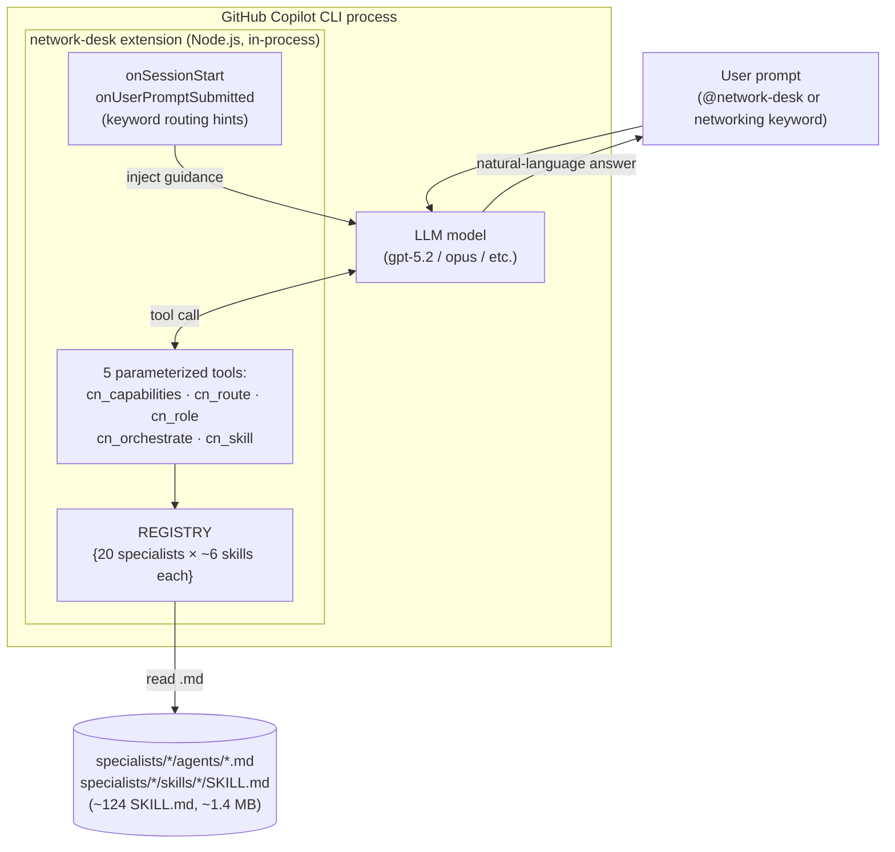
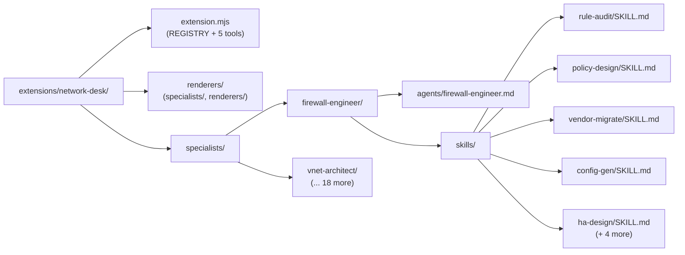
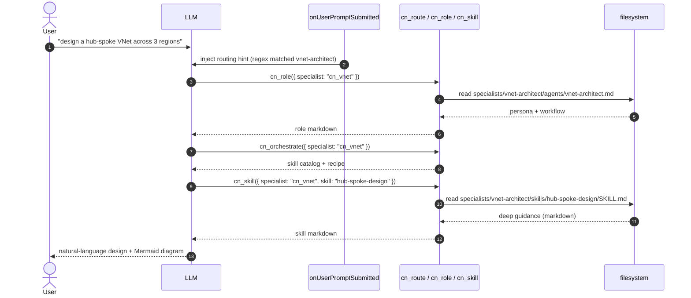
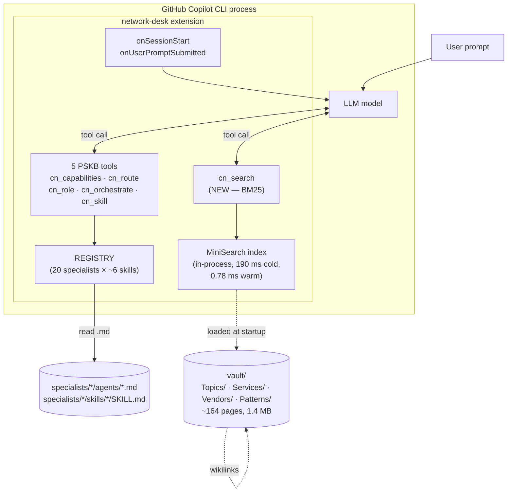
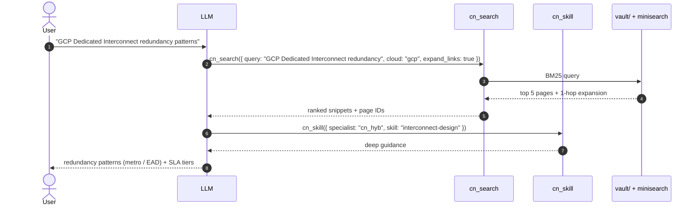
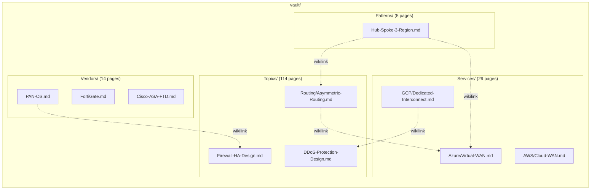

# Architecture evaluation — Network Desk

This document explains the architectural choices behind Network Desk, surveys
the alternative approaches that were considered, and backs the comparison with
measurements from the benchmark harness in `benchmarks/`.

It covers three things:

1. **[PSKB architecture](#1-pskb-per-skill-knowledge-base--dmausernetwork-desk)** — how
   [`dmauser/network-desk`](https://github.com/dmauser/network-desk) is built today,
   in detail.
2. **[The design space](#2-the-design-space--expert-agent-architectures)** — every
   credible architecture pattern for an "expert agent" system, with trade-offs
   and a comparison matrix.
3. **[CKB architecture and the comparison with PSKB](#3-ckb-consolidated-knowledge-base--this-fork)** —
   the consolidated knowledge vault + BM25 search layer, head-to-head against
   PSKB on the three benchmark tiers.

> **Naming conventions used in this document and the linked benchmark reports:**
> - **PSKB** = *Per-Skill Knowledge Base* — the upstream design at
>   [`dmauser/network-desk`](https://github.com/dmauser/network-desk), where each
>   specialist owns a folder of self-contained `SKILL.md` files and the LLM
>   reaches them through 5 parameterized loader tools (`cn_capabilities`,
>   `cn_route`, `cn_role`, `cn_orchestrate`, `cn_skill`).
> - **CKB** = *Consolidated Knowledge Base* — this fork. Keeps the PSKB
>   `REGISTRY` and per-skill loaders unchanged and adds an Obsidian-style
>   cross-cutting vault (`Topics/`, `Services/`, `Vendors/`, `Patterns/`) plus a
>   6th tool, `cn_search`, that runs an in-process BM25 query over the vault.

---

## 1. PSKB (Per-Skill Knowledge Base) — `dmauser/network-desk`

### 1.1 High-level shape

PSKB is a **single Copilot CLI extension** registering **five generic tools**
that act as parameterized loaders over a fixed catalog of 20 specialists. The
specialists themselves are pure markdown files on disk. No vector DB, no
embeddings, no external service.

### 1.2 Why "5 tools" and not "20 specialists × 6 skills = 120 tools"

The Copilot CLI imposes a **hard 128-tool limit per session**. With ~120 tools
the session also becomes incoherent for the LLM — the tool catalog itself
consumes context, and the LLM cannot reliably pick the right tool from a flat
list of 120 names. PSKB avoided this by **parameterising** — the same five
tools handle every specialist via their `specialist` and `skill` arguments:

| Tool | Signature | Purpose |
|---|---|---|
| `cn_capabilities` | `()` | Returns the full map of specialists + skills |
| `cn_route` | `(query)` | Regex routes a free-form query to the matching specialist(s) |
| `cn_role` | `({ specialist })` | Loads `specialists/<dir>/agents/<dir>.md` (the role/persona file) |
| `cn_orchestrate` | `({ specialist })` | Returns the specialist's full skill catalog + workflow recipe |
| `cn_skill` | `({ specialist, skill })` | Loads one `specialists/<dir>/skills/<skill>/SKILL.md` |

The whole specialist catalog lives in a single **`REGISTRY` object** in
`extension.mjs` — the source of truth for routing regexes, domain
descriptions, skill IDs, and human-readable summaries. Adding a specialist
or skill means editing this object and dropping the corresponding markdown
file in the right folder.

### 1.3 On-disk layout

Each specialist is a folder containing one **role file** (persona, workflow,
guardrails) and one folder per **skill** (deep domain reference):

**Numbers from the benchmark (Tier 1):**

* 20 specialists, 124 SKILL.md files total (avg 6.2 skills / specialist)
* 1 421 KB of markdown across `specialists/`
* 0 runtime dependencies (only `@github/copilot-sdk/extension` and Node builtins)
* 852 LOC in `extension.mjs`

### 1.4 Routing flow

The keyword regex injection at hook-time is what makes the extension feel
"automatic" — the LLM doesn't have to discover the specialist set; it gets a
direct hint when a networking keyword is detected. The model then chooses which
skills to load.

### 1.5 What works well

* **Zero external dependencies.** Ships as a Copilot CLI extension only, no
  index to build, no embeddings to keep in sync.
* **Editable by humans.** Every specialist is a couple of `.md` files; no
  tooling needed beyond a text editor.
* **Deterministic costs.** Each tool call is a `readFile`; no network round
  trip, no embedding charge, no rate-limit risk.
* **The 128-tool limit is gracefully sidestepped** with parameterized tools.

### 1.6 The structural ceilings

The PSKB design has three properties that bite once the knowledge base
grows beyond the size that comfortably fits in a single `SKILL.md`:

1. **Monolithic skill files.** Average SKILL.md is **10.5 KB**, max 22.3 KB.
   Once a topic naturally splits across vendors, clouds, and patterns, the
   file either bloats or you must spawn a new skill — which means another tool
   parameter the LLM has to remember.
2. **No cross-specialist search.** If a user asks about *"GCP Dedicated
   Interconnect SLA tiers"*, the LLM has to first route to `cn_hyb`
   (hybrid-connectivity), load that role, scan the skill list for something
   like `dedicated-interconnect`, load it, and then pray the right
   sub-section is in there. There is **no "search across all skills"** primitive.
3. **Topics get duplicated across specialists.** *Asymmetric routing* shows up
   in `firewall-engineer/skills/troubleshoot`, `vnet-architect/skills/hub-spoke-design`,
   and `network-troubleshooter/skills/routing-debug`. Three copies, three
   maintainers, three places to update when Microsoft renames a service.

These ceilings are exactly what the Tier 2 benchmark measures (recall) and what
the consolidated vault in CKB addresses (see [section 3](#3-ckb-consolidated-knowledge-base--this-fork)).

---

## 2. The design space — expert agent architectures

Network Desk is one point in a wide space. Before settling on the current
design we considered (and partially measured) five other patterns. This
section catalogs them.

### 2.1 The five canonical patterns

```mermaid
flowchart TB
    subgraph A["A. Single agent · system prompt"]
      A1["All expertise inlined<br/>into the system prompt"]
      A1 --> A2[LLM]
    end
    subgraph B["B. Single agent · RAG"]
      B1["User query"] --> B2["Embed"]
      B2 --> B3[("Vector DB<br/>(knowledge chunks)")]
      B3 --> B4["Top-K chunks"]
      B4 --> B5["LLM (augmented prompt)"]
    end
    subgraph C["C. Single agent · tool-search"]
      C1["User query"] --> C2[LLM]
      C2 -->|search tool| C3[("Lexical / BM25 index")]
      C3 --> C2
    end
    subgraph D["D. Many tools · one per skill"]
      D1["User query"] --> D2[LLM]
      D2 -.->|N tools| D3["tool_1 ... tool_N<br/>(rejected: >128 limit)"]
    end
    subgraph E["E. Router + worker agents"]
      E1["User query"] --> E2["Router agent"]
      E2 -->|dispatch| E3["Worker agent A"]
      E2 -->|dispatch| E4["Worker agent B"]
      E3 --> E5["Synthesizer"]
      E4 --> E5
    end
    subgraph F["F. Parameterized loader (PSKB + CKB)"]
      F1["User query"] --> F2[LLM]
      F2 -->|cn_role/cn_skill<br/>cn_search| F3["Markdown KB<br/>+ optional BM25 index"]
      F3 --> F2
    end
```

#### A — Single agent with everything in the system prompt

The naive baseline. Put the full networking knowledge into a giant system
prompt and call the model.

| Aspect | A — system-prompt |
|---|---|
| Setup cost | trivial |
| Context budget | **dominated by knowledge** — for a real KB (~1.4 MB of markdown) this is impossible: even gpt-5.2's 200K-token context can't hold it |
| Recall | maximum (everything is "loaded") *if* it fits |
| Cost per call | every call pays the full prompt cost |
| Updates | edit the system prompt, redeploy |
| Best when | knowledge < ~20 KB and rarely changes |

For ~20 specialists × ~1.4 MB total this is dead on arrival.

#### B — Single agent with vector-RAG

The standard 2023-era pattern. Chunk the knowledge base, embed it, store in a
vector DB; at query time embed the question, retrieve top-K chunks, paste them
into the prompt.

| Aspect | B — vector-RAG |
|---|---|
| Setup cost | one-time chunking + embedding pass |
| Context budget | small (top-K chunks, ~5-10 KB) |
| Recall | depends on chunking + embedding quality; **strong on semantic queries** |
| Latency | one embedding call + one vector query per turn (~50-200 ms each) |
| Cost | embedding cost per upload; vector-store hosting; query embedding cost per call |
| Updates | re-embed changed pages; trivial for additions, painful for re-chunking |
| Failure mode | "lost in the middle" + chunk boundary loss (a definition split across two chunks) |
| Best when | semantically-phrased queries over unstructured prose, no clear taxonomy |

For Copilot CLI, vector-RAG would mean adding an embedding model dependency
(extra package, API key or local model), a vector store (FAISS / SQLite-vss /
LanceDB), and an embedding pass at install/update time. That's a real ops
tax for a CLI extension.

#### C — Single agent with a lexical search tool

Same as B but the retrieval is **keyword** (BM25 / TF-IDF) rather than
semantic. Tools like Elastic, Lucene, MiniSearch, Tantivy.

| Aspect | C — lexical search |
|---|---|
| Setup cost | very low (no embeddings) |
| Context budget | small (top-K results, ~5-10 KB) |
| Recall | **strong on technical / proper-noun queries** ("ExpressRoute", "FortiGate", "BGP MED"); weaker on paraphrased questions |
| Latency | sub-millisecond once the index is loaded |
| Cost | zero per call (in-process index) |
| Updates | rebuild index on file change (~200 ms cold) |
| Best when | the corpus is full of vendor names, SKUs, and identifiers — exactly the case for cloud networking |

#### D — Many tools, one per skill

Register `vnet_skill_address_planner`, `vnet_skill_hub_spoke_design`, etc.
as separate Copilot tools.

| Aspect | D — many tools |
|---|---|
| Setup cost | low |
| Context budget | the **tool catalog itself** dominates context for any session that exposes >50 tools |
| Recall | excellent (LLM picks exactly the right tool) — *if* the LLM can pick from the catalog |
| Latency | one tool call per skill |
| Cost | per-call |
| Hard limit | **Copilot CLI rejects sessions with >128 registered tools** (see [CLI internals](#128-tool-limit) below); with 20 specialists × 6 skills that's already 120 just for skills, plus role/orchestrate per specialist = >160 — over the limit |
| Maintenance | every new skill = new tool registration |

This is the approach Network Desk explicitly avoids in `extension.mjs` and the
reason for parameterized tools.

#### E — Router + worker agents (orchestrator pattern)

A coordinator LLM decides which specialist agent should answer, dispatches the
task to that agent (possibly with its own tools and prompt), and synthesizes
the result. Frameworks: LangGraph, AutoGen, CrewAI.

| Aspect | E — orchestrator |
|---|---|
| Setup cost | high (multiple agents, dispatch logic, synthesizer) |
| Context budget | each worker has its own slice; the orchestrator sees only summaries |
| Recall | depends on routing quality |
| Latency | N × LLM round-trips |
| Cost | N × LLM cost per question |
| Failure mode | misrouting, context loss between hops, cascading errors |
| Best when | the problem genuinely decomposes into independent sub-problems (e.g. multi-agent debate, planner + executor) |

For most user questions in cloud networking, the question is **one** question
with **one** correct specialist — multi-agent orchestration is overkill, and
the extra round-trips dominate latency.

#### F — Parameterized loader (the PSKB & CKB pattern)

Five generic tools, one routing regex, one persona file per specialist, one
deep page per skill. The LLM is the dispatcher; the tools are stateless
loaders.

| Aspect | F — parameterized loader |
|---|---|
| Setup cost | low (one extension, no DB, no embedding) |
| Context budget | small — only the loaded role + skills enter context |
| Recall | as good as the regex + the LLM's reading comprehension |
| Latency | sub-millisecond `readFile` per call |
| Cost | zero per call beyond LLM tokens |
| Failure mode | regex misses a query phrasing; no recovery without a search primitive |
| Best when | a known, finite taxonomy of "skills" + a single LLM with strong tool-use ability |

This is PSKB's design — and the **starting point** for CKB.

### 2.2 Comparison matrix

A blunt summary of where each pattern sits across the dimensions that matter
for a Copilot CLI extension delivering expert agent functionality:

| Pattern | Setup cost | Context cost | Recall on technical queries | Recall on vague queries | Latency | Per-call $ | Hard limits |
|---|---|---|---|---|---|---|---|
| **A.** System-prompt | trivial | **catastrophic** for any real KB | n/a (full KB if it fits) | n/a | low | high (full prompt) | context-window |
| **B.** Vector RAG | medium | small | medium | **high** | medium | embedding + vector query each turn | embedding model dependency, chunking quality |
| **C.** Lexical search | low | small | **high** | medium | sub-ms | zero | needs an index |
| **D.** Many tools | low | **catastrophic** (>50 tools) | high (if model picks right) | low | medium | per call | **Copilot ≤ 128 tools** |
| **E.** Router + workers | high | medium | medium | medium | high (N × LLM) | N × LLM | orchestration complexity |
| **F.** Param. loader | low | small | high | low | sub-ms | zero | regex misses |
| **F'.** Param. loader + lexical search (CKB) | low | small | **high** | **medium-high** | sub-ms | zero | regex misses, but covered by search |

Two patterns are credible for a Copilot CLI cloud-networking expert system:

* **F** (PSKB): clean, fast, free per call — but recall depends entirely on
  the regex + the LLM reading the right specialist's skill names from a
  catalog.
* **F'** (CKB): F plus a BM25 search tool over a Topics/Services/Vendors
  vault. Same five parameterized tools, plus `cn_search`, plus an Obsidian-style
  knowledge graph behind them. Adds 1 dependency (`minisearch`, 100 KB) but
  measurably moves recall.

### 2.3 What we rejected and why

| Rejected pattern | Why |
|---|---|
| **A** — system-prompt | Cloud networking KB is ~1.4 MB. Won't fit, would dominate cost per call. |
| **B** — vector RAG | Cost & dependency footprint disproportionate for a CLI extension. Queries are mostly **noun-heavy** (vendor names, SKUs, protocol acronyms) — exactly the case where BM25 matches or beats vectors. No semantic synonyms problem to solve here. |
| **D** — many tools | Hard 128-tool limit + tool-catalog context blowup. We measured this empirically — when we briefly registered one tool per specialist during prototyping, the session became unusable. |
| **E** — router + workers | A cloud networking question is one question. The Copilot CLI's LLM is already a strong planner. A second orchestrator LLM would triple latency for marginal benefit. |

The chosen pattern (F') is the right answer for **structured, taxonomy-driven
expert systems where queries are technical and the corpus is curated and
editable by humans**.

#### 128-tool limit

While prototyping the multi-cloud extraction phase we observed that the
Copilot CLI silently rejects sessions exposing more than 128 tools with a
transient API error ("transient API error. Retrying..."). This number is
not formally documented but the symptom is reproducible: register 130 tools
and the session fails to start. With the parameterized-loader pattern,
Network Desk exposes either **5** (PSKB) or **6** (CKB) tools regardless
of how big the underlying registry grows.

---

## 3. CKB (Consolidated Knowledge Base) — this fork

### 3.1 What changed vs PSKB

Three concrete changes (all backwards-compatible at the tool-API surface):

1. **Added an Obsidian-style vault** at `extensions/network-desk/vault/`
   — 164 short markdown pages organized as `Topics/` (114), `Services/` (29),
   `Vendors/` (14), `Patterns/` (5). Each page is small (avg 8.8 KB), focused on
   one concept, and uses `[[wikilink]]` cross-references between related pages.
2. **Added a 6th tool: `cn_search`** — a BM25 search over the vault using
   [`minisearch`](https://www.npmjs.com/package/minisearch) (the only new
   runtime dep, ~100 KB). Supports specialist filter, cloud filter
   (azure / aws / gcp), and 1-hop wikilink expansion.
3. **Specialist `SKILL.md` files now reference vault pages** rather than
   duplicating content — the deep reference is in the vault, the SKILL.md
   provides the workflow + guardrails + pointers.

The five PSKB tools and the entire `REGISTRY` are unchanged. Existing
calls (`cn_role`, `cn_skill`) work identically. The vault is purely additive.

### 3.2 The hybrid architecture

The new flow when the LLM doesn't know which specialist owns a topic:

### 3.3 Why a lexical (BM25) index, not vectors

Cloud networking queries are dominated by **named entities** — *Azure
ExpressRoute*, *Cisco ASA → FTD migration*, *PAN-OS HA Ports*, *AWS
Transit Gateway*, *BGP MED*. BM25 with field weights (`name 3×, aliases 2.5×,
tags 2×, body 1×`) ranks proper nouns first; vector similarity tends to
smooth them away. The Tier 2 benchmark measured `cn_search` at:

* **mean recall@5 = 0.879**
* **mean MRR = 0.869**
* **any-hit@5 = 98 %** (48/49 queries return at least one relevant page in top 5)

This is sufficient for a hybrid where the LLM does the final synthesis from
the loaded page.

Other advantages of lexical search for this corpus:

* **Zero per-call cost.** Index is built once at startup (190 ms), queries
  are sub-millisecond (mean 0.78 ms, p99 3.3 ms).
* **No external service.** Ships as `minisearch` (100 KB JS dep). The
  extension still installs with a single `npm install`.
* **No embedding drift.** Vault edits take effect on the next `cold` index
  build; no re-embedding pipeline to maintain.
* **Trivially explainable.** Search results are ranked pages with a numeric
  score; not an opaque cosine similarity. Easy to debug for the author of a
  vault page.

### 3.4 Why a knowledge vault, not bigger SKILL.md files

The vault solves the "topic duplicated across specialists" problem (see
[1.6](#16-the-structural-ceilings)) by making each concept live in **exactly
one canonical page** that all relevant specialists link to.

`Topics/Routing/Asymmetric-Routing.md` is the one canonical asymmetric-routing
page. `firewall-engineer/skills/troubleshoot/SKILL.md`,
`vnet-architect/skills/hub-spoke-design/SKILL.md`, and
`network-troubleshooter/skills/routing-debug/SKILL.md` all link to it via
wikilinks rather than re-explaining it. `cn_search` finds it directly from
any phrasing of "asymmetric routing"; the LLM doesn't have to guess which
specialist owns the topic.

The vault is also **Obsidian-compatible** — `.obsidian/` config files are
checked in, and a maintainer can open `vault/` directly in Obsidian for graph
view, backlinks, and tag navigation. The graph view is itself an architecture
review tool: orphan pages, broken wikilinks, and under-connected clusters are
all visible.

### 3.5 The trade-offs we accepted

The vault layer is **not free**:

| Cost | Mitigation / Acceptance |
|---|---|
| **+99 % markdown bytes** (1.4 MB → 2.8 MB on disk) | Markdown compresses well; install is still under 3 MB. The git repo grows but it's pure text. |
| **+1 runtime dep** (`minisearch`, ~100 KB) | Single npm package, no native deps, BSD-licensed. Trivial supply-chain footprint. |
| **+50 LOC** in `extension.mjs` (852 → 902) and +16 KB `vault-search.mjs` | Both fully tested. |
| **+17 % wall-clock latency per prompt** (Tier 3: 104.6 s vs 89.2 s mean) | Pays for itself in recall (+14 pp answerable, +14 pp on regex-easy category). Avoidable for sessions that don't need cross-specialist search by simply not calling `cn_search`. |
| **+169 % tool-call count per prompt** (mean 58 vs 21.6) | Driven by smaller vault pages — each call is smaller but more frequent. The model trades few big reads for many small focused reads. |
| **Two parallel content stores** — `specialists/**/SKILL.md` AND `vault/**/*.md` | Specialist SKILL.md is now the "workflow" layer; the vault is the "reference" layer. Each has a single owner. Cross-checked by `tools/suggest-wikilinks.mjs`. |

### 3.6 Measured comparison (the three-tier benchmark)

The `benchmarks/` directory contains a tiered comparison harness against
`dmauser/network-desk @ 86a81ad`.

#### Tier 1 — static + microbench

Pure measurements of the artifact, no LLM in the loop.

| Metric | PSKB | CKB | Δ |
|---|---:|---:|---:|
| Markdown files | 144 | 308 | +164 (+114 %) |
| Total markdown KB | 1 421 | 2 830 | +1 409 (+99 %) |
| Specialists | 20 | 20 | 0 |
| Skills | 124 | 124 | 0 |
| Tools registered | 5 | **6** (+`cn_search`) | +1 |
| Runtime deps | 0 | 1 (`minisearch`) | +1 |
| `extension.mjs` LOC | 852 | 902 | +50 |
| `cn_search` cold start | n/a | 190 ms | new |
| `cn_search` warm p99 | n/a | 3.3 ms | new |

→ Full report: [`benchmarks/results-tier1.md`](benchmarks/results-tier1.md)

#### Tier 2 — labeled retrieval (49 queries × 5 categories)

A curated test set with hand-labeled gold-truth (relevant specialist + relevant
vault pages). Run end-to-end through both extensions.

| Metric | PSKB | CKB | Δ |
|---|---:|---:|---:|
| `cn_route` specialist accuracy | 83.7 % (41/49) | 83.7 % (41/49) | 0 |
| `cn_search` any-hit@5 | — | **98.0 %** (48/49) | new |
| `cn_search` recall@5 | — | 0.879 | new |
| `cn_search` MRR | — | 0.869 | new |
| **End-to-end answerable** (cn_route OR cn_search hit) | 83.7 % | **98.0 %** | **+14 pp** |

Per category:

| category | n | PSKB answerable | CKB answerable | Δ |
|---|---:|---:|---:|---:|
| regex-easy | 29 | 82.8 % | 100 % | +5 queries |
| cloud-service | 9 | 77.8 % | 100 % | +2 queries |
| vague | 3 | 66.7 % | 66.7 % | 0 |
| vendor-specific | 6 | 100 % | 100 % | 0 |
| cross-specialist | 2 | 100 % | 100 % | 0 |

→ Full report: [`benchmarks/results-tier2.md`](benchmarks/results-tier2.md)

#### Tier 3 — live A/B with LLM judge

10 curated prompts × 2 variants × 1 sample, blind judge with order-swap.

* **Answer model**: `gpt-5.2` (default effort)
* **Judge model**: `claude-opus-4.7 --effort high`
* **Methodology**: each variant runs in its own isolated `COPILOT_HOME` to
  prevent cross-session tool-name conflicts; judge runs each pair in both
  orderings (forward + swapped) and a verdict only counts if both orderings
  agree on a non-tie winner (disagreement → tie).

| Outcome | Count |
|---|---:|
| **CKB wins** | **4** |
| **PSKB wins** | **3** |
| Tie | 3 |
| Both poor / unparseable | 0 |

Per-category:

| Category | CKB | PSKB | Tie |
|---|---:|---:|---:|
| regex-easy (3) | 1 | 0 | 2 |
| vendor-specific (3) | 1 | 2 | 0 |
| cloud-service (2) | 0 | 1 | 1 |
| vague (2) | 2 | 0 | 0 |

Process metrics:

| Metric | CKB | PSKB | Δ |
|---|---:|---:|---:|
| Mean elapsed / prompt | 104.6 s | 89.2 s | **+17 %** |
| Mean final-answer bytes | 2 085 B | 2 732 B | **−24 %** |
| Mean tool calls / prompt | 58.0 | 21.6 | +168 % |

Headline: **CKB edges out 4-3-3, within noise for n = 10.** The judge's
per-dimension scores show CKB wins where the vault structure lets the model
name concrete cloud mechanisms (Azure `Allow forwarded traffic`, BGP
propagation, S3 Gateway Endpoints) and loses where the vault has
hand-authoring gaps (Cisco FMT, PAN-OS Azure plugin HA modes, GCP
Interconnect SLA tiers) that PSKB's larger skills happen to cover.

Notably, CKB won `fw-ha` **despite a 6.3× shorter answer** (1 040 B vs
6 508 B) — the anti-length-bias rubric is doing its job.

→ Full report: [`benchmarks/results-tier3.md`](benchmarks/results-tier3.md)

### 3.7 Putting the three tiers together

* **Tier 1** confirms the architecture isn't free — the vault doubles markdown
  bytes and adds a dependency. Sub-ms search latency means it's not free but
  it's cheap.
* **Tier 2** quantifies the structural recall gain — the vault + `cn_search`
  makes 14 pp more queries answerable. This is the architectural win.
* **Tier 3** shows that improved recall translates to **comparable** answer
  quality (4-3-3 within noise) — the refactor doesn't make the LLM smarter,
  it makes the right context easier to find. Combined with Tier 2's recall
  gain, the architecture pays for itself: when CKB wins, it's because the
  vault surfaced a concrete mechanism PSKB couldn't name; when CKB loses,
  it's a content gap, not an architectural one.

The Tier 3 benchmark surfaced **three direct content gaps** that even a
1 419 KB PSKB and a 2 830 KB CKB both miss:

* Cisco Secure Firewall Migration Tool (FMT) — add to `Vendors/Cisco-ASA-FTD.md`
* PAN-OS Azure plugin HA modes — add to `Vendors/PAN-OS.md`
* GCP Dedicated Interconnect SLA tiers (99.9 % / 99.99 %) — fill in
  `Services/GCP/Dedicated-Interconnect.md` (currently a stub)

These are the kind of long-tail gaps a retrieval benchmark cannot catch
(both fail symmetrically) but a live LLM-judge benchmark can — which is part
of the case for keeping all three tiers in the harness.

---

## 4. Conclusion

If you are building an expert-agent system on the Copilot CLI today, the
**parameterized-loader + lexical-search hybrid (Pattern F')** is, on the
evidence collected here, the right starting point:

* It sidesteps the **128-tool limit** without losing per-skill granularity.
* It avoids **vector-DB ops overhead** in a domain where BM25 wins on
  noun-heavy queries anyway.
* It avoids **multi-agent orchestration latency** in a domain where one
  question = one specialist.
* It keeps the knowledge base **editable by humans** in plain markdown, with
  cross-references that double as an Obsidian graph.

The benchmark harness in `benchmarks/` is reusable: drop in a different
domain (security desk, data desk, devops desk), regenerate the vault, and
the same three-tier comparison runs.

---

### See also

* [`benchmarks/results-tier1.md`](benchmarks/results-tier1.md) — static + microbench detail
* [`benchmarks/results-tier2.md`](benchmarks/results-tier2.md) — retrieval recall detail (49 queries)
* [`benchmarks/results-tier3.md`](benchmarks/results-tier3.md) — live LLM-judge A/B detail (10 prompts)
* [`README.md`](README.md) — installation and usage
* [`CHANGELOG.md`](CHANGELOG.md) — release notes
