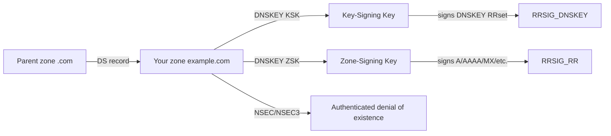
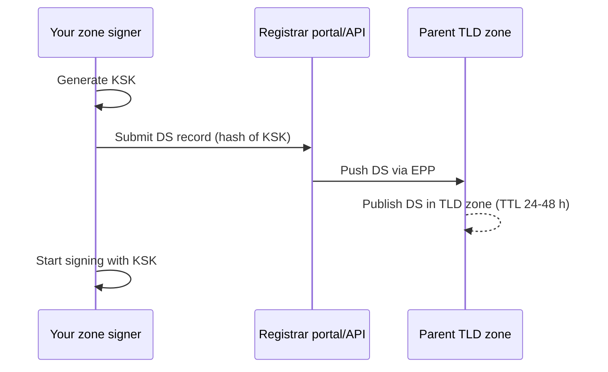
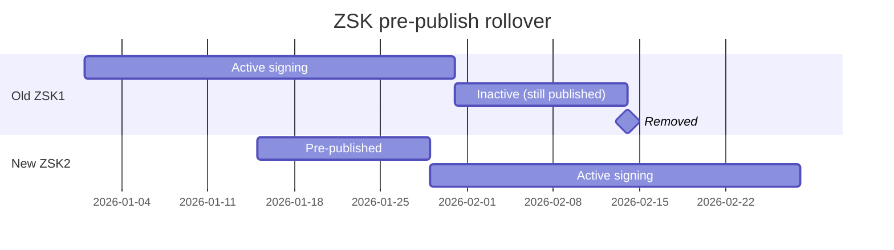

# Skill: DNSSEC Design & Operations

> Pairs with `dns_skill_zone_design` (zone topology) and `dns_skill_record_audit` (zone hygiene). Use this skill to design and operate DNSSEC for authoritative zones and validating resolvers. Analysis only.

## Purpose

Design DNSSEC end-to-end: algorithm selection, key hierarchy (KSK / ZSK / CSK), signing automation, secure key storage, **DS-record delegation** with the parent zone, monitoring, rollover, and emergency rollback. Covers Azure DNS, AWS Route 53, GCP Cloud DNS, and BIND-style self-managed authoritative servers.

---

## Why DNSSEC

DNSSEC adds **authenticated origin** and **data integrity** to DNS — clients can prove an answer came from the legitimate zone and wasn't tampered with on-path. It does **not** add confidentiality (use DoT/DoH for that). DNSSEC is now a baseline requirement for many compliance regimes (PCI-DSS 4.0, FedRAMP) and is increasingly required by registrars for high-trust TLDs.

---

## Concept map



- **KSK** (Key-Signing Key): signs the DNSKEY RRset only. Rarely rotates. Hash published as DS at the parent.
- **ZSK** (Zone-Signing Key): signs all other RRsets. Rotates more often.
- **CSK** (Combined Signing Key): a single key plays both roles. Simpler ops; smaller zones favor this.
- **DS record**: hash of the KSK, published at the parent zone. The "chain of trust" anchor.
- **Authenticated denial of existence**: proves a name does *not* exist. Mechanisms vary by platform (NSEC, NSEC3, or provider-specific compact denial).

---

## Algorithm selection

| Algorithm | RFC | Key sizes | Use it? |
|---|---|---|---|
| RSA/SHA-256 (alg 8) | 5702 | 2048-4096 b | Yes — widely supported, safe default |
| RSA/SHA-512 (alg 10) | 5702 | 2048-4096 b | Avoid — larger signatures, no security gain |
| ECDSA P-256/SHA-256 (alg 13) | 6605 | 256 b | **Preferred** — small signatures, fast validation |
| ECDSA P-384/SHA-384 (alg 14) | 6605 | 384 b | OK — overkill for most zones |
| Ed25519 (alg 15) | 8080 | 256 b | Preferred — smallest, fastest; check resolver support |
| Ed448 (alg 16) | 8080 | 456 b | Edge cases only |
| RSA/SHA-1 (algs 5, 7) | — | — | **Forbidden** — deprecated, do not use |
| GOST (alg 12) | — | — | Russia-specific; avoid outside required environments |

**Default:** ECDSA P-256/SHA-256 (alg 13). Smallest signatures (DNS response fits in UDP without fragmentation), broad support since ~2017, hardware acceleration on modern resolvers.

For platforms that expose NSEC3 tuning, follow RFC 9276 and avoid high iteration counts because they amplify resolver load.

---

## Vendor-specific enablement

### Azure DNS (Public Zones)

DNSSEC for Azure Public DNS was GA in 2024. CSK-based with ECDSA P-256.

```bash
az network dns dnssec-config create --resource-group rg-dns --zone-name example.com

# Get DS records to publish at the parent registrar
az network dns dnssec-config show --resource-group rg-dns --zone-name example.com \
  --query "signingKeys[].delegationSignerInfo"
```

Azure DNS handles signing, key rotation, and authenticated denial of existence using RFC 9824 compact denial of existence. Your operational tasks:
1. Enable DNSSEC.
2. Publish the DS records at your registrar.
3. Monitor chain validity and provider state.

### AWS Route 53

```bash
# Create KSK in KMS (asymmetric, ECC_NIST_P256, key usage SIGN_VERIFY)
aws kms create-key --customer-master-key-spec ECC_NIST_P256 \
  --key-usage SIGN_VERIFY --description "Route53 DNSSEC KSK example.com"

# Create the KSK in Route 53 referencing the KMS key
aws route53 create-key-signing-key \
  --hosted-zone-id Z123 --key-management-service-arn arn:aws:kms:... \
  --name example-com-ksk --status ACTIVE

# Enable signing on the hosted zone
aws route53 enable-hosted-zone-dnssec --hosted-zone-id Z123

# Retrieve DS for the parent
aws route53 get-dnssec --hosted-zone-id Z123
```

Route 53 manages the ZSK internally and rotates it automatically. **You** manage the KSK via KMS — and KMS key deletion is *destructive*: schedule with a 30-day delay.

### GCP Cloud DNS

```bash
# Create the zone with DNSSEC on
gcloud dns managed-zones create example-com \
  --dns-name=example.com. \
  --dnssec-state=on \
  --ksk-algorithm=ecdsap256sha256 --ksk-key-length=256 \
  --zsk-algorithm=ecdsap256sha256 --zsk-key-length=256

# Get DS records
gcloud dns dns-keys list --zone=example-com --format="value(ds_record_data)"
```

GCP rotates the ZSK automatically; KSK rotation is a manual one-click operation.

### BIND9 (self-managed)

```bash
# Generate keys (KSK then ZSK, ECDSA P-256)
dnssec-keygen -a ECDSAP256SHA256 -f KSK -n ZONE example.com
dnssec-keygen -a ECDSAP256SHA256          -n ZONE example.com

# Add keys to named.conf zone block
zone "example.com" {
    type primary;
    file "example.com.zone";
    dnssec-policy default;       # automatic signing + rollover (BIND 9.16+)
    inline-signing yes;
};

# Publish DS to parent
dnssec-dsfromkey -2 Kexample.com.+013+12345.key
```

Store private keys in HSM via PKCS#11 for production zones.

---

## Publishing DS at the parent (the most error-prone step)



**Order matters**: publish DNSKEY (start signing) → wait for TTL → submit DS at registrar → wait for TLD publish. Reverse causes a validation outage for all DNSSEC-aware resolvers.

Verify chain end-to-end before considering complete:

```bash
# Walk the chain from root
dig +trace +dnssec example.com A

# Validate with Verisign analyzer
# https://dnssec-analyzer.verisignlabs.com/example.com

# Quick DNSViz visualization
# https://dnsviz.net/d/example.com/dnssec/
```

---

## Key rollover

### ZSK rollover — Pre-publish method (most common)



Most managed services (Route 53, Cloud DNS, Azure DNS) handle this automatically. For BIND, set `dnssec-policy` and let it manage state.

### KSK rollover — Double-DS method

1. Generate new KSK; add to DNSKEY RRset alongside old.
2. Submit **new DS** at registrar; both DS records published in parent.
3. Wait for **parent TTL** (24-48 h) so all resolvers see both DS.
4. Switch active KSK signing the DNSKEY RRset to the new key.
5. Remove old DS at registrar.
6. After parent TTL, remove old KSK from zone.

Cadence: ZSK every 30-90 d; KSK every 1-2 y (or never if algorithm/key size still secure).

---

## Monitoring

Always alert on:

- **Signature near expiry** — RRSIGs have an expiration (`signature-validity-period`). If signer fails, expirations approach. Alert at T-7d.
- **DS-DNSKEY mismatch** — DS at parent no longer hashes any DNSKEY in the zone. Immediate page.
- **Bogus answers** — set up a validating resolver that queries your zone; alert on `SERVFAIL` with `ad=0`.
- **Algorithm rollover not advancing** — for managed services, check state-machine progress.
- **CDS / CDNSKEY** records present unexpectedly (RFC 7344 child-to-parent automation triggers).

Tools:

| Tool | Purpose |
|---|---|
| DNSViz (`dnsviz.net`) | Visualization of chain state |
| Verisign DNSSEC Analyzer | Quick chain check |
| Zonemaster | Comprehensive zone health including DNSSEC |
| `delv` (BIND) | Validating recursive query (replaces `dig +sigchase`) |
| `kdig` (Knot) | Modern validating dig replacement |

---

## Emergency rollback

If a misconfiguration causes resolution failures for DNSSEC-aware resolvers:

1. **If the zone is irreparably broken, break the chain of trust at the parent first**: remove the DS record at the registrar/parent zone.
2. Wait for the DS TTL and parent-zone propagation to expire, then confirm validating resolvers no longer see a DS for the child zone.
3. Only after the DS is gone from validators, unsign/disable DNSSEC on the child zone. For Azure DNS, follow the official unsign sequence: https://learn.microsoft.com/azure/dns/dnssec-unsign.
4. **Faster path** (if keys are valid and only signatures are stale): regenerate or republish signatures instead of unsigning, when the provider supports it.
5. **Communication**: notify dependents — DNSSEC failures look like total DNS outage to validating clients (Google Public DNS, Cloudflare 1.1.1.1, many ISPs).

---

## Verification checklist

- [ ] Algorithm chosen (default: ECDSA P-256, alg 13).
- [ ] Keys generated and stored in HSM / KMS / Key Vault — *never* in plain files for prod.
- [ ] DNSKEY RRset published with both KSK and ZSK (or single CSK).
- [ ] DS records submitted at registrar and verified visible in parent zone.
- [ ] Chain validates end-to-end with `dig +dnssec` and DNSViz.
- [ ] Authenticated denial method understood for the platform: Azure RFC 9824 compact denial, provider-managed NSEC/NSEC3, or RFC 9276-aligned NSEC3 where configurable.
- [ ] Auto-rollover policy enabled (managed) or scripted (self-managed).
- [ ] Three monitoring signals wired: signature expiry, DS-DNSKEY consistency, external validation probe.
- [ ] Rollback runbook documented with parent-TTL timing.
- [ ] Registrar account secured (MFA + lock) — registrar is the new attack surface.

---

## References

- RFC 4033/4034/4035 (DNSSEC core)
- RFC 6605 (ECDSA in DNSSEC)
- RFC 8080 (Ed25519/Ed448 in DNSSEC)
- RFC 9276 (NSEC3 parameter guidance)
- Azure DNS DNSSEC: https://learn.microsoft.com/azure/dns/dnssec
- Route 53 DNSSEC: https://docs.aws.amazon.com/Route53/latest/DeveloperGuide/dns-configuring-dnssec.html
- GCP Cloud DNS DNSSEC: https://cloud.google.com/dns/docs/dnssec-config
- BIND DNSSEC Policy: https://bind9.readthedocs.io/en/latest/dnssec-guide.html
- DNSViz: https://dnsviz.net/

**Analysis only — verify against vendor documentation before applying.**
