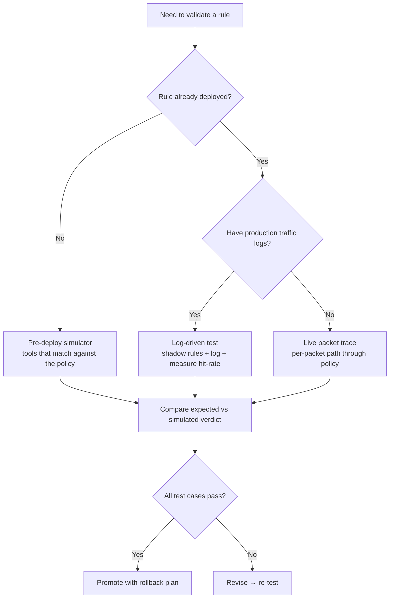

# Skill: Firewall Policy Testing & Rule Simulation

> Pairs with `fw_skill_policy_design` (write) and `fw_skill_rule_audit` (review). Use this skill to **validate** rules — proposed or live — **before** they reach production. Analysis only: never modify rules without explicit user confirmation.

## Purpose

Test firewall rules without putting traffic at risk. Covers vendor-native simulators, log-driven validation, packet-trace tools, automated rule-coverage testing, and a structured pre-deployment checklist.

---

## Decision tree — which test mode?



---

## Vendor-native simulators

### Azure Firewall — Policy Analytics & rule hit metrics

```bash
# Enable Policy Analytics on a Firewall Policy (collects rule-hit telemetry)
az network firewall policy update \
  --name fw-policy --resource-group rg-hub \
  --enable-policy-analytics true

# Query rule hit counts via Log Analytics (Azure Monitor)
# KQL — top hit rules in last 24h
AzureDiagnostics
| where Category == "AzureFirewallNetworkRule" or Category == "AzureFirewallApplicationRule"
| where TimeGenerated > ago(24h)
| summarize hits = count() by Resource, RuleName = tostring(parse_json(msg_s).rule)
| sort by hits desc
```

Policy Analytics also surfaces: **unused rules**, **rule shadowing**, **IP-group dependency drift**, and **traffic that didn't match any rule** (the implicit deny).

### AWS Network Firewall — log-driven test with Suricata rules

```bash
# Stand up a non-prod firewall endpoint with a copy of the rule group
# in "alert-only" mode (Suricata: replace `drop`/`reject` with `alert`).

# Send a test flow from a test EC2 to the target
aws logs filter-log-events \
  --log-group-name /aws/network-firewall/alert \
  --filter-pattern '{ $.event.src_ip = "10.0.10.5" }' \
  --start-time $(date -d '5 min ago' +%s%3N)
```

For AWS Network Firewall, keep analyzer scope explicit: `--analyze-rule-group` is for stateless rule-group behavior, not full stateful Suricata evaluation. For stateful rules, export/describe the rule group, validate Suricata syntax offline, and test in a non-production firewall endpoint before deploy.
```bash
aws network-firewall describe-rule-group --rule-group-arn <arn>
# Then validate Suricata rules with the current Suricata toolchain and lab traffic before production.
```
Reference: https://docs.aws.amazon.com/cli/latest/reference/network-firewall/describe-rule-group.html

### Palo Alto PAN-OS — `test security-policy-match`

```bash
# CLI — query "what policy would apply to this flow?"
test security-policy-match \
  from trust to untrust source 10.1.1.5 destination 203.0.113.10 \
  destination-port 443 protocol 6 application ssl

# Returns: matched rule name, action, profile group — without sending any packet
```

For commit-time validation use **Best Practice Assessment (BPA)** and **policy optimizer** (Panorama → Optimizer tab) which flags unused, redundant, and overly permissive rules.

### Fortinet FortiGate — policy lookup + packet sniffer

```bash
# CLI — predict matched policy for a 5-tuple
diagnose firewall policy lookup vd root \
  src-ip 10.1.1.5 dst-ip 203.0.113.10 dst-port 443 protocol 6 ingress-intf port1

# Live packet trace with policy verdict
diagnose debug enable
diagnose debug flow filter addr 10.1.1.5
diagnose debug flow trace start 10
```

FortiAnalyzer ships a **policy hit count report** and a **rule shadowing detector**.

### Check Point R81+ — `fw monitor` + SmartConsole rule-base analyzer

```bash
# Inline packet trace through policy
fw monitor -e "accept src=10.1.1.5;" -F "10.1.1.5,0,203.0.113.10,443,6"
# Position markers (i,I,o,O) show pre/post inspection at each chain
```

SmartConsole → **Manage Policies → Analyze Policy** flags shadowed/unused rules and policy package conflicts.

### Cisco ASA / FTD — `packet-tracer`

```bash
packet-tracer input INSIDE tcp 10.1.1.5 12345 203.0.113.10 443 detailed
# Returns: every phase (ACL, NAT, inspect, route) with allow/drop verdict
```

FTD adds **rule hit count** in FMC and a **rule comparison tool** between policy versions.

### Vendor validation matrix

| Platform | Primary pre-deploy validation | Runtime/log validation |
|---|---|---|
| Azure Firewall | Policy Analytics, rule hit metrics, non-prod policy clone | Azure Monitor resource-specific logs; verify current tables in Azure docs |
| AWS Network Firewall | Stateless analyzer for stateless groups; Suricata syntax + lab endpoint for stateful groups | CloudWatch/S3/Kinesis alert and flow logs |
| GCP Cloud Firewall / Cloud Armor | `gcloud` describe/dry-run where supported; preview Cloud Armor policy rules | Firewall Rules Logging and Cloud Armor request logs |
| Palo Alto PAN-OS | `test security-policy-match`, commit validation, BPA/Policy Optimizer | Traffic logs, threat logs, rule hit counts |
| Fortinet FortiGate | `diagnose firewall policy lookup`, FortiManager install preview | FortiAnalyzer reports, debug flow, packet sniffer |
| Check Point | SmartConsole policy analysis and verify/install preview | SmartLog, `fw monitor`, hit counts |
| Cisco ASA/FTD | `packet-tracer`, FMC policy comparison/deploy preview | Connection events, ASP drops, syslog |
| Juniper SRX | `show security match-policies`, commit check/confirmed commit | `show security flow session`, policy hit counts, traceoptions |
| Zscaler ZIA/ZPA | Admin Portal policy test/preview where available; scoped pilot policy | NSS logs, user/session logs, test users/locations |
| Sophos XG/XGS | Policy simulation/validation in UI where available; lab appliance | Log Viewer, packet capture, conntrack diagnostics |
| OPNsense | Config validation, `pfctl -nf` on generated pf rules when applicable | `pfctl -sr -v`, live logs, packet capture |
| pfSense | Config validation, `pfctl -nf` on generated pf rules when applicable | `pfctl -sr -v`, firewall logs, packet capture |
| VyOS | `commit-confirm`, lab config load, verify release-specific syntax | `show firewall ... statistics`, `monitor firewall`, packet capture |
| iptables/nftables | `iptables-restore --test` / `nft --check -f` | TRACE/log-only chains, counters, conntrack |

### Cloud-agnostic: nftables / iptables / VyOS / pfSense / OPNsense

```bash
# nftables — dry-run policy evaluation
nft --check -f new-ruleset.nft

# iptables — log-only test (precede ACCEPT/DROP with LOG to a separate chain)
iptables -N TEST_LOG
iptables -A TEST_LOG -j LOG --log-prefix "TEST-RULE: "
iptables -I FORWARD 1 -s 10.1.1.5 -d 203.0.113.10 -p tcp --dport 443 -j TEST_LOG

# Verify hits in dmesg / journalctl, then promote
```

---

## Log-driven validation (production)

When the rule is already live but you need confidence:

1. **Add a logging-only shadow rule** above the rule under test (same match criteria, action = log+pass-through).
2. Let it run for 24-72h covering your traffic patterns (include peak, batch windows, off-hours).
3. **Compare hit volumes**: shadow rule hits ≈ expected rule hits. If shadow ≫ expected, you have unintended matches.
4. **Cross-reference with flow logs**: NSG flow logs (Azure), VPC Flow Logs (AWS), VPC Flow Logs (GCP) — confirm the same 5-tuples appear at the network layer.
5. **Look for shadowed cases**: traffic that *would have* matched the shadow rule but hit an earlier-matching rule first → that earlier rule is shadowing your new one.

---

## Automated test-cases (treat rules as code)

Test rule changes the same way you test application code:

```yaml
# tests/fw-policy.yaml
cases:
  - name: "App tier to DB tier on 5432 allowed"
    src: 10.1.10.5
    dst: 10.1.20.10
    port: 5432
    proto: tcp
    expected: allow
    expected_rule: app-to-db

  - name: "App tier to internet on 443 must go via proxy"
    src: 10.1.10.5
    dst: 203.0.113.10
    port: 443
    proto: tcp
    expected: deny
    reason: "Direct egress to internet bypasses content inspection"

  - name: "DB tier outbound DNS allowed only to internal resolver"
    src: 10.1.20.10
    dst: 10.0.0.4
    port: 53
    proto: udp
    expected: allow
    expected_rule: db-dns-internal

  - name: "DB tier outbound DNS to public resolver denied"
    src: 10.1.20.10
    dst: 1.1.1.1
    port: 53
    proto: udp
    expected: deny
```

Run via a harness that calls the vendor simulator (`test security-policy-match`, `packet-tracer`, `diagnose firewall policy lookup`, etc.) and asserts the verdict. Run on **every PR** that changes the rule base. Integrate with `nauto_skill_pipeline_design`.

---

## Common bug classes to test for explicitly

| Bug class | Test technique |
|---|---|
| **Rule shadowing** (earlier rule overrides intent) | Simulate the *exact* 5-tuple of the new rule; verify the matched rule name equals expected. |
| **Order-dependence after refactor** | Re-run full test suite after any rule reorder. |
| **Asymmetric return path** | Test reverse 5-tuple too; stateful FW should remember session, stateless requires explicit return rule. |
| **NAT-after-policy vs policy-after-NAT** confusion | Test with both pre-NAT and post-NAT addresses; vendors differ (PAN matches pre-NAT, ASA matches post-NAT). |
| **IP-group / object drift** | After updating an address object, replay tests for every rule referencing it. |
| **Application-layer mismatch** | For app-aware FWs (PAN, FortiGate, Azure FW), test with explicit `application=` to catch SSL-decoy traffic. |
| **Default-deny misinterpretation** | Always include at least one negative case (traffic that should be blocked) — easy to miss. |
| **Time-based rule windows** | Run simulator at boundary times (00:00, 23:59) for time-restricted rules. |

---

## Pre-deployment checklist

- [ ] Every new/changed rule has a written **intent statement** (allow X to Y for Z).
- [ ] At least one **positive test case** per intent statement.
- [ ] At least one **negative test case** (traffic that must NOT match).
- [ ] All test cases run through the vendor simulator and pass.
- [ ] Shadow-rule logging on production for ≥ 24 h with hit volume reviewed.
- [ ] Rule placement verified — no shadowing by earlier rules (vendor analyzer or `test ... match` for the rule directly above).
- [ ] **Rollback plan** documented: how to revert (config snapshot, `git revert`, restore-from-Panorama).
- [ ] Change-window scheduled; impact-aware (peak-hour avoidance).
- [ ] Post-deploy: 30-min observation window with hit-count alerts on the new rule.

---

## References

- Azure Firewall Policy Analytics: https://learn.microsoft.com/azure/firewall/policy-analytics
- AWS Network Firewall logs and analysis: https://docs.aws.amazon.com/network-firewall/latest/developerguide/firewall-logging.html
- PAN-OS `test security-policy-match`: https://docs.paloaltonetworks.com/pan-os/network-security/security-policy/security-policy-best-practices/policy-test
- FortiGate policy lookup: https://docs.fortinet.com/document/fortigate/latest/cli-reference (search "diagnose firewall policy lookup")
- Cisco packet-tracer: https://www.cisco.com/c/en/us/td/docs/security/asa/asa97/configuration/general/asa-97-general-config/admin-trshoot.html
**Analysis only — verify against vendor documentation before applying.**
