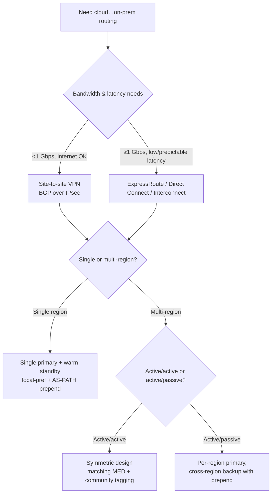
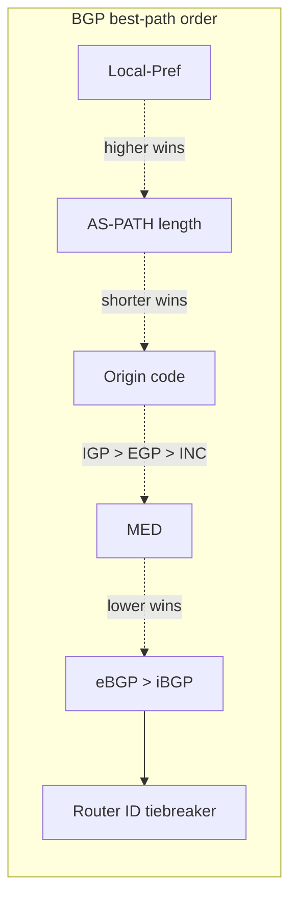
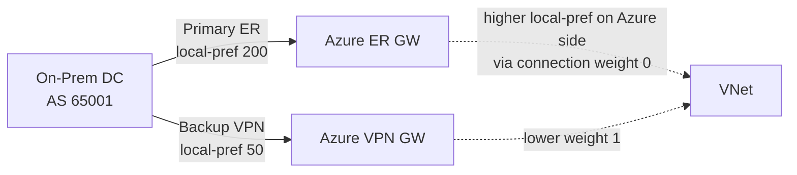

# Skill: BGP Design for Cloud Hybrid Connectivity

> Pairs with `hyb_skill_routing_design` (overall path design), `hyb_skill_vpn_design`, `hyb_skill_expressroute_design`, and `vwan_skill_routing_intent`. Use this skill for **dedicated BGP architecture** — route filters, attribute manipulation, multi-circuit failover, communities, and convergence tuning. Analysis only.

## Purpose

Design BGP for hybrid and multi-cloud connectivity so that:

- Routes propagate only where intended (no leaks).
- Primary/backup paths converge fast and deterministically.
- Active/active load-balances symmetrically.
- The blast radius of any misconfiguration is bounded.

Covers Azure ExpressRoute & VPN Gateway, AWS Direct Connect & Site-to-Site VPN, GCP Cloud Interconnect & HA VPN, plus customer-edge routers (Cisco, Juniper, Arista, FRR, MikroTik).

---

## Foundations

### ASN allocation

| Side | Allowed ASNs |
|---|---|
| Customer (private) | 64512-65534 (16-bit private) or 4200000000-4294967294 (32-bit private). Recommended: pick a single private ASN per organization and reuse on every CE. |
| Azure | Customer chooses for VPN Gateway / VirtualNetworkGateway (`asn` property). Reserved: AS 65515 used by Microsoft-managed components; do NOT use on CE. ExpressRoute peering uses customer + Microsoft (12076) on private peering. |
| AWS | Customer chooses for the Virtual Private Gateway / Transit Gateway. AWS-managed default: 64512. Direct Connect: Amazon side uses 7224 (public). |
| GCP | Customer chooses on Cloud Router (`googleAsn` is reserved 16550 for Partner Interconnect; Cloud Router uses customer-chosen ASN). |

**Best practice**: use a unique private ASN per *site*, not per device — simplifies AS-PATH-based path selection.

### Cloud-specific BGP capacity limits

| Cloud | Max prefixes advertised by cloud → on-prem | Max accepted from on-prem |
|---|---|---|
| Azure VPN Gateway | ~1000 (depends on SKU) | 4000 |
| Azure ExpressRoute private peering | unlimited Azure → on-prem | 4000 from on-prem |
| Azure Virtual WAN hub | ~10000 routes total | 10000 |
| AWS Site-to-Site VPN | 100 | 100 |
| AWS Direct Connect | 100 per BGP session (private VIF), 1000 (transit VIF) | same |
| AWS Transit Gateway | 10000 routes per route table | same |
| GCP Cloud Router | 200 IPv4 + 200 IPv6 learned (raise via support) | same |

Always stay below limits with a 25% safety margin. Aggregate where possible.

---

## Decision tree — pick the BGP topology



---

## Route filters — what to advertise, what to accept

**Default-deny everything**, then add explicit permits. Inbound vs outbound matters:

```cisco
! Cisco IOS-XE example — accept only RFC1918 from cloud, advertise only datacenter aggregates outbound
ip prefix-list FROM-CLOUD-IN seq 10 permit 10.0.0.0/8 le 24
ip prefix-list FROM-CLOUD-IN seq 20 permit 172.16.0.0/12 le 24

ip prefix-list TO-CLOUD-OUT seq 10 permit 192.168.0.0/16 le 16
ip prefix-list TO-CLOUD-OUT seq 20 permit 10.200.0.0/15 le 15

route-map RM-FROM-CLOUD-IN permit 10
 match ip address prefix-list FROM-CLOUD-IN
route-map RM-TO-CLOUD-OUT permit 10
 match ip address prefix-list TO-CLOUD-OUT

router bgp 65001
 neighbor 169.254.21.1 remote-as 65515
 neighbor 169.254.21.1 route-map RM-FROM-CLOUD-IN in
 neighbor 169.254.21.1 route-map RM-TO-CLOUD-OUT out
```

**Critical filter principles:**

1. Never advertise a default route to the cloud unless you mean it (cloud workloads will egress through you).
2. Never accept your own datacenter prefixes back from the cloud (loop prevention; many vendors filter by AS_PATH automatically but don't rely on it).
3. Filter both **directions**, both **prefix list** and **AS-PATH** (`as-path access-list`) — defense in depth.
4. Cap maximum prefixes per neighbor: `neighbor x.x.x.x maximum-prefix 1000 80 restart 5` — protects against route-table blowup from misconfig.

---

## Attribute manipulation for path control



### Local-Preference (inbound on egress from your AS)

```cisco
route-map RM-PRIMARY-IN permit 10
 set local-preference 200
route-map RM-BACKUP-IN permit 10
 set local-preference 50
```

Use Local-Pref to choose *which way out of your AS* (e.g., prefer ExpressRoute over VPN backup).

### AS-PATH prepend (outbound to make a path look worse)

```cisco
route-map RM-BACKUP-OUT permit 10
 set as-path prepend 65001 65001 65001
```

Use prepend to influence the **cloud's** path selection inbound to your DC. Three prepends is usually enough — more can cause some providers to filter as suspicious.

### MED (inter-AS metric)

Useful when peering with the same upstream from multiple sites — lower MED preferred for inbound to your AS. Most clouds set MED based on geographic distance; don't override unless you've measured.

### BGP Communities

Tag routes for downstream policy. Pattern: `<AS>:<purpose>`.

```cisco
ip community-list standard CL-PROD permit 65001:100   ! prod
ip community-list standard CL-DEV  permit 65001:200   ! dev

route-map RM-OUT permit 10
 match ip address prefix-list PROD-NETS
 set community 65001:100

route-map RM-CLOUD-IN permit 10
 match community CL-PROD
 set local-preference 200
```

Standard convention buckets:
- `:100` Production
- `:200` Non-production
- `:300` DMZ / internet-facing
- `:999` Black-hole / RTBH

---

## Multi-circuit failover patterns

### Active/Passive (single region)



- Customer side: Local-Pref 200 on ER, 50 on VPN.
- Azure side: ExpressRoute `routingWeight` / Connection weight prefers ER.
- BFD on both circuits if supported (Azure ER MSEE: BFD-enabled by default; Azure VPN: configurable).

### Active/Active (single region)

Symmetric design: same Local-Pref, same MED, same AS-PATH length. Forward and return must take the same path or you'll have asymmetric flows that stateful firewalls drop.

Use ECMP on both ends:

```cisco
router bgp 65001
 address-family ipv4
  maximum-paths 4   ! enable ECMP across up to 4 equal-cost BGP paths
```

### Active/Active across regions

Anchor each region's traffic with **AS-PATH prepend** on the *other* region's path:

```cisco
! Site East-US-A advertises to East-US ER without prepend, to West-EU ER with 2x prepend
route-map RM-TO-EUS permit 10
route-map RM-TO-WEU permit 10
 set as-path prepend 65001 65001
```

Use **GeoDNS** or **Front Door / CloudFront / Cloud Load Balancing** for client steering; BGP handles the cloud-to-DC return path.

---

## Convergence & failure detection

### BFD (Bidirectional Forwarding Detection)

```cisco
interface GigabitEthernet0/0/1.100
 bfd interval 300 min_rx 300 multiplier 3
 bfd template ER-CIRCUIT

router bgp 65001
 neighbor 169.254.21.1 fall-over bfd
```

- Sub-second failure detection (vs 90-180s default BGP keepalive/hold).
- Available on: Azure ExpressRoute MSEE peerings, AWS Direct Connect, GCP Interconnect VLAN attachments, modern CE routers.
- **Not available on most VPN tunnels** — use shorter BGP timers there (`timers bgp 10 30`).

### BGP timers (when BFD isn't available)

```cisco
neighbor 169.254.21.1 timers 10 30
! keepalive=10s, hold-time=30s — failover in ~30s on tunnel down
```

Don't go below 5/15 — risks flapping under transient packet loss.

### Graceful Restart

Enable on both sides to prevent control-plane restarts (route processor reload, software upgrade) from draining the data-plane. Most managed cloud gateways support it; verify on CE.

---

## Cloud-specific gotchas

### Azure ExpressRoute
- **No transit between two ExpressRoute circuits** by default. Use ExpressRoute Global Reach for ER↔ER, or route through a customer NVA / Virtual WAN hub.
- Microsoft side will *not* honor your AS-PATH prepend for routes destined to Microsoft public services (Microsoft peering uses BGP communities, not AS-PATH).
- ExpressRoute Direct (10/100 Gbps) requires you to manage both BGP sessions to redundant MSEEs.

### Azure VPN Gateway
- Active-active SKUs (VpnGw2+) have two public IPs; configure two BGP sessions, one per IP.
- APIPA addresses (169.254.x.x) required for BGP peering; conflicts cause silent failure — pick non-default addresses.

### AWS Direct Connect
- BGP MD5 authentication is **mandatory** on private VIFs.
- Use **transit VIF** for Direct Connect Gateway → Transit Gateway (supports 1000 prefixes vs 100).
- AWS adds the path **with Local-Pref 100** for primary and lower for backup automatically when you set `bgpCommunity` 7224:7100/7200/7300 (East Coast / Central / West Coast routing influence).

### AWS Site-to-Site VPN
- Two tunnels per connection; advertise the same prefixes on both with AS-PATH prepend on the backup tunnel.
- BGP timers fixed at 30/90 by AWS — design for ~90s convergence on tunnel failure unless using accelerated VPN.

### GCP Cloud Router
- Custom Mode: declare every advertised prefix explicitly. Default Mode: advertises subnets in the VPC automatically.
- Use **Custom Mode + advertised IP ranges** for explicit control.
- HA VPN uses two interfaces per Cloud Router; pair with two on-prem VPN gateways for 99.99% SLA.

---

## Loop prevention & route leaks

Default safeguards aren't enough. Add belt-and-braces:

1. **AS-PATH filter** to reject any route containing your own ASN — prevents accidental re-import after misconfiguration.
2. **Community-based filtering** — tag at ingress with `local-as:source-circuit`; drop at egress if it matches the same source (no hairpin).
3. **Maximum-prefix limit** — hard cap with restart, so a leak storm doesn't burn the CE.
4. **Route reflectors only inside your AS** — eBGP must remain plain eBGP to the cloud.
5. **Disable next-hop-self** on eBGP unless you specifically need it (advertise the cloud's gateway IP, not your CE's).

---

## Observability

Always export from CE and check on cloud side:

- BGP session uptime / flap counters per neighbor.
- Number of routes received / advertised vs configured maximums.
- BFD session up/down events.
- Route changes (`debug bgp updates in/out`).
- Per-prefix path attributes — confirm Local-Pref / Community as designed.
- Azure ExpressRoute monitoring: ARP table, route table, BGP peer status via `Get-AzExpressRouteCircuitRouteTable`.
- AWS Direct Connect: CloudWatch metrics `ConnectionBpsEgress`, `BgpSessionState`.
- GCP: Cloud Router `gcloud compute routers get-status`.

Wire alerts via `nmon_skill_alert_design` and `nmon_skill_synthetic_monitoring`.

---

## Verification checklist

- [ ] ASN plan documented; no overlap or use of reserved cloud ASNs.
- [ ] Prefix-list and AS-PATH filters configured **both directions** per neighbor.
- [ ] Maximum-prefix limit set with `restart` action.
- [ ] Local-Pref + AS-PATH prepend reviewed against actual desired path.
- [ ] Community tags follow the agreed naming convention.
- [ ] BFD enabled on ExpressRoute / Direct Connect / Interconnect; BGP timers tuned on VPN.
- [ ] Graceful Restart enabled where supported.
- [ ] No transit between two cloud circuits unless explicitly designed and route-mapped.
- [ ] Active/Active flows verified symmetric (`traceroute` from both ends).
- [ ] BGP MD5 / TCP-AO authentication where the platform supports it.
- [ ] Monitoring & alerts wired — neighbor state, prefix count, BFD events.

---

## References

- RFC 4271 (BGP-4), 5492 (capabilities), 7911 (add-path), 4724 (Graceful Restart), 5880 (BFD).
- Azure ExpressRoute BGP: https://learn.microsoft.com/azure/expressroute/expressroute-routing
- Azure VPN BGP: https://learn.microsoft.com/azure/vpn-gateway/vpn-gateway-bgp-overview
- AWS BGP for Direct Connect: https://docs.aws.amazon.com/directconnect/latest/UserGuide/routing-and-bgp.html
- AWS Site-to-Site VPN routing: https://docs.aws.amazon.com/vpn/latest/s2svpn/VPNRoutingTypes.html
- GCP Cloud Router: https://cloud.google.com/network-connectivity/docs/router/concepts/overview

**Analysis only — verify against vendor documentation before applying.**
