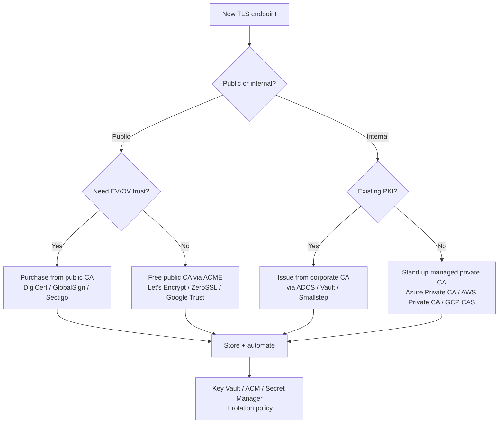

# Skill: TLS Certificate Management for Load Balancers

> Pairs with `lb_skill_ssl_offload` (where TLS terminates) and `lb_skill_traffic_routing` (how SNI/ALPN steers traffic). Use this skill for the **lifecycle** of certs on LBs: issuance, storage, deployment, rotation, monitoring, revocation. Analysis only.

## Purpose

Design a robust, automated certificate lifecycle for load balancers so that no service ever goes down because of a forgotten renewal. Covers cert sources (public CA, ACME, private CA, BYO), storage (Key Vault / ACM / Secret Manager / cert-manager), deployment to each major LB, rotation strategy, monitoring/alerting, and revocation.

---

## Decision tree — pick the cert source



**Default recommendation for new public endpoints**: managed cert from the LB itself (App Gateway managed certs, ACM, GCP managed SSL) — zero-touch renewals, no key handling.

---

## Per-LB certificate flow

### Azure Application Gateway

```bash
# Option 1 — App Gateway managed certificate (preferred for public LBs)
az network application-gateway ssl-cert create \
  --gateway-name appgw --resource-group rg-net \
  --name www-cert \
  --key-vault-secret-id "https://kv-prod.vault.azure.net/secrets/www-cert"
# AGW polls Key Vault every 4 h; new versions auto-deployed.

# Option 2 — BYO PFX uploaded directly (avoid for production — no auto-rotate)
az network application-gateway ssl-cert create \
  --gateway-name appgw --resource-group rg-net \
  --name www-cert --cert-file ./www.pfx --cert-password '***'
```

Key Vault must have an access policy for the AGW's user-assigned managed identity with `secret get` permission. The cert is stored as a **Key Vault certificate** (not secret) — the secret URI without a version pin enables auto-rotation.

### Azure Front Door (Standard/Premium)

- **Front Door-managed cert** — free, auto-renewed; CNAME validation; ~24h provisioning. Default choice for new public domains.
- **Customer-managed via Key Vault** — required for EV/OV, wildcards across non-FD-managed domains, or strict cert-pinning workflows.

### AWS Application Load Balancer / Network Load Balancer

```bash
# ACM-issued cert — fully managed, no key material exported
aws acm request-certificate \
  --domain-name www.example.com \
  --subject-alternative-names "api.example.com" \
  --validation-method DNS

# Attach to listener
aws elbv2 modify-listener \
  --listener-arn <listener-arn> \
  --certificates CertificateArn=arn:aws:acm:...
```

ACM auto-renews 60 days before expiry **only if** DNS validation records are still in place. NLB requires the cert in ACM **in the same region** as the NLB.

### AWS CloudFront

ACM cert must be in **us-east-1** (N. Virginia) regardless of origin region. Renewal is automatic but requires DNS validation CNAMEs to remain.

### GCP External HTTPS LB

```bash
# Google-managed cert (preferred)
gcloud compute ssl-certificates create www-cert \
  --domains=www.example.com,api.example.com --global

# Self-managed (BYO)
gcloud compute ssl-certificates create www-cert-byo \
  --certificate=./www.crt --private-key=./www.key --global
```

Managed certs renew automatically. Self-managed must be replaced and the new resource attached to the target proxy (atomic swap).

### NGINX / HAProxy / Envoy (self-hosted)

Use **cert-manager** (Kubernetes) or **certbot** (VMs):

```yaml
# cert-manager Certificate resource (issues via ACME → Let's Encrypt)
apiVersion: cert-manager.io/v1
kind: Certificate
metadata: { name: www-cert, namespace: ingress }
spec:
  secretName: www-cert-tls
  duration: 2160h        # 90 days
  renewBefore: 720h      # renew 30 days before expiry
  issuerRef: { name: letsencrypt-prod, kind: ClusterIssuer }
  dnsNames: [ www.example.com, api.example.com ]
```

The Secret is mounted by the ingress controller; reloads happen automatically (NGINX SIGHUP, Envoy SDS hot-restart).

---

## Storage — Key Vault / ACM / Secret Manager / cert-manager

| Backend | Best for | Auto-rotation? | Audit |
|---|---|---|---|
| Azure Key Vault (certificate object) | Azure LBs + multi-region | Yes — KV issuer + autoRenew lifecycle | Azure Monitor logs |
| AWS ACM | AWS LBs only | Yes — DNS-validated, 60d before expiry | CloudTrail + ACM events |
| AWS Secret Manager (cert as secret) | Cross-region / non-AWS LBs | No (manual lambda) | CloudTrail |
| GCP Certificate Manager | GCP LBs | Yes for Google-managed | Cloud Audit Logs |
| HashiCorp Vault PKI | Any LB + short-lived certs (hours) | Yes | Vault audit log |
| cert-manager (k8s) | Ingress controllers, service mesh | Yes | k8s events + Prometheus |

**Rule:** the LB pulls from the backend; humans should never download/upload PFX/PEM by hand for prod.

---

## SNI strategy

When multiple certs share one listener:

```bash
# AGW — multi-site listener; AGW picks cert based on SNI host
az network application-gateway ssl-cert create --name www-cert ...
az network application-gateway ssl-cert create --name api-cert ...
az network application-gateway http-listener create \
  --name multi-site-listener --frontend-port port443 \
  --host-names www.example.com api.example.com
```

- Each cert must cover its hostname (exact match or wildcard).
- A **default cert** is required for clients that don't send SNI (rare today; mostly legacy IoT and ancient .NET).
- For Front Door / CloudFront / GCP HTTPS LB: SNI handling is built-in — just attach multiple cert resources.
- Order matters for fallback: more-specific SAN wins over wildcard.

---

## ALPN considerations

- HTTP/2 requires ALPN `h2`; HTTP/3 requires `h3` (and UDP 443).
- AGW, ALB, CloudFront, GCP HTTPS LB enable HTTP/2 by default and negotiate via ALPN.
- For mTLS via ALB: enable `mutual-authentication` mode and supply the trust store ARN.

---

## Rotation strategy

| Cert type | Lifetime | Rotation cadence |
|---|---|---|
| Managed (AGW / ACM / GCP managed) | 90-395 d | Auto, ~30-60 d before expiry |
| ACME (Let's Encrypt / ZeroSSL) | 90 d | Auto every 60 d |
| Public CA purchased | 1 y (max 398 d since 2020) | Manual or automated via API; renew at T-30 |
| Internal CA (Vault PKI short-lived) | 24 h – 30 d | Continuous; design clients to refresh |
| Code-signing / EV | 1-3 y | Manual; HSM required |

**Always rotate via blue/green at the cert level**: deploy the new cert as an *additional* SAN-compatible cert; switch the listener; keep the old cert attached for 24 h; remove only after confirmed clean cutover. This prevents handshake failures from clients pinning the old chain.

---

## Monitoring & alerting

Implement **three independent expiry alerts**:

1. **At the CA / store level** — Key Vault expiry events, ACM `CertificateNearExpiration` CloudWatch event, GCP cert advisor.
2. **At the LB level** — listener-attached cert metadata polled every 24 h; alert at 30 d / 14 d / 7 d.
3. **External black-box** — synthetic probe to `https://endpoint/` that records `cert_expiry_seconds`; alert at 30 d.

```yaml
# Sample Prometheus alert (probe_ssl_earliest_cert_expiry from blackbox_exporter)
- alert: TlsCertExpiresIn30Days
  expr: probe_ssl_earliest_cert_expiry - time() < 30 * 86400
  for: 1h
  annotations:
    summary: "{{$labels.instance}} cert expires in <30d"
```

Hand off to `nmon_skill_synthetic_monitoring` to wire the probe.

---

## Revocation & emergency rotation

When a key is suspected compromised:

1. **Issue replacement cert** with new key (do NOT reuse private key).
2. **Deploy** to LB via blue/green (above).
3. **Revoke old cert** via the CA (ACME revoke, ACM `delete-certificate`, public CA portal).
4. **Update HPKP / HSTS pinning consumers** if any (rare now; HPKP is deprecated).
5. **Audit Key Vault / Secret Manager access logs** for the compromise window.
6. **Rotate any downstream credentials** that may have been exfiltrated via the compromised TLS session.

Document the runbook *before* an incident — name on-call, target time-to-revoke (≤ 4 h), and where the breakglass cert lives.

---

## Verification checklist

- [ ] Cert source decided (managed by LB / ACME / public CA / private CA) and documented.
- [ ] Storage backend chosen; LB has read access via identity (not embedded credentials).
- [ ] All certs cover the right SANs (`openssl x509 -in cert.pem -noout -text | grep -A1 'Subject Alternative Name'`).
- [ ] Cert chain order is correct: leaf → intermediates → (optional) root. Check with `openssl s_client -connect host:443 -showcerts`.
- [ ] OCSP stapling enabled (AGW: enabled by default; NGINX: `ssl_stapling on;`).
- [ ] HTTP/2 + TLS 1.3 enabled; TLS 1.0/1.1 disabled at the listener policy.
- [ ] Rotation cadence verified end-to-end in non-prod (force-renew + observe).
- [ ] Three-tier expiry alerts wired (CA, LB, external probe).
- [ ] Revocation runbook exists with named owners.

---

## References

- Azure App Gateway TLS termination: https://learn.microsoft.com/azure/application-gateway/ssl-overview
- AWS ACM: https://docs.aws.amazon.com/acm/latest/userguide/
- GCP Certificate Manager: https://cloud.google.com/certificate-manager/docs
- cert-manager: https://cert-manager.io/docs/
- Mozilla SSL Configuration Generator: https://ssl-config.mozilla.org/
- SSL Labs server test: https://www.ssllabs.com/ssltest/

**Analysis only — verify against vendor documentation before applying.**
