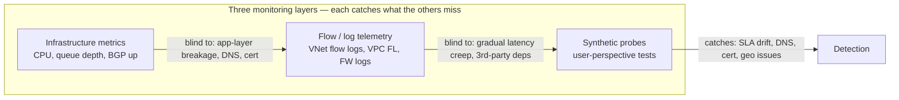

# Skill: Synthetic Network Monitoring

> Pairs with `nmon_skill_alert_design` (alerting strategy), `nmon_skill_connection_monitor` (cloud-native probe products), `nmon_skill_baseline_analysis` (defining "normal"), and `ntsh_skill_connectivity_test` (one-off triage). Use this skill to design **proactive, continuous synthetic probes** that detect outages before users do. Analysis only.

## Purpose

Design a synthetic monitoring layer that probes the network from the **user's perspective** — measuring not what the device says is up, but what the user actually experiences. Covers Azure Network Watcher Connection Monitor, AWS CloudWatch Synthetics, GCP Cloud Monitoring uptime checks, plus self-hosted Blackbox Exporter, Pingdom-style SaaS, and synthetic-HTTP frameworks.

---

## Where synthetic monitoring fits



Symptoms only synthetic catches reliably:

- Gradually rising latency / packet loss.
- DNS resolution failure for specific recursive resolvers / regions.
- TLS cert chain breakage from a specific client perspective.
- Third-party API degradations (Stripe, Auth0, S3) that look fine on your infra.
- Asymmetric routing where one direction works.
- Country/AS-specific reachability problems (BGP leaks, regional ISP issues).
- WAF / DDoS scrubbers blocking legitimate probes (catch your own WAF before customers do).

---

## Decision tree — pick the probe product

```mermaid
flowchart TD
    A[What are you monitoring?] --> B{Internal VNet/VPC reachability?}
    B -- Yes --> C[Azure Connection Monitor /<br/>AWS Reachability Analyzer (one-shot) +<br/>VPC Reachability + custom EC2 prober /<br/>GCP Cloud Monitoring uptime check]
    B -- No --> D{Public endpoint behavior?}
    D -- Yes from cloud --> E[CloudWatch Synthetics canaries /<br/>Azure App Insights availability tests /<br/>GCP uptime checks]
    D -- Yes from global PoPs --> F[Pingdom / Datadog Synthetic /<br/>Catchpoint / ThousandEyes /<br/>StatusCake / UptimeRobot]
    D -- Self-hosted preference --> G[Blackbox Exporter + Prometheus + Grafana]
    E --> H{User-flow needed?}
    F --> H
    H -- Yes (login → checkout) --> I[Browser-based canary<br/>Puppeteer / Playwright]
    H -- No (simple HTTP) --> J[HTTP/HTTPS probe]
```

---

## Cloud-native synthetic tools

### Azure — Connection Monitor + App Insights availability tests

**Connection Monitor** (Network Watcher) — probes between Azure VMs, Azure Arc-enabled on-premises servers using the Azure Monitor Agent (AMA), and external endpoints. Test types: TCP, ICMP, HTTP, HTTPS. Reports loss %, RTT, per-hop topology, and threshold-based health. The legacy Log Analytics agent path is retired; use Arc + AMA for non-Azure/on-premises probes.

```bash
az network watcher connection-monitor create \
  --name cm-app-to-db \
  --location eastus \
  --endpoint-source-name vm-app1 \
  --endpoint-source-resource-id /subscriptions/.../virtualMachines/vm-app1 \
  --endpoint-dest-name db-svc \
  --endpoint-dest-address db.internal.example.com \
  --test-config-name http-443 \
  --test-config-protocol Tcp --test-config-tcp-port 443 \
  --frequency 60 \
  --workspace-ids /subscriptions/.../workspaces/law-prod
```

**Application Insights availability tests** — global HTTP probes from Azure regions. Two flavors:
- **URL ping test** (single GET).
- **Standard test** (extends URL ping with status code, content match, custom headers).
- **TrackAvailability** SDK call for custom logic.

For browser flows: **Playwright-based tests** in Azure Monitor.

### AWS — CloudWatch Synthetics

Lambda-backed canaries written in Node.js or Python, running on a schedule. Built-in blueprints:

- **Heartbeat**: HTTP/HTTPS GET; assert status code.
- **API canary**: multi-step REST flows with token refresh.
- **GUI workflow**: Selenium WebDriver / Playwright.
- **Link checker**: crawl and report broken links.
- **Visual monitoring**: screenshot diffs to catch UI regressions.

```yaml
# CloudFormation snippet
Synthetics:
  Type: AWS::Synthetics::Canary
  Properties:
    Name: api-health
    RuntimeVersion: syn-nodejs-puppeteer-7.0
    Schedule: { Expression: rate(1 minute) }
    Code:
      Handler: index.handler
      S3Bucket: my-canary-source
      S3Key: api-health.zip
    RunConfig:
      TimeoutInSeconds: 60
      MemoryInMB: 1000
      EnvironmentVariables: { TARGET: https://api.example.com/health }
```

For internal endpoints: attach the canary to a VPC subnet via `VpcConfig`.

### GCP — Uptime Checks

Configurable HTTP/HTTPS/TCP probes from 6 global locations (US East/West/Central, Europe, Asia-Pacific, South America). Set thresholds, content matchers, custom headers, and SSL certificate expiration warning windows.

```bash
gcloud monitoring uptime create api-health \
  --resource-type=uptime-url \
  --resource-labels=host=api.example.com,project_id=PROJECT \
  --http-check=path=/healthz,port=443,use-ssl=true,validate-ssl=true \
  --period=60s --timeout=10s \
  --regions=usa-oregon,europe,asia-pacific
```

---

## Self-hosted: Blackbox Exporter + Prometheus

For Kubernetes / Prometheus environments:

```yaml
# blackbox-exporter modules.yml
modules:
  http_2xx_with_cert:
    prober: http
    timeout: 10s
    http:
      method: GET
      preferred_ip_protocol: ip4
      fail_if_not_ssl: true
      tls_config: { insecure_skip_verify: false }
      valid_status_codes: [200, 204]
  tcp_connect:
    prober: tcp
    timeout: 5s
  dns_lookup:
    prober: dns
    dns:
      query_name: api.example.com
      query_type: A
      valid_rcodes: [NOERROR]
      validate_answer_rrs:
        fail_if_matches_regexp: ['127\.0\.0\.\d+']
  icmp:
    prober: icmp
```

```yaml
# prometheus scrape config
- job_name: blackbox-http
  metrics_path: /probe
  params: { module: [http_2xx_with_cert] }
  static_configs:
    - targets:
      - https://api.example.com/healthz
      - https://www.example.com/
  relabel_configs:
    - source_labels: [__address__]
      target_label: __param_target
    - target_label: __address__
      replacement: blackbox-exporter:9115
```

Key Prometheus alerts:

```yaml
- alert: ProbeFailing
  expr: probe_success == 0
  for: 2m
- alert: CertExpiringSoon
  expr: probe_ssl_earliest_cert_expiry - time() < 14*86400
  for: 1h
- alert: ProbeLatencyHigh
  expr: probe_duration_seconds > 1.5
  for: 5m
```

---

## Global probe vendors

For internet-facing services, geographic diversity matters more than probe sophistication. Vendors with extensive PoPs:

| Vendor | Strength |
|---|---|
| Catchpoint | Largest enterprise PoP footprint; deep BGP/path visualizations. |
| ThousandEyes (Cisco) | Best for hybrid + ISP path correlation; agent-to-agent tests. |
| Datadog Synthetic | Unified with APM/RUM; broad PoP coverage; Playwright-based flows. |
| New Relic Synthetics | Tight with their APM; Selenium scripts. |
| Pingdom (SolarWinds) | Simple, cheap, decent coverage. |
| StatusCake / UptimeRobot | Budget; basic checks. |
| Better Stack | Modern UX; reasonable PoP set; includes status pages. |

**Place agents where users are**, not where it's convenient. If your user base is 60% US + 30% EU + 10% APAC, weight probes accordingly. Add at least one probe in a different ASN/ISP per region to catch carrier-specific issues.

---

## Probe design principles

### 1. Test what users do, not what you build

- Don't just `/healthz` — exercise the real flow (login → list → fetch one record).
- For APIs, probe the auth-token-required path with a service-account credential rotated separately.

### 2. Distinguish probe failure from service failure

- Run two probes per target with **different** dependencies (DNS resolver, network path, credentials).
- If only one fails, it's the probe; if both fail, it's the service.
- Tag probes so dashboards show ProbeError vs ServiceError separately.

### 3. Use realistic frequencies

| Tier | Frequency | Why |
|---|---|---|
| Tier-0 user-facing flows | 30-60 s | Tight MTTD; high probe cost; usually paid SaaS PoPs. |
| Tier-1 internal services | 1-5 min | Reasonable balance. |
| Tier-2 batch / async services | 5-15 min | Cost-aware. |
| Long-running comprehensive (Selenium flows) | 5-15 min | Expensive per run. |

Avoid sub-30-second probing without a strong reason — it bumps your own infra load and rarely improves SLA materially.

### 4. Bake-in retries before alerting

A single failed probe is noise. Require **N consecutive failures from M PoPs** before paging.

```yaml
# Datadog-style example
alert_threshold: 2     # consecutive failures
warn_threshold: 1
locations: [us-east-1, eu-west-1, ap-south-1]
min_failure_locations: 2   # require multi-region failure
```

### 5. Probe traffic must be allow-listed

WAF, DDoS protection, and rate-limit rules will block your probes if you don't allow them. Document IP ranges (CloudWatch Synthetics from Lambda VPC; Datadog publishes ranges; Catchpoint provides them). Use a shared header (`X-Synthetic: yes` + secret) so WAF allows without IP coupling.

### 6. Measure RUM and synthetic together

Real-user monitoring (RUM) tells you what's happening; synthetic tells you what would happen if no one was using it. Correlate dashboards — a synthetic regression at 3 AM PT predicts a real-user incident at 9 AM ET.

---

## SLO / SLI integration

Synthetic probe data feeds SLIs:

```yaml
# Example SLI
availability_sli: |
  (sum(probe_success{tier="tier-0"}) /
   count(probe_success{tier="tier-0"})) * 100

latency_sli: |
  histogram_quantile(0.95, sum by (le) (rate(probe_duration_seconds_bucket{tier="tier-0"}[5m])))
```

Target SLO of 99.9% availability ≈ 43 m/mo downtime budget. If you probe every 60 s and require 2 consecutive failures, you've already burned 2 min just to detect — adjust the budget plan accordingly.

Hand off SLO definition to `nmon_skill_alert_design`.

---

## Dashboards & alerts

Minimum dashboard set:

1. **Service availability matrix** — rows = services, cols = regions, cells = % success last 1h.
2. **Latency heatmap** — same axes, P95 latency.
3. **Cert expiry** — list of all endpoints with days until expiry, sorted.
4. **DNS health** — per-resolver lookup success and time.
5. **Probe health** — meta-dashboard: are the probes themselves healthy.
6. **Recent failures** — feed of last 50 probe failures with location, error, response body excerpt.

Alert routing:

- **Tier-0 availability < SLO target** → page on-call.
- **Cert expiring < 14 d** → ticket to platform team.
- **Single-region probe failure** → low-priority page (probable regional ISP issue).
- **Multi-region probe failure** → high-priority page.
- **Probe latency 2x baseline** → low-priority info, correlate with deploys.

---

## Common pitfalls

- **Probing your own monitoring infrastructure with itself** — circular dependency. Use a different vendor or cloud for the meta-probe.
- **Whitelisting probes too broadly** — `X-Synthetic: true` with no secret means an attacker can claim that header. Use a rotating signed token.
- **Probing internal endpoints from public PoPs** — won't work; design VPC-attached canaries (CloudWatch Synthetics VPC, Azure Connection Monitor agents).
- **No alert hysteresis** — flapping at threshold creates alert fatigue. Use sustained-condition logic.
- **Treating probe latency as user latency** — your probe runs from a clean Lambda; real users run on flaky Wi-Fi. Combine with RUM for real-world numbers.
- **Forgetting to test the auth path** — many "the service is up" probes use the same endpoint that has no auth, missing 90% of failure modes.

---

## Verification checklist

- [ ] Inventory of synthetic probes mapped to each Tier-0 / Tier-1 service.
- [ ] At least two PoPs per critical service, different cloud regions or vendors.
- [ ] Auth-required path probed with rotating credentials, not anonymous endpoints only.
- [ ] WAF / DDoS / rate-limit rules allow probe traffic without IP-pinning.
- [ ] Cert expiry monitored separately for each endpoint.
- [ ] DNS resolution probed from each region using both internal and public resolvers.
- [ ] Multi-region failure threshold required before paging.
- [ ] Probe data feeds SLO dashboards.
- [ ] Dashboards built; alerts wired with severity bands.
- [ ] Cost reviewed: probe count × frequency × per-run cost.
- [ ] Meta-monitoring: probes-of-probes confirmed they themselves are alive.

---

## References

- Azure Network Watcher Connection Monitor: https://learn.microsoft.com/azure/network-watcher/connection-monitor-overview
- Azure App Insights availability tests: https://learn.microsoft.com/azure/azure-monitor/app/availability-overview
- AWS CloudWatch Synthetics: https://docs.aws.amazon.com/AmazonCloudWatch/latest/monitoring/CloudWatch_Synthetics_Canaries.html
- GCP Uptime Checks: https://cloud.google.com/monitoring/uptime-checks
- Prometheus Blackbox Exporter: https://github.com/prometheus/blackbox_exporter
- ThousandEyes documentation: https://docs.thousandeyes.com/
- Google SRE Book — Monitoring Distributed Systems: https://sre.google/sre-book/monitoring-distributed-systems/

**Analysis only — verify against vendor documentation before applying.**
