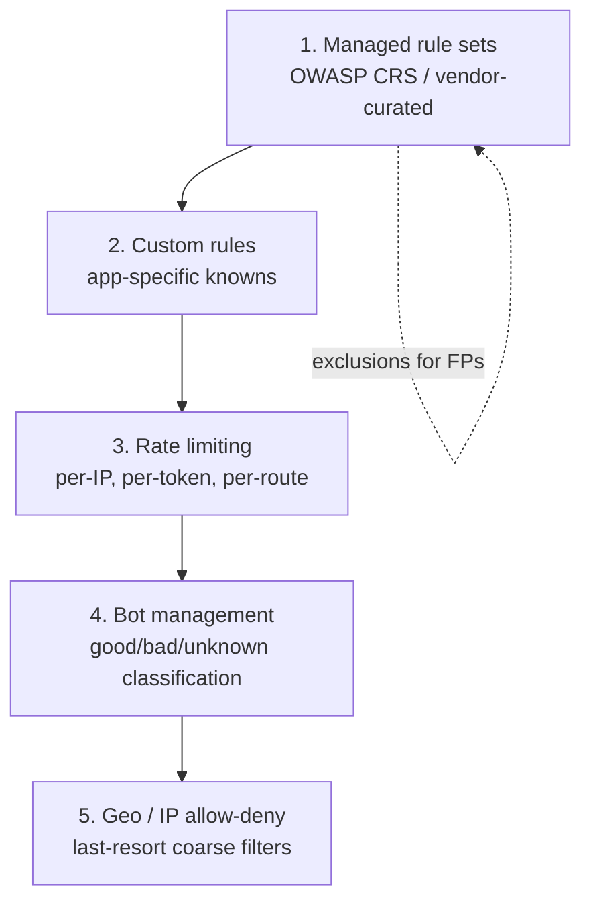
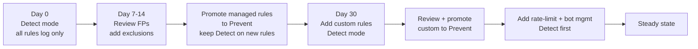

# Skill: WAF Policy Design (Cross-Cloud)

> Pairs with `lb_skill_waf_rules` (LB-specific WAF rule syntax), `cdn_skill_waf_edge` (edge WAF), and `nsec_skill_zero_trust_architecture` (overall posture). Use this skill to **design** WAF policies across Azure / AWS / GCP / vendor WAFs — managed rule sets, custom rules, rate limiting, bot management, and the operational model. Analysis only.

## Purpose

Produce a coherent WAF policy that:

- Blocks the OWASP Top 10 + cloud-specific attack patterns without breaking the application.
- Has a measured roll-out path (Detect → Prevent) with a baseline before block.
- Is observable, tunable, and auditable.
- Plays nicely with bot management, rate limiting, geo-blocking, and downstream IPS/IDS.

Covers Azure WAF (Front Door + App Gateway), AWS WAFv2 (CloudFront/ALB/API Gateway/AppSync), GCP Cloud Armor, plus vendor WAFs (F5 Advanced WAF, Imperva, Akamai App & API Protector, Cloudflare WAF, Fortinet FortiWeb).

---

## Five-layer WAF policy model

Every robust WAF policy is built from five composable layers — design them in this order:



Misordering causes pain: rate limits hitting before bot classification block legit search-engine crawlers; geo-deny before managed rules wastes the managed evaluation.

---

## Layer 1 — Managed rule sets

Start with the vendor's managed/core set. **Always deploy in Detect mode first**, observe for 7-14 days, tune exclusions, then promote to Prevent.

| WAF | Managed sets to enable | Notes |
|---|---|---|
| Azure WAF (Front Door / App Gateway) | DRS 2.1 (Default Rule Set) + Bot Manager Rule Set | DRS 2.1 is OWASP CRS 3.3.2-based; configurable anomaly score threshold (default 5). |
| AWS WAFv2 | AWS-managed `CoreRuleSet`, `KnownBadInputs`, `SQLi`, `LinuxOperatingSystem` (if applicable), `IpReputationList`, `AnonymousIpList` | Use `Count` action first, then `Block`. |
| GCP Cloud Armor | preconfigured WAF rules `crs-v33-stable` family (`sqli-v33-stable`, `xss-v33-stable`, etc.) | Sensitivity 1-4; start at 1. |
| Cloudflare WAF | OWASP Managed Ruleset + Cloudflare Managed Ruleset + Exposed Credential Check | Use "Log" action initially. |
| F5 Advanced WAF | "Comprehensive" or "Rapid Deployment" policy with automatic learning | Run in transparent mode while learning suggests exclusions. |

**Anomaly scoring vs traditional ruleset**: OWASP CRS uses anomaly scoring — each rule contributes a score; only when the total exceeds threshold does the request block. Reduces false-positives at the cost of more nuanced tuning.

---

## Layer 2 — Custom rules for known patterns

Custom rules cover what managed sets can't know: your app's specific URIs, parameter shapes, header conventions, deprecated endpoints.

Common custom-rule patterns:

| Goal | Match | Action |
|---|---|---|
| Block requests to deprecated `/api/v1/*` from non-internal IPs | URI startsWith `/api/v1/` AND source not in corp CIDR | Block |
| Block `POST` on `/admin` from outside admin VLAN | Method=POST AND URI startsWith `/admin` AND source not in admin CIDR | Block |
| Require User-Agent for `/api/*` | URI startsWith `/api/` AND User-Agent empty | Block |
| Block requests with `..` traversal in any path segment | URI matches `\.\.[/\\]` | Block |
| Block direct origin access if request lacks the CDN's shared header | URI=`*` AND header `X-CDN-Auth` != "<secret>" | Block |
| Tag requests with suspicious payload size for downstream rate-limit | Body length > 1 MB on `/upload` is OK; > 5 MB rate-limit | Tag + RL |

Custom rules generally evaluate **before** managed rules (vendor-specific — Azure WAF: priority lower number = higher precedence; AWS WAFv2: priority in WebACL).

---

## Layer 3 — Rate limiting

Rate-limit on the **identity that owns the abuse cost** — usually a token or IP, not the HTTP path.

```yaml
# Example rate-limit rules (vendor-neutral)
- name: anonymous-burst
  scope: per source IP
  match: "no Authorization header"
  limit: 600 / 5 min
  action: block 5 min

- name: auth-burst
  scope: per JWT sub claim (or API key header)
  match: "Authorization: Bearer present"
  limit: 6000 / 5 min
  action: throttle (429)

- name: login-credstuffing
  scope: per source IP
  match: "POST /login"
  limit: 20 / 5 min
  action: challenge (CAPTCHA / managed challenge)
  on-failure: block 1 h

- name: enumeration
  scope: per source IP
  match: "404 responses"
  limit: 50 / 1 min
  action: block 15 min
```

Vendor implementations:

- **Azure WAF**: rate-limit rules with grouping by `RemoteAddr`, `GeoLocation`, request URI, request headers. 1-minute granularity.
- **AWS WAFv2**: `RateBasedRule` with aggregation by IP / forwarded-IP / custom key (header, query string, cookie). 5-minute window, evaluated continuously.
- **GCP Cloud Armor**: `rateLimitOptions` with `RATE_BASED_BAN` action; key types: `ALL`, `IP`, `HTTP_HEADER`, `HTTP_COOKIE`, `XFF_IP`.
- **Cloudflare**: rate-limit rules with characteristics including IP, JA3 fingerprint, headers, cookies; sub-second buckets.

Always combine rate-limit with **graceful degradation** — return `Retry-After` header; log the rate-limit event for capacity planning.

---

## Layer 4 — Bot management

A modern web property sees 30-60% bot traffic. Block uniformly and you'll break Googlebot; allow uniformly and you bleed credentials and inventory.

Classify, then act per class:

| Class | Examples | Default action |
|---|---|---|
| Verified good bots | Googlebot, Bingbot, ApplePay, Slackbot | Allow + log |
| Verified neutral | Pingdom, UptimeRobot, your own monitors | Allow + log |
| Unknown bots | UA looks bot-ish, no published reverse-DNS proof | Challenge (managed CAPTCHA / JS challenge) |
| Bad bots | Known scraper toolchains, fingerprinted automation | Block |
| Headless browsers (Puppeteer, Selenium) | Detected via JS challenge + fingerprint | Block on unauth routes; challenge on public routes |

Tools:

- **Azure Bot Manager Rule Set** (DRS-aligned).
- **AWS WAF Bot Control** (managed rule group `AWSManagedRulesBotControlRuleSet`).
- **GCP reCAPTCHA Enterprise** integrated with Cloud Armor for "Bot Management".
- **Cloudflare Bot Management** with bot scores 0-99.
- **DataDome / PerimeterX / Imperva Advanced Bot Protection** for high-stakes verticals (e-commerce, ticketing, banking).

Always **publish your bot policy** at `/robots.txt` and `/security.txt` so legitimate operators know how to engage.

---

## Layer 5 — Geo / IP coarse filters

Last resort; cheapest computationally; lowest accuracy.

- **Geo-block** by country only when a compliance or risk reason exists. Don't geo-block your customers. Combine with allow-list for known third parties.
- **IP allow-list** for admin endpoints (`/admin`, `/internal`) — pair with identity-based PEP (don't rely on IP alone).
- **AS reputation** — block known abuse-heavy ASNs (VPNs, residential proxies) on sensitive endpoints; tag and challenge elsewhere.
- **Threat intel feeds** — Microsoft / AWS / GCP-managed reputation lists; vendor feeds (Spamhaus, Webroot, etc.).

---

## Detect → Prevent rollout



Rules:

1. **Never** promote to Prevent without ≥ 7 days of Detect data covering a full business cycle (weekday + weekend, batch windows).
2. Tune exclusions at the **smallest possible scope** — exclude a specific rule for a specific URI / parameter / source, not "disable rule globally".
3. Document every exclusion with: rule ID, scope, reason, ticket, expiry date.
4. Re-evaluate exclusions quarterly.

---

## False-positive tuning

Common FP patterns and the right exclusion:

| FP pattern | Likely rule | Right fix |
|---|---|---|
| Rich-text editor posts triggering XSS rule | OWASP XSS rules 941xxx | Exclude rule for the specific POST URI + parameter (`body.content`). |
| Base64 in JWT/API parameter triggering RCE rule | OWASP RCE rules 932xxx | Exclude for the specific parameter name; do not disable globally. |
| GraphQL introspection query triggering SQLi | OWASP SQLi rules 942xxx | Exclude for `Content-Type: application/json` + URI `/graphql`. |
| File-upload binary triggering protocol-violation rules | 920xxx | Skip body inspection for the upload URI; rely on app-layer scanning. |
| Health-check returning 4xx not actual issue | Anomaly score | Exclude health-check URI from scoring. |

Better than disabling: re-implement the protection in a custom rule scoped to the legitimate parameter, so attack patterns elsewhere still trigger.

---

## Logging, alerting, observability

A WAF without telemetry is just a brittle proxy. Required outputs:

- **Per-request log** with: rule IDs matched, action taken, score, request details (truncated if PII), client info.
- **Aggregate metrics**: block rate, challenge rate, top rules, top sources, top URIs blocked. Dashboards in Log Analytics / CloudWatch / Cloud Logging.
- **Alerts**:
  - Sudden spike in blocks (potential attack OR a new FP from a deploy).
  - Sudden drop in blocks (WAF bypass, misconfig).
  - High-confidence rules (managed credential-stuffing) firing → page security.
- **Bypass detection**: probe via synthetic checks (`nmon_skill_synthetic_monitoring`) to confirm rules still fire; compare to baseline weekly.

---

## Integration with the rest of the stack

- **Upstream** of WAF: CDN cache (block before WAF when possible), DDoS protection (volume → WAF doesn't see it), bot scoring at the edge.
- **Downstream** of WAF: app authn/authz, runtime app self-protection (RASP), database query firewalls.
- **Side channel**: SIEM / XDR ingestion; SOAR auto-block playbooks.
- **For internal apps**: WAF in front of identity-aware proxy (ZTNA broker); the broker handles AuthN/AuthZ, the WAF handles request hygiene.
- **For APIs**: pair WAF with an **API gateway** that enforces schema validation; some WAFs (F5 NGINX App Protect, Cloudflare API Shield, AWS WAF + API Gateway, Azure APIM with WAF) do schema validation natively.

---

## Cost and performance considerations

- WAF latency budget: 1-5 ms typical for managed services; allocate accordingly in SLOs.
- Cost drivers: requests inspected, rules evaluated, log volume (often the biggest line item — sample non-blocked logs aggressively).
- For very high-volume sites: tier the WAF — edge WAF (CDN-level) for volumetric/coarse, regional WAF for app-specific deep inspection.
- Disable body inspection on routes where it's not needed (static, health checks) to save processing and money.

---

## Verification checklist

- [ ] Managed rule set enabled; running in Detect mode for ≥ 7 days before any block.
- [ ] Documented baseline of normal traffic (volume, top rules matched, expected FP rate).
- [ ] Custom rules cover at least the app's known abuse paths (admin, login, deprecated endpoints, internal headers).
- [ ] Rate-limit rules per identity (token / API key / IP) — not naive per-IP-only.
- [ ] Bot management policy distinguishes good / unknown / bad; published `robots.txt` and `security.txt`.
- [ ] Geo / IP filters used sparingly and re-justified quarterly.
- [ ] Each exclusion has rule ID, scope, owner, reason, expiry.
- [ ] Logging to SIEM; alerts wired for spike, drop, and high-confidence rule events.
- [ ] Synthetic bypass tests in place to verify WAF is live.
- [ ] WAF placement vs CDN, DDoS, API gateway, identity proxy is documented.
- [ ] Rollback runbook exists: how to revert to Detect mode or disable a rule in < 5 minutes.

---

## References

- OWASP Core Rule Set (CRS): https://owasp.org/www-project-modsecurity-core-rule-set/
- OWASP API Security Top 10: https://owasp.org/API-Security/
- Azure WAF on Front Door: https://learn.microsoft.com/azure/web-application-firewall/afds/afds-overview
- AWS WAFv2: https://docs.aws.amazon.com/waf/latest/developerguide/waf-chapter.html
- GCP Cloud Armor: https://cloud.google.com/armor/docs/cloud-armor-overview
- Cloudflare WAF: https://developers.cloudflare.com/waf/
**Analysis only — verify against vendor documentation before applying.**
