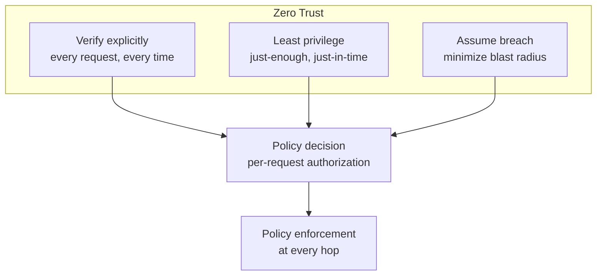
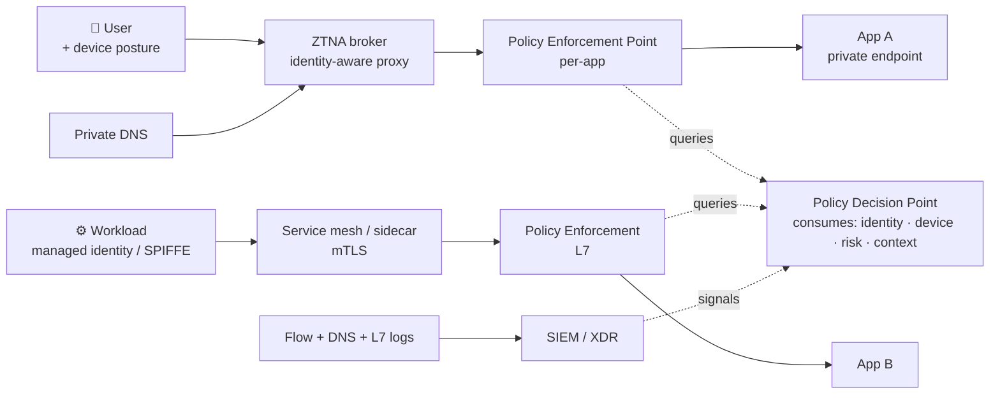
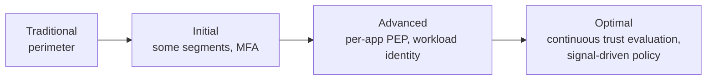

# Skill: Zero Trust Network Architecture

> Pairs with `nsec_skill_segmentation_design` (micro-segmentation execution), `pl_skill_*` (private connectivity), `sase_skill_ztna_design` (user-side ZTNA), `cnet_skill_network_policy` (pod-level). Use this skill to design the **overall Zero Trust networking posture** — pillars, identity-aware access, continuous verification, and the mapping from principles to concrete cloud controls. Analysis only.

## Purpose

Translate the Zero Trust mandate ("never trust, always verify; assume breach") into a concrete, layered network architecture. Avoid the common trap of treating Zero Trust as a product purchase — it's a design discipline applied across identity, device, network, workload, and data layers.

Aligns with **NIST SP 800-207**, **CISA Zero Trust Maturity Model v2.0**, **Microsoft Zero Trust pillars**, and **DoD Zero Trust Reference Architecture v2.0**.

---

## Zero Trust core principles

Three principles, every design choice must satisfy all three:

1. **Verify explicitly** — authenticate and authorize using *all* available signals: user identity, device posture, location, behavior, workload identity, request risk.
2. **Use least-privilege access** — JIT/JEA elevation; default deny; time-boxed grants.
3. **Assume breach** — segment; encrypt end-to-end; minimize blast radius; instrument for detection.

---

## The seven pillars (and what "networking" owns)

| Pillar | Owner | Networking's role |
|---|---|---|
| **Identity** | IAM team | Consume identity claims (user, workload, device) into network policy. |
| **Devices** | Endpoint team | Consume device-posture signals into conditional access; enforce posture at the network edge for legacy clients. |
| **Networks** | **Networking** | Microsegment; eliminate flat networks; encrypt; remove implicit-trust zones; treat the internal network as if it were public. |
| **Applications & workloads** | App / platform | Workload identity (SPIFFE/SPIRE, managed identities), mTLS in service mesh. |
| **Data** | Data security | Network supports DLP enforcement points; encryption in transit. |
| **Visibility & analytics** | SOC | Provide flow logs, packet captures, DNS logs, TLS inspection to SIEM. |
| **Automation & orchestration** | Platform | Policy-as-code; auto-remediation; signal-driven policy changes. |

This skill focuses on the **Networks pillar** with explicit integration points for the others.

---

## Reference architecture (cloud-native)

Components:

- **PDP** (Policy Decision Point) — central brain (Microsoft Entra Conditional Access, Okta Identity Engine, AWS Verified Access, GCP BeyondCorp Enterprise, Zscaler ZIA/ZPA).
- **PEP** (Policy Enforcement Point) — distributed; sits in front of every protected resource. Examples: ZTNA broker, service-mesh sidecar, App Gateway with auth, ALB with OIDC, Private Service Connect, App Proxy.
- **Signal sources** — identity provider, MDM (Intune, Jamf), EDR (Defender for Endpoint, CrowdStrike), risk engines, threat intel.

---

## Map principles to cloud controls

| Principle | Anti-pattern (don't) | Zero-Trust pattern (do) |
|---|---|---|
| **No implicit network trust** | Flat VPC with security-group "allow all from VPC". | Default-deny per-subnet NSGs; tier-to-tier rules only between explicit identities; treat VNet/VPC as untrusted. |
| **No VPN-as-trust** | "Once on the VPN, you can reach everything." | ZTNA replacing site VPN; per-app authorization; identity + device posture per request. |
| **Identity-aware access to private apps** | Public load balancer + IP allow-list. | Private endpoint + identity-aware proxy (App Proxy, AWS Verified Access, IAP). |
| **East-west encryption** | TLS at the edge only; cleartext inside. | mTLS in service mesh (Istio, Linkerd, AWS App Mesh) or sidecar; cloud-native (Azure Application Gateway for Containers, AWS App Mesh, Anthos Service Mesh). |
| **No lateral movement** | Single L3 boundary; once in, free reign. | L7 segmentation; egress per-namespace; FQDN-based egress; deny-by-default east-west. |
| **No standing access** | Permanent admin SSH key in a bastion. | JIT bastion (Azure Bastion + PIM, AWS SSM Session Manager + IAM short-term roles, GCP IAP TCP). |
| **No DNS exfil** | Public resolver from workload subnets. | Forced DNS through internal resolver + DNS firewall + logging (Azure Private Resolver + DNS Security Policies; Route 53 Resolver DNS Firewall; GCP DNS Server Policy). |
| **No exception by ticket** | Manual NSG additions. | Policy-as-code; pull-request review; auto-expiring rules. |

---

## Maturity progression

Use this to set realistic 12/24/36-month roadmaps:

- **Traditional → Initial**: enable MFA everywhere; replace any "any-any" rule; tag workloads with identity.
- **Initial → Advanced**: deploy ZTNA for at least one critical app set; introduce workload identities; turn on mTLS for one mesh.
- **Advanced → Optimal**: feed risk signals into Conditional Access; auto-revoke sessions on EDR alert; baseline behavior per identity.

---

## Network-pillar design choices

### 1. Replace site-to-site VPN with ZTNA where possible

Per-app, identity-aware tunnels — not full network access. Vendors: Zscaler ZPA, Cloudflare Access, Cisco Duo Network Gateway, Netskope NPA, Microsoft Entra Private Access (formerly Azure AD App Proxy + GSA), AWS Verified Access, GCP IAP. Hand off detailed design to `sase_skill_ztna_design`.

### 2. Microsegmentation

Default-deny + explicit allows at L4 *and* L7 where possible. Cloud-native primitives:

- **Azure**: Application Security Groups (ASGs) → NSG rules tied to workload identities; Azure Firewall application rules with FQDN+TLS inspection; Service Tags for managed services.
- **AWS**: Security groups referencing other security groups (not CIDRs); VPC Lattice for service-to-service authorization; Network Firewall stateful rules.
- **GCP**: Firewall rules with service accounts as source/target; hierarchical firewall policies; Cloud Service Mesh authorization.
- **Kubernetes**: NetworkPolicy + Cilium ClusterwideNetworkPolicy with FQDN egress.

Hand off detailed design to `nsec_skill_segmentation_design`.

### 3. Private connectivity to PaaS

Eliminate public endpoints to managed services. Use Private Link / PrivateLink / Private Service Connect. Hand off to `pl_skill_endpoint_design`.

### 4. East-west encryption

- **App-tier**: mTLS via service mesh.
- **Storage**: ensure in-transit encryption (TLS, SMB 3.1.1, NFS with Kerberos krb5p).
- **Backbone**: cloud-provider backbone encryption (Azure: MACsec on dedicated ER Direct; AWS: KMS-managed for cross-region; GCP: backbone encrypted by default).

### 5. Egress control

Outbound traffic is a primary exfil vector. Funnel through:

- Cloud-native FW with FQDN inspection (Azure Firewall, AWS Network Firewall, GCP Cloud Firewall + Cloud NAT).
- SWG / SSE for user-initiated egress.
- For Kubernetes: Cilium FQDN egress policies, Calico GlobalNetworkPolicy egress, dedicated egress gateway (Istio, Cilium Gateway API).

### 6. DNS as a security control

DNS resolution decisions reveal intent before the connection. Force internal resolution, log every query, apply DNS firewall, alert on newly-observed domains. Hand off to `dns_skill_resolver_design`.

### 7. Continuous verification

Authentication ≠ authorization for the entire session. Re-evaluate signals:

- Microsoft Entra Conditional Access **Continuous Access Evaluation** for token revocation on signal change.
- AWS Verified Access policy re-evaluation per request.
- Service-mesh policy refresh intervals.
- ZTNA broker session refresh tied to device-posture signals.

---

## Workload identity (the bridge to Apps & Workloads pillar)

Workload identity replaces shared secrets and hop-based trust:

- **Azure**: Managed Identity (system / user-assigned); Federated Workload Identity for k8s pods → AAD.
- **AWS**: IAM Roles for EC2 / Lambda / EKS service accounts (IRSA); Roles Anywhere for non-AWS workloads with X.509.
- **GCP**: Workload Identity for GKE; Workload Identity Federation for non-GCP workloads.
- **Cross-cloud**: SPIFFE/SPIRE for cluster-issued SVIDs (X.509 or JWT-SVID).

Network policy then keys off identity, not IP — the IP becomes incidental.

---

## Threat model (what Zero Trust mitigates and what it doesn't)

| Threat | Mitigated by ZT? |
|---|---|
| Stolen long-lived credential | Yes — MFA + continuous evaluation reduce window; phish-resistant auth (FIDO2) closes the residual gap. |
| Compromised employee device | Yes — device posture in PDP; auto-quarantine via XDR signal. |
| East-west movement after initial foothold | Yes — microsegmentation + L7 policy + mTLS. |
| Supply-chain attack on a dependency | Partial — workload identity + egress control limit reach, but doesn't prevent the initial code execution. |
| Insider with legitimate access | Partial — JIT + JEA + telemetry detect anomalies; can't prevent abuse within granted scope. |
| Vulnerability in the PDP itself | **Risk** — PDP is the new perimeter; protect with all the same controls plus a break-glass path. |
| DDoS against public PEPs | **Outside scope** — combine with `nsec_skill_ddos_design`. |

---

## Common anti-patterns

1. **Zero Trust = ZTNA tool** — buying a product doesn't replace policy work; ZTNA is one PEP among many.
2. **Network ZT without identity ZT** — segmentation by IP without identity-aware policy reverts to traditional networking.
3. **PDP single point of failure** — if PDP is down and PEPs fail-open, you've removed your last line of defense.
4. **Encrypt everything but log nothing** — mTLS without telemetry blinds the SOC.
5. **Microsegmentation everywhere at once** — boil-the-ocean projects fail; start with crown-jewel apps.
6. **Treating mobile and unmanaged devices the same as managed** — device-posture signals must differentiate.

---

## Verification checklist

- [ ] Zero Trust target maturity stated (Initial / Advanced / Optimal) with timeline.
- [ ] Every protected resource has a named PEP and PDP.
- [ ] No remaining "any-any" or "VPC-wide-allow" rules.
- [ ] At least one continuous-evaluation control wired (CAE, AWS Verified Access policy refresh, mesh policy reconciliation).
- [ ] All east-west traffic for crown-jewel apps uses mTLS or equivalent.
- [ ] Egress goes through a logged, FQDN-aware control point.
- [ ] DNS queries forced through internal resolver with logging.
- [ ] Workload identity replaces at least one previously-shared credential.
- [ ] Telemetry pipeline to SIEM/XDR covers identity, network flow, DNS, L7, EDR.
- [ ] PDP HA + break-glass path documented.
- [ ] No NSG/SG references rely on IP allow-lists that could be reused by a different identity.

---

## References

- NIST SP 800-207 Zero Trust Architecture: https://csrc.nist.gov/publications/detail/sp/800-207/final
- CISA Zero Trust Maturity Model v2.0: https://www.cisa.gov/zero-trust-maturity-model
- DoD Zero Trust Reference Architecture: https://dodcio.defense.gov/Library/Zero-Trust-Reference-Architecture/
- Microsoft Zero Trust guidance: https://www.microsoft.com/security/business/zero-trust
- Google BeyondCorp: https://cloud.google.com/beyondcorp-enterprise
- AWS Zero Trust: https://aws.amazon.com/security/zero-trust/
- SPIFFE/SPIRE: https://spiffe.io/
**Analysis only — verify against vendor documentation before applying.**
