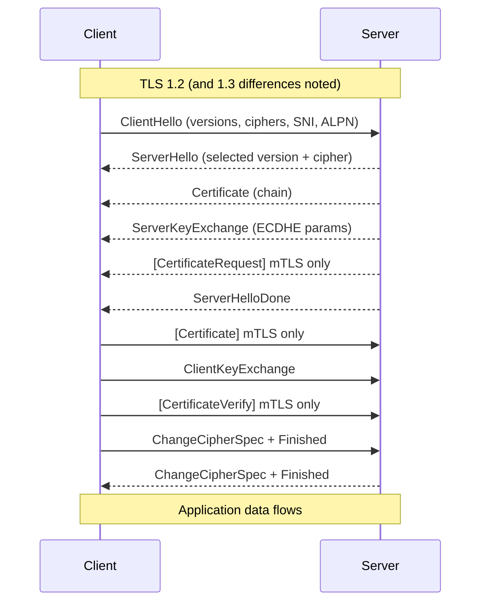

# Skill: TLS Handshake Debugging

> Pairs with `ntsh_skill_packet_capture` (how to capture) and `ntsh_skill_pcap_analysis` (deep analysis). Use this skill to **debug TLS handshake failures** end-to-end — cert chain issues, SNI, ALPN, mTLS, cipher mismatches, and decoded TLS alert codes. Analysis only.

## Purpose

When users see "connection failed", "certificate error", "handshake failure", "SSL_ERROR_*", or sudden 525/526 responses behind a CDN, this skill walks you through pinpointing **which side** failed, **which step** of the handshake failed, and **why**, with the commands to prove it.

---

## TLS handshake refresher (what can break, and where)



TLS 1.3 collapses this into a single round-trip and encrypts Certificate/CertificateVerify under the handshake key. The same failure classes still apply but show up as different Wireshark dissector frames.

Failure points (each maps to a section below):

1. **TCP layer** — connection never reaches TLS.
2. **ClientHello** — sent but no ServerHello, or rejected with alert.
3. **Version negotiation** — no overlap (e.g., client TLS 1.3-only vs server 1.0).
4. **Cipher negotiation** — no overlapping cipher.
5. **Certificate validation** — trust, expiry, hostname, chain order, OCSP.
6. **SNI / hostname routing** — multi-tenant LB picks wrong cert.
7. **ALPN** — client wants `h2`, server only offers `http/1.1` (or vice versa, with strict client).
8. **mTLS** — client cert request not satisfied or rejected.
9. **Application protocol** — handshake succeeds but app rejects (HTTP 421, gRPC INTERNAL).

---

## First triage — three commands, three minutes

```bash
# 1. Can you reach the port at all?
nc -vz host.example.com 443       # OR  Test-NetConnection host.example.com -Port 443

# 2. What does the server actually present?
openssl s_client -connect host.example.com:443 -servername host.example.com \
                 -alpn h2,http/1.1 -showcerts -tls1_2 </dev/null

# 3. Quick public-facing summary (web-only, but cached and rich)
# https://www.ssllabs.com/ssltest/analyze.html?d=host.example.com
# CLI alternative:
testssl.sh --fast --severity LOW host.example.com:443
```

Read in this order:
- Is TCP up? If no, this is **not** a TLS problem — go to `ntsh_skill_connectivity_test` / `nsec_*`.
- Does `openssl s_client` complete the handshake at all? Look at the output's `Verify return code:` line — `0 (ok)` means cert is good; any other number is a cert problem.
- Does the negotiated version + cipher + ALPN match what your client expects? Look at `Protocol`, `Cipher`, and `ALPN protocol` lines.

---

## Decoding TLS alerts (Wireshark filter: `tls.alert_message`)

| Alert code | Name | Most common cause |
|---|---|---|
| 10 | unexpected_message | Implementation bug; out-of-order record. |
| 20 | bad_record_mac | Wrong session key — middlebox MITM, NAT rewriting payload. |
| 22 | record_overflow | Record > 16 KB; broken impl. |
| 30 | decompression_failure | Legacy; should not appear in TLS 1.2+. |
| **40** | **handshake_failure** | **Cipher or version mismatch — most common server-side reject.** |
| **42** | **bad_certificate** | **Client rejected server cert (or vice versa for mTLS).** |
| 43 | unsupported_certificate | Cert type the peer doesn't understand. |
| **45** | **certificate_expired** | Cert past `notAfter`. |
| **48** | **unknown_ca** | Cert chain doesn't terminate at a trusted root for the peer. |
| 49 | access_denied | mTLS — client identified but not authorized. |
| 50 | decode_error | Malformed structure. |
| **51** | **decrypt_error** | **mTLS — `CertificateVerify` signature failed; common when client uses wrong key for cert.** |
| 70 | protocol_version | No version in common. |
| 71 | insufficient_security | Configured ciphers too weak. |
| **80** | **internal_error** | **Server-side bug; check server logs.** |
| 86 | inappropriate_fallback | Client did a downgrade dance; server rejects. |
| **90** | **user_canceled** | **Client closed before completing handshake (often a timeout).** |
| 100 | no_renegotiation | Renegotiation disallowed. |
| **112** | **unrecognized_name** | **SNI didn't match any configured server — extremely common with multi-cert LBs and Front Door.** |
| 113 | bad_certificate_status_response | OCSP stapled response bad. |
| 116 | certificate_required | mTLS — server expected client cert, got none. |
| 120 | no_application_protocol | ALPN had no overlap; client demanded `h2` server only had `http/1.1` or similar. |

**Direction matters**: who emitted the alert? In Wireshark click the alert frame and check **src IP** — that's who refused.

---

## Decoding `openssl s_client` output

Look for these lines and what they mean:

```
CONNECTED(00000003)
Can't use SSL_get_servername
depth=2 C = US, O = ..., CN = Root CA
verify return:1
depth=1 C = US, O = ..., CN = Intermediate CA
verify return:1
depth=0 CN = host.example.com
verify return:1
---
Certificate chain
 0 s:CN = host.example.com
   i:CN = Intermediate CA
 1 s:CN = Intermediate CA
   i:CN = Root CA
---
Server certificate
-----BEGIN CERTIFICATE-----
...
-----END CERTIFICATE-----
subject=CN = host.example.com
issuer=CN = Intermediate CA
---
No client certificate CA names sent
Peer signing digest: SHA256
Peer signature type: ECDSA
Server Temp Key: X25519, 253 bits
---
SSL handshake has read 4321 bytes and written 412 bytes
Verification: OK
---
New, TLSv1.3, Cipher is TLS_AES_256_GCM_SHA384
Server public key is 2048 bit
Secure Renegotiation IS NOT supported
Compression: NONE
Expansion: NONE
ALPN protocol: h2
...
SSL-Session:
    Protocol  : TLSv1.3
    Cipher    : TLS_AES_256_GCM_SHA384
    Session-ID: ...
    Session-ID-ctx:
    Resumption PSK: ...
    Verify return code: 0 (ok)
```

Diagnostics:

- **`verify return code` ≠ 0** — cert validation problem. Common codes:
  - `19 (self signed certificate in certificate chain)` — your trust store doesn't include the intermediate or root.
  - `20 (unable to get local issuer certificate)` — intermediate cert not sent by server.
  - `21 (unable to verify the first certificate)` — chain incomplete.
  - `10 (certificate has expired)` — leaf or intermediate past `notAfter`.
  - `9 (certificate is not yet valid)` — `notBefore` in future (clock skew!).
  - `18 (self signed certificate)` — using a self-signed cert; expected only in dev.
- **`subject=` does not match the hostname** — request used SNI X but server returned cert for Y.
- **No `ALPN protocol:`** — server didn't agree on ALPN; HTTP/2 will fall back to HTTP/1.1 or fail.
- **`Cipher: ...` is something your client list doesn't include** — your client lib is more restrictive than `openssl`.

---

## Common failure patterns and the right next step

### A. Cert hostname mismatch

```bash
openssl s_client -connect ip:443 -servername host.example.com
# subject= shows a different name → cert is for a different host
```

Cause: LB/CDN listener configured with wrong cert, or SNI not sent. Hand off to `lb_skill_tls_cert_mgmt`.

### B. Trust chain incomplete

Many CDNs/LBs forget to attach intermediates. Test on the wire:

```bash
openssl s_client -connect host:443 -showcerts < /dev/null \
  | awk '/BEGIN CERTIFICATE/,/END CERTIFICATE/'
# Count the certs returned. Expect leaf + at least one intermediate.
# If only the leaf comes back, the chain is incomplete.
```

Fix: re-issue from the LB stapling the full chain; or upload a `fullchain.pem` instead of `cert.pem`.

### C. Cipher / version mismatch (alert 40 or 70)

```bash
# Server's ciphers
nmap --script ssl-enum-ciphers -p 443 host.example.com

# Or testssl
testssl.sh --protocols --ciphers host.example.com:443
```

Diagnose:
- Server only allows TLS 1.3 but client is on legacy 1.0/1.1 → modernize client.
- Server cert is ECDSA but client list lacks ECDHE-ECDSA-* → enable on client.
- FIPS-mode client missing modern ciphers — accept upgrade or relax server.

### D. Unrecognized SNI (alert 112)

Almost always means: the request hit a listener that doesn't know the requested hostname.

```bash
# What SNI is your client actually sending?
SSLKEYLOGFILE=/tmp/keys.log curl -v https://host.example.com:443/
# Inspect curl's "* TLSv1.3 (OUT)" / "subjectAltName: " output, then decrypt PCAP in Wireshark
```

Common in: multi-cert App Gateway listeners, Front Door, ALB with SNI-based routing, CloudFront alternate domain names.

### E. mTLS failures (alerts 42 / 51 / 116)

```bash
# Test mTLS handshake with explicit client cert
openssl s_client -connect host:443 -servername host.example.com \
  -cert client.crt -key client.key -CAfile ca.crt -tls1_2
```

- Alert 116 from server → server expects client cert but got none. Check the client trust store and the cert is presented.
- Alert 51 from server → `CertificateVerify` failed; the cert and the key the client used don't match (mixed-up keys), or the signature algorithm doesn't match.
- Alert 42/48 from server → server doesn't trust the client cert's issuer. Confirm server's CA bundle includes your CA.

### F. OCSP stapling problems

```bash
openssl s_client -connect host:443 -status < /dev/null \
  | grep -A 5 "OCSP response"
```

- "OCSP Response Status: successful" → fine.
- "no response sent" with a client that requires stapling → enable stapling at the LB.
- Stale staple → renew or check LB OCSP cache settings.

### G. Clock skew

```bash
date -u
openssl s_client -connect host:443 -servername host < /dev/null \
  | openssl x509 -noout -dates
# notBefore and notAfter — compare to current UTC
```

If client clock is wrong (off by hours/days), valid certs look expired or not-yet-valid. Fix NTP.

### H. Middlebox interception

Symptoms: works fine on personal network, fails on corp. Server cert in PCAP shows a corp internal CA chain, not the real one.

```bash
openssl s_client -connect host:443 < /dev/null 2>&1 \
  | grep "issuer="
# If issuer is your corp CA, an inspection proxy is in the path
```

Fix: install corp CA into the client trust store, OR have the proxy whitelist the host for cert-pinning apps.

---

## Decrypting captured TLS for forensic analysis

Per RFC: ephemeral DH/ECDHE handshakes (the modern default) cannot be decrypted with the server's private key. To decrypt:

```bash
# Client provides keylog via env var (curl, browser)
SSLKEYLOGFILE=/tmp/keys.log curl https://host/

# Wireshark → Preferences → Protocols → TLS → (Pre)-Master-Secret log filename: /tmp/keys.log
# Now encrypted records show plaintext.
```

For TLS 1.2 RSA cipher suites only (rare today), the server private key still decrypts.

For mTLS forensics, also capture the client's private key into the keylog — needed to verify the `CertificateVerify` signature.

Hand off to `ntsh_skill_pcap_analysis` for the full decryption walkthrough.

---

## QUIC / TLS 1.3 over UDP (HTTP/3)

QUIC uses TLS 1.3 inside UDP. Tooling differs:

```bash
# Test HTTP/3 with curl built with quiche/nghttp3
curl --http3 -v https://host/

# Capture and analyze with Wireshark — quic dissector built in;
# keylog file path same as TLS for decryption.
```

Common pitfalls: middleboxes blocking UDP/443; client falling back silently to TLS 1.3 over TCP; Alt-Svc advertisement missing on the server.

---

## Verification checklist

- [ ] TCP layer confirmed reachable before debating TLS.
- [ ] `openssl s_client` output captured with `-servername` (SNI) and `-alpn` matching the real client.
- [ ] The exact TLS alert code and direction documented.
- [ ] Cert chain completeness checked (`-showcerts`).
- [ ] Subject / SAN coverage of the requested hostname verified.
- [ ] notBefore / notAfter vs client clock checked.
- [ ] Cipher list overlap between client and server enumerated (`nmap ssl-enum-ciphers` or `testssl.sh`).
- [ ] If mTLS: client cert, key, and server's trusted CA bundle all confirmed.
- [ ] If failure is intermittent: PCAP captured on both sides for correlation.
- [ ] If middlebox suspected: cert issuer compared to real CA.
- [ ] Remediation handed off to the right specialist: cert lifecycle → `lb_skill_tls_cert_mgmt`; LB config → `lb_skill_ssl_offload`; firewall blocking → `fw_skill_troubleshoot`; DNS pointing at the wrong host → `dns_skill_troubleshoot`.

---

## References

- RFC 8446 (TLS 1.3): https://www.rfc-editor.org/rfc/rfc8446
- RFC 5246 (TLS 1.2): https://www.rfc-editor.org/rfc/rfc5246
- RFC 6066 (SNI/ALPN extensions): https://www.rfc-editor.org/rfc/rfc6066
- IANA TLS Alert Registry: https://www.iana.org/assignments/tls-parameters/tls-parameters.xhtml#tls-parameters-6
- Mozilla SSL Configuration Generator: https://ssl-config.mozilla.org/
- testssl.sh: https://testssl.sh/
- SSL Labs: https://www.ssllabs.com/ssltest/

**Analysis only — verify against vendor documentation before applying.**
