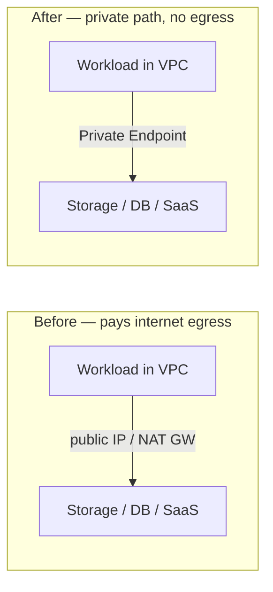
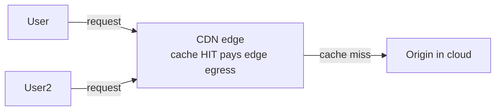

# Skill: Egress Cost Architecture

> Pairs with `price_skill_egress_calc` (how to *calculate* current egress cost), `price_skill_cost_optimizer` (general waste reduction), `pl_skill_endpoint_design` (private connectivity), `cdn_skill_*` (edge offload), and `mcn_skill_transit_design` (cross-cloud paths). Use this skill to design architectures that **structurally avoid egress charges** — not just measure them. Analysis only.

## Purpose

Egress is usually the largest, least-controllable line item on cloud network bills. This skill provides patterns that move workloads, traffic, or boundaries so that fewer bytes ever cross a paid egress meter. Covers cross-region transit, cross-AZ optimization, PrivateLink-style boundary collapses, CDN offload, peering, regional pinning, and tier discounts.

---

## What "egress" means and where it's billed

Each cloud bills egress differently. Know what you're optimizing for:

| Cloud | Egress meter triggered when… | Notable free cases |
|---|---|---|
| **Azure** | Outbound from VNet to internet; cross-region in same continent; cross-region between continents; into specific peer types. | Inbound free; within an Availability Zone via private IPs free; to Microsoft services in same region free over Private Link; first 100 GB/mo to internet free per account. |
| **AWS** | Outbound to internet; cross-AZ within same region; cross-region; out of a VPC via NAT GW (NAT GW also has hourly + per-GB processing). | Inbound free; same-AZ private IP free; CloudFront → internet has separate (lower) rate than EC2 → internet; AWS PrivateLink Interface endpoints incur per-hour + per-GB, but cheaper than internet egress at scale; first 100 GB/mo to internet free at account level. |
| **GCP** | Internet egress; cross-region; cross-zone within region for some services; Premium Tier higher than Standard Tier. | Same-zone private IP free; many Google service egresses free or at reduced rates if you use Direct Peering / Cloud Interconnect; free 200 GB/mo to internet across the account. |
| **Cloudflare R2 / Backblaze B2 / etc.** | Zero egress to internet by design. | Used as cost-bypass for hot static content. |

Always reference the live pricing page — rates change.

---

## Pattern catalog — biggest savings first

### 1. Private endpoints / PrivateLink instead of public PaaS



- **Azure**: Storage / SQL / Cosmos / Service Bus via **Private Endpoint** stays on Microsoft backbone. Even when the endpoint is in another region, it's far cheaper than internet egress.
- **AWS**: S3 / DynamoDB **Gateway Endpoints** are **free**. Interface Endpoints (Kinesis, KMS, SQS, etc.) have per-hour + per-GB but avoid NAT Gateway pricing — break-even is usually < 100 GB/day per endpoint.
- **GCP**: **Private Service Connect** for Google services and 3rd-party SaaS. Same logic.

**Rule**: if you're talking to a same-cloud managed service, you should be on a private endpoint. NAT Gateway → S3 is a billing leak.

### 2. CDN offload for static and frequently-cached content



- CDN egress is **billed cheaper** than direct origin egress (CloudFront tiered ~ 50% of EC2 internet; Azure CDN/Front Door similar; Google Cloud CDN ~ 30-50% off Premium Tier).
- Cache-Control discipline (`Cache-Control: public, max-age=3600`, ETag, Vary) is the multiplier — a 95% hit rate means origin egress is 1/20.
- **Tiered caching** / Origin Shield concentrates misses on a single PoP, reducing origin reads further.
- For dynamic but cacheable: short TTLs (10-60 s) on hot reads still save dramatically.

Hand off cache strategy to `cdn_skill_cache_optimization`.

### 3. Regional pinning — keep traffic where the workload is

The cheapest byte is the one that never crosses a regional boundary.

- **Read replicas in each region** for read-heavy workloads (RDS read replicas, Cosmos multi-region read, Spanner regional reads).
- **Co-located clients & servers**: deploy compute in the region that owns the data.
- **Object storage**: place buckets where consumers are; replicate only what crosses the boundary.
- **Avoid cross-region service calls** in the hot path — async-replicate state instead.

For multi-region active-active: design the cost (RPO/RTO tradeoff against egress) deliberately, don't let it grow organically.

### 4. Cross-AZ minimization within a region

AWS bills cross-AZ traffic; Azure does not within the same region (in most cases); GCP bills cross-zone for some services.

Patterns:

- **Topology-aware routing** in service meshes (Istio `trafficPolicy.loadBalancer.localityLbSetting`, Linkerd zone-aware, Kubernetes `topology.kubernetes.io/zone` annotations).
- **AZ-affinity in NLB / ALB** with cross-zone load balancing **disabled** for AWS NLB (now configurable on ALB too).
- **DB primary + same-AZ readers** for low-latency synchronous traffic; cross-AZ standby only for failover.
- Pay attention to **VPC endpoints behavior** — interface endpoints are AZ-scoped; create per-AZ endpoints to avoid cross-AZ.

### 5. Direct/Dedicated interconnects for high egress

Once internet egress passes ~5-20 TB/month from a single cloud to a single destination, dedicated connectivity wins:

- **AWS Direct Connect** with public VIF → ~70% cheaper egress to internet (Data Transfer Out via DX).
- **Azure ExpressRoute** with Microsoft Peering → reduced egress to Microsoft services.
- **GCP Cloud Interconnect / Direct Peering** → reduced internet egress for traffic to peered ASNs.

Break-even modeling:

```
Months_to_break_even = (port_setup_costs + cross_connect_costs)
                     / (monthly_egress_savings)
```

For 50 TB/mo, often < 6 months. Combine with `hyb_skill_expressroute_design`.

### 6. Egress-free storage tiers for shared data

- **Cloudflare R2**: S3-compatible, $0 egress.
- **Backblaze B2 + Cloudflare**: $0 egress when paired.
- **Wasabi**: $0 egress within fair-use limits.

Pattern: keep "hot egress" data (model artifacts, container images, public datasets) in egress-free storage; treat S3/Azure Blob as primary durable storage and sync.

### 7. Compress, batch, dedupe

Application-layer hygiene that's often overlooked:

- **Enable gzip/brotli** on every HTTP response.
- **Use protobuf or msgpack** for high-volume APIs instead of JSON — 30-70% size reduction.
- **Coalesce small messages** in event streams; batch writes.
- **Delta sync** instead of full snapshots.
- **Dedupe at the boundary** (CDN, API gateway) using ETag / If-None-Match.

A 40% payload reduction is a 40% egress saving — no architectural changes required.

### 8. Multi-cloud — avoid double-billing

Cross-cloud traffic is billed by **both** providers as egress. Patterns:

- **Cloud-agnostic peering exchanges** (Megaport, PacketFabric, Equinix Fabric) where both clouds drop traffic into a private peering — egress charged at private rates on both sides.
- **Anchor heavy traffic in one cloud** and use the other only for specific workloads (compliance, vendor lock-in reduction).
- **CDN at the edge** that fetches from whichever origin is cheapest given the request.

Hand off transit design to `mcn_skill_transit_design`.

### 9. NAT Gateway tax (AWS-specific)

NAT GW charges per hour + per GB processed — separate from egress. For high-throughput outbound:

- **VPC Gateway Endpoints** for S3 / DynamoDB → eliminate NAT for those (free).
- **Interface Endpoints** for other AWS services → cheaper than NAT for medium-to-high volumes.
- **Self-managed NAT instances** in extreme-traffic cases (cheaper per GB but operational burden).
- Some workloads can be moved to **public subnets with Security Groups** entirely, eliminating NAT.

### 10. Tiered pricing — restructure for discount cliffs

All three major clouds offer tiered egress pricing (cheaper per-GB after thresholds). For very large egress, **consolidate billing** into one account / one organization to capitalize on the highest tier.

Negotiate **EDP / MAP / EA commit discounts** — most enterprises see 10-30% off list once committed spend exceeds $1M/yr.

---

## Cost-architecture review checklist (use on every design)

When reviewing a design for egress optimization, run this questionnaire:

- [ ] Are any managed services accessed over public endpoints + NAT GW? → switch to Private Endpoint / Gateway Endpoint.
- [ ] Is there a CDN in front of every user-facing GET? If not, why not?
- [ ] What's the cache hit ratio target, and is the cache-control header strategy documented?
- [ ] Is any cross-region traffic in the hot path? Can read replicas eliminate it?
- [ ] For AWS: cross-AZ traffic measured; topology-aware routing considered.
- [ ] For multi-cloud: is the traffic going through a private peering exchange?
- [ ] Static assets / images / large blobs: stored where egress is cheapest (R2 / B2 / equivalent)?
- [ ] Is gzip/brotli on for all eligible responses?
- [ ] API serialization: JSON OK, or worth protobuf/msgpack for high-volume?
- [ ] Per-month egress projected; is dedicated connectivity (ER/DX/Interconnect) at break-even yet?
- [ ] NAT GW cost line item — is it actually needed?
- [ ] Commit-discount opportunities (EDP / MAP / EA) reviewed with finance?

---

## Modeling the saving

Always quantify before proposing change:

```
current_monthly_egress_cost = Σ(bytes_meter_i × rate_i)
proposed_monthly_egress_cost = Σ(bytes_meter_i' × rate_i') + one_time_setup_amortized

saving = current - proposed
break_even_months = setup_costs / monthly_saving
```

Include in proposal:
1. **Today's bill line items** (from cost analytics) — don't guess.
2. **Forecast for 12 months** at current growth rate.
3. **Implementation cost** (engineering hours, downtime, migration risk).
4. **Steady-state monthly saving** after migration.
5. **Break-even date**.
6. **Reversibility plan** — what if traffic patterns shift in 6 months.

---

## Common anti-patterns

- **"Just turn on CDN"** without cache strategy → 10% hit rate, marginal saving.
- **NAT GW for everything** when half the traffic is to AWS services that have free Gateway endpoints.
- **Cross-region replication for low-RPO availability** when an async pattern would meet the SLA at a fraction of the cost.
- **Multi-region active-active** where a regional active + global failover would do, doubling the steady-state egress.
- **Picking the wrong CDN tier** — premium tiers charge more per GB but include features (image optimization, advanced routing) that may not be needed.
- **Optimizing egress while egress is < 5% of total bill** — focus where the money is. Run `price_skill_egress_calc` first.
- **Ignoring inbound asymmetry** — most clouds give free ingress; design replication to pull, not push, where possible.

---

## Verification checklist

- [ ] Egress baselined by source, destination, and meter (account / VPC / region / service).
- [ ] Top 5 egress contributors identified — they are where the architectural fix lives.
- [ ] At least one of patterns 1-3 applied to each top contributor.
- [ ] Quantified before/after monthly cost and break-even time.
- [ ] Implementation risk and reversibility documented.
- [ ] Finance / FinOps team involved if changes affect commit-discount thresholds.
- [ ] Post-implementation: 30-day measurement window scheduled to validate savings.

---

## References

- Azure pricing — bandwidth: https://azure.microsoft.com/pricing/details/bandwidth/
- AWS Data Transfer pricing: https://aws.amazon.com/ec2/pricing/on-demand/#Data_Transfer
- AWS NAT Gateway pricing: https://aws.amazon.com/vpc/pricing/
- GCP Network pricing: https://cloud.google.com/vpc/network-pricing
- AWS gateway vs interface endpoint comparison: https://docs.aws.amazon.com/vpc/latest/privatelink/concepts.html
- Cloudflare R2 (zero egress): https://www.cloudflare.com/products/r2/
- FinOps Foundation — Cloud Network Costs: https://www.finops.org/

**Analysis only — verify against vendor documentation before applying.**
