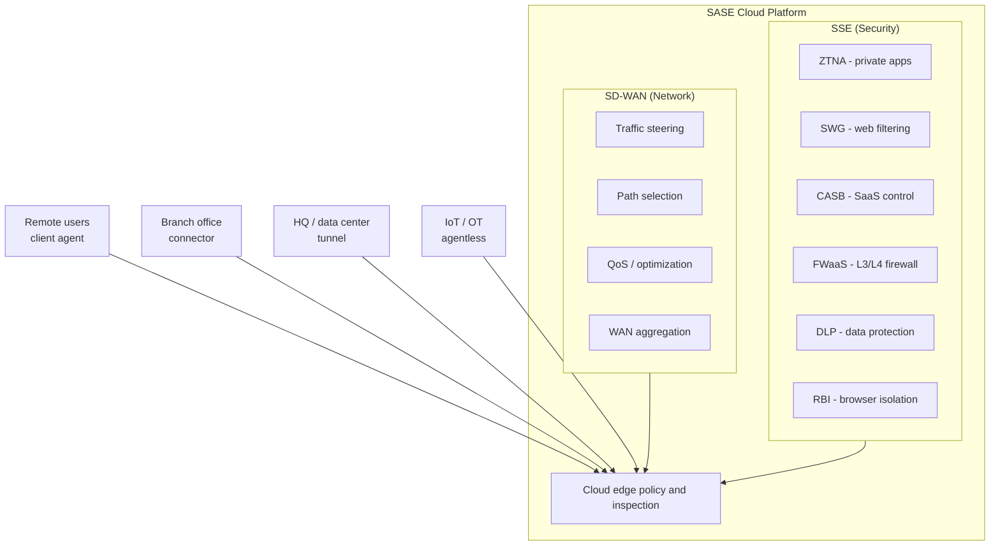
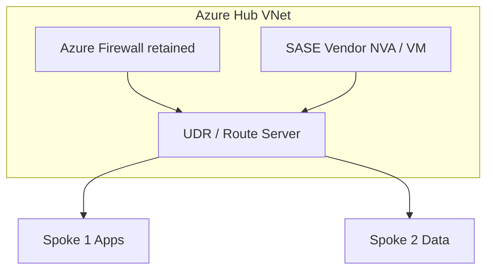

# Skill: SASE/SSE Architecture Design

## Purpose

Design complete Secure Access Service Edge (SASE) and Security Service Edge (SSE) architectures that converge networking and security into a unified, cloud-delivered service model. This skill covers the full Gartner SASE framework, deployment models, migration strategies, and integration with existing enterprise infrastructure.

## Core Knowledge

### The SASE Framework (Gartner Model)

SASE, defined by Gartner in 2019, converges two previously separate domains into a single cloud-delivered service:

**Networking (SD-WAN side):**
- Software-Defined Wide Area Network (SD-WAN)
- WAN optimization
- Quality of Service (QoS)
- Routing and traffic steering
- Bandwidth aggregation

**Security (SSE side):**
- Zero Trust Network Access (ZTNA)
- Secure Web Gateway (SWG)
- Cloud Access Security Broker (CASB)
- Firewall-as-a-Service (FWaaS)
- Remote Browser Isolation (RBI)
- Data Loss Prevention (DLP)

The core principle is that security and networking decisions are made together at the cloud edge, closest to the user, rather than backhauling traffic to centralized data centers.

### SSE Pillars — Detailed Breakdown

**ZTNA (Zero Trust Network Access):**
Replaces traditional VPN by providing identity-aware, application-level access. Users connect to specific applications, not network segments. Access decisions are based on identity + device posture + context.

**SWG (Secure Web Gateway):**
Inspects and filters all internet-bound traffic. Provides URL categorization, TLS inspection, malware scanning, and content filtering. Replaces on-premises proxy appliances.

**CASB (Cloud Access Security Broker):**
Governs access to SaaS applications. Provides shadow IT discovery, DLP enforcement, SaaS security posture management (SSPM), and threat protection for cloud services.

**FWaaS (Firewall-as-a-Service):**
Cloud-delivered Layer 3/4 and Layer 7 firewall capabilities. Applies network segmentation policies without requiring on-premises firewall appliances at every location.

### Single-Vendor vs Best-of-Breed

**Single-Vendor SASE:**

Advantages:
- Unified management console and policy engine
- Consistent data plane across all security services
- Simplified procurement and vendor management
- Single agent on endpoints
- Correlated telemetry and analytics
- Faster time to deployment

Disadvantages:
- Vendor lock-in
- May not be best-in-class in all pillars
- Single point of failure for all security services
- Feature gaps require waiting on vendor roadmap
- Negotiation leverage reduced

Best fit: Organizations prioritizing operational simplicity, mid-market companies with limited security staff, greenfield deployments.

**Best-of-Breed (Multi-Vendor):**

Advantages:
- Select top-tier solution for each pillar
- Avoid single-vendor lock-in
- Leverage existing investments
- Negotiate competitive pricing
- Depth of features in specialized areas

Disadvantages:
- Integration complexity and gaps
- Multiple agents on endpoints
- Inconsistent policy models
- Higher operational overhead
- Potential security blind spots between solutions

Best fit: Large enterprises with dedicated security teams, organizations with strong existing investments in specific pillars, highly regulated industries requiring specific capabilities.

**Hybrid Approach (Pragmatic Middle Ground):**

Most enterprises adopt a hybrid model:
- Primary SSE vendor for SWG + CASB + ZTNA (single data plane)
- Separate SD-WAN vendor (often driven by existing WAN contracts)
- Specialized DLP or CASB for specific compliance needs
- Integration via APIs, SCIM, and log forwarding

### Cloud-Native vs Hybrid SASE

**Cloud-Native SASE:**

All security and networking functions run in the vendor's global cloud infrastructure. No on-premises hardware for security processing.

Architecture characteristics:
- Global PoP (Point of Presence) network with anycast routing
- User traffic steered to nearest PoP via DNS or agent
- All inspection happens at the PoP (TLS decrypt, malware scan, DLP)
- Policy engine distributed across all PoPs
- Data plane scales elastically

When to use:
- Remote-first or hybrid workforces
- Organizations with minimal on-premises infrastructure
- SaaS-heavy application portfolios
- Companies seeking to eliminate hardware refresh cycles

**Hybrid SASE:**

Combines cloud-delivered security with on-premises security processing for latency-sensitive or compliance-bound traffic.

Architecture characteristics:
- Cloud PoPs handle remote user and branch traffic
- On-premises security stack retained for DC-to-DC traffic
- Local breakout at branches with cloud policy enforcement
- SD-WAN appliances at branches with integrated security
- Data residency controls keep certain inspection local

When to use:
- Organizations with significant on-premises applications
- Regulatory requirements for data residency
- Latency-sensitive applications (real-time trading, manufacturing)
- Transitional state during migration from legacy architecture

### Deployment Models

**Client-Based (Agent):**

A lightweight agent installed on managed endpoints (laptops, desktops, mobile):
- Intercepts all traffic at the OS network stack
- Establishes tunnels to nearest SASE PoP
- Reports device posture (OS version, patches, EDR status)
- Supports pre-logon connectivity for domain join
- Handles seamless roaming between networks

Use cases: Managed corporate devices, remote workers, contractors with managed devices.

**Clientless (Browser-Based):**

Access via reverse proxy or browser isolation without installing software:
- Users access applications through a portal or magic link
- Browser renders application via isolated session
- No endpoint software required
- Limited to web-based (HTTP/HTTPS) applications
- Suitable for BYOD and third-party access

Use cases: Unmanaged devices, third-party vendors, contractors, M&A integration.

**Branch Connector (Appliance/VM):**

A physical or virtual appliance at branch locations:
- Terminates site-to-site tunnels to SASE cloud
- Routes all branch traffic through security stack
- Provides local LAN switching and Wi-Fi (some models)
- Supports IoT and OT device traffic without agents
- Can run lightweight security (local DNS filtering, basic FW)

Use cases: Branch offices, retail locations, manufacturing sites, IoT/OT environments.

### Integration with Existing Network Infrastructure

**Azure Hub-Spoke Integration:**

- Deploy SASE vendor NVA in the hub VNet for east-west inspection
- Use UDRs to steer traffic through SASE NVA
- Retain Azure Firewall for Azure-native policy (or replace entirely)
- Connect branch offices via SASE SD-WAN tunnels to hub NVA
- Remote users connect via SASE agent → cloud PoP → hub NVA → spoke apps

**Azure Virtual WAN Integration:**

- Deploy SASE vendor as integrated NVA in vWAN hub
- Leverage vWAN routing intent for automatic traffic steering
- SASE vendor handles security inspection in the vWAN data plane
- Branch SD-WAN appliances terminate in vWAN hub
- Supports Zscaler, Palo Alto, Fortinet, and others as vWAN partners

**AWS Transit Gateway Integration:**

- SASE vendor VPC attached to Transit Gateway
- Route tables steer inspection traffic through SASE VPC
- GRE/IPsec tunnels from SASE cloud to TGW
- AWS Verified Access for AWS-native ZTNA (limited scope)
- CloudWAN for global SD-WAN with SASE security services

### Migration from Legacy VPN/Proxy to SASE

**Phase 1 — Foundation (Months 1–3):**
- Deploy SASE agent to pilot group (IT staff, early adopters)
- Configure identity provider integration (Microsoft Entra ID, Okta)
- Define initial ZTNA policies for 5–10 critical applications
- Run in monitor/audit mode to baseline traffic patterns
- Keep existing VPN operational as primary access method

**Phase 2 — Expand Security (Months 3–6):**
- Enable SWG for internet traffic (parallel with existing proxy)
- Migrate URL filtering policies from legacy proxy
- Configure TLS inspection with bypass rules for known-good
- Enable CASB discovery to identify shadow IT
- Expand ZTNA to 20–50 applications
- Begin redirecting internet traffic through SASE (split tunnel)

**Phase 3 — Migrate Access (Months 6–12):**
- Move all remote users to ZTNA for private app access
- Disable VPN split tunnel; route all traffic through SASE
- Decommission legacy VPN concentrators
- Enable FWaaS for branch locations
- Migrate remaining proxy users to SWG
- Deploy branch connectors to replace site-to-site VPN

**Phase 4 — Optimize (Months 12–18):**
- Decommission legacy proxy appliances
- Implement DLP policies across SWG and CASB
- Enable advanced features (RBI, UEBA, SSPM)
- Consolidate SD-WAN with SASE vendor (if single-vendor strategy)
- Full zero trust posture with continuous trust assessment

### Reference Architectures by Organization Size

**Small Organization (100–500 users):**
- Single-vendor SASE (e.g., Zscaler, Cato Networks)
- Client agent on all managed devices
- Clientless access for contractors
- 1–3 branch connectors
- Direct-to-cloud for all traffic
- Managed IdP (Microsoft Entra ID / Okta)
- No on-premises security hardware

**Mid-Market (500–5,000 users):**
- Primary SSE vendor + separate SD-WAN (or single-vendor)
- Client agent with device posture
- Branch connectors with local breakout
- Hybrid: cloud PoP for internet, connector for private DC apps
- Azure vWAN or hub-spoke integration
- Existing firewall retained for DC east-west (phased removal)
- Dedicated DLP policies for regulated data

**Large Enterprise (5,000–50,000+ users):**
- Multi-vendor or hybrid approach
- Regional PoP requirements and data residency controls
- Multiple IdP integrations (post-M&A)
- Complex SD-WAN with dual-vendor branches
- Retained on-premises security for specific traffic flows
- Custom integrations via APIs (SIEM, SOAR, ITSM)
- Dedicated compliance team managing CASB and DLP
- Global traffic steering with latency optimization

## Decision Framework

| Factor | Cloud-Native SASE | Hybrid SASE | Legacy + Point Solutions |
|--------|-------------------|-------------|--------------------------|
| Remote workforce | ✅ Ideal | ✅ Good | ❌ VPN scaling issues |
| Branch offices | ✅ Branch connector | ✅ SD-WAN + cloud | ⚠️ MPLS + firewall |
| On-prem apps | ⚠️ Connector required | ✅ Local + cloud | ✅ Direct |
| SaaS-heavy | ✅ Direct-to-cloud | ✅ Good | ❌ Backhaul penalty |
| Latency-sensitive | ⚠️ PoP proximity dependent | ✅ Local breakout | ✅ Direct path |
| Compliance (data residency) | ⚠️ Check PoP locations | ✅ Local processing | ✅ Full control |
| OpEx vs CapEx | OpEx (subscription) | Mixed | CapEx (hardware) |
| Time to deploy | Weeks | Months | Months–Years |

## Key Design Decisions Checklist

1. **Identity Provider** — Which IdP(s) will serve as the trust anchor?
2. **Agent Strategy** — Which devices get agents? What about BYOD/IoT?
3. **Traffic Steering** — Full tunnel vs split tunnel? What bypasses the SASE stack?
4. **TLS Inspection** — Where to inspect? What to bypass (certificate pinning)?
5. **Data Residency** — Where is traffic inspected? Where are logs stored?
6. **Redundancy** — What happens if SASE vendor has an outage?
7. **SD-WAN Integration** — Same vendor or separate? API integration depth?
8. **Migration Approach** — Big bang or phased? Which users/apps first?
9. **Policy Model** — User-based? Device-based? App-based? Context-based?
10. **Monitoring** — How does SASE telemetry integrate with existing SIEM/SOC?

---
**Analysis only — verify against vendor documentation before applying.**
