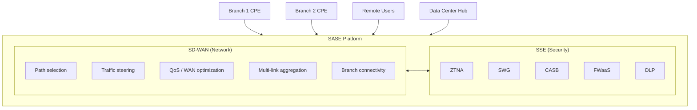
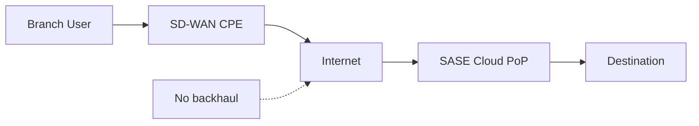
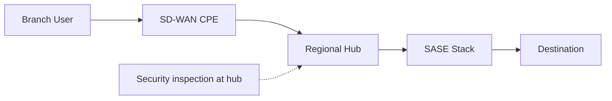
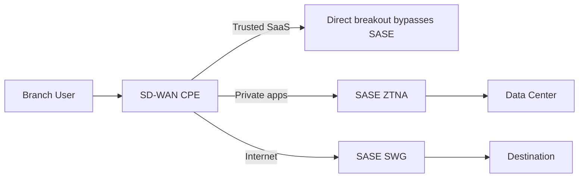
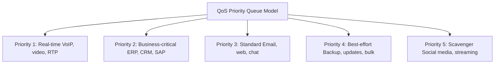
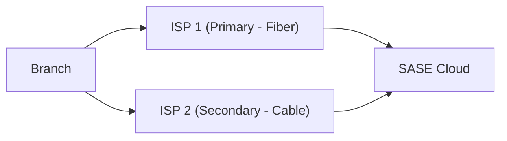
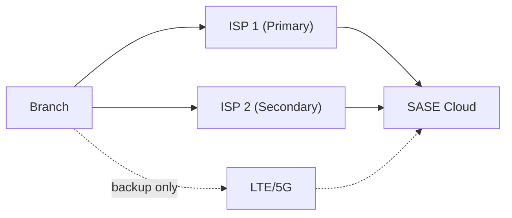
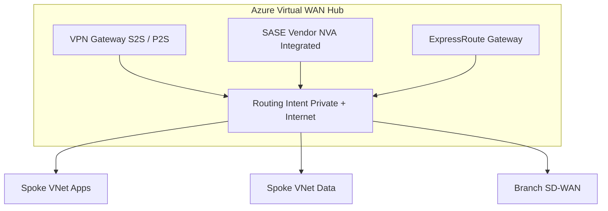
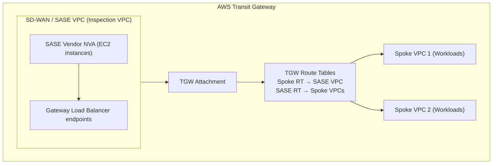

# Skill: SD-WAN with SASE Integration

## Purpose

Design SD-WAN architectures that integrate with SASE security services, covering branch connectivity patterns, traffic steering strategies, cloud provider integration (Azure vWAN, AWS Transit Gateway), QoS, redundancy, and multi-vendor SD-WAN deployments. SD-WAN is the networking pillar of SASE, responsible for intelligent path selection while the SSE pillar provides security inspection.

## Core Knowledge

### SD-WAN as the Networking Pillar of SASE

In the Gartner SASE framework, SD-WAN provides the network fabric that connects users and branches to applications and security services:

**SD-WAN responsibilities in SASE:**
- Steer traffic to the appropriate security service (SWG, ZTNA, FWaaS)
- Select optimal WAN path based on application requirements
- Aggregate bandwidth across multiple links (MPLS, broadband, LTE)
- Provide local breakout for trusted SaaS (Office 365, Teams)
- Connect branches to SASE cloud PoPs via encrypted tunnels
- Ensure failover and redundancy across WAN links

### Traffic Steering Models

**Direct-to-Cloud (Internet Breakout):**

- All traffic exits directly from branch to internet
- SASE cloud PoP provides security inspection
- Lowest latency for SaaS and internet access
- Requires SASE PoP proximity (latency-sensitive)
- Best for: SaaS-heavy branches, remote offices

**Regional Hub Backhaul:**

- Traffic routes to regional hub for inspection
- Security stack centralized at fewer locations
- Higher latency but more control
- Suitable for compliance-heavy environments
- Best for: Regulated industries, data residency requirements

**Split-Tunnel with Policy:**

- SD-WAN classifies traffic by application/destination
- Trusted SaaS (O365, Teams) goes direct for performance
- Private app access routes through ZTNA
- General internet routes through SWG
- Most common production pattern
- Requires well-defined application classification

**Application-Aware Steering Rules (Example):**

| Application | Steering | Reason |
|-------------|----------|--------|
| Microsoft 365 | Direct breakout | Microsoft recommends; latency-sensitive |
| Zoom/Teams (media) | Direct breakout | Real-time; QoS-sensitive |
| Salesforce | Through SWG | DLP required; inspected |
| Internal ERP | ZTNA tunnel | Private app; identity-verified |
| General web | Through SWG | URL filtering + malware scan |
| YouTube (streaming) | Through SWG | Bandwidth control |
| Windows Update | Direct breakout | High bandwidth; trusted |

### Branch Connectivity Patterns

**Thin Branch:**

Minimal hardware at branch; all intelligence in the cloud:
- Small SD-WAN appliance or virtual CPE (vCPE)
- No local security stack — all traffic steered to SASE cloud
- Simple configuration: tunnel to SASE + local LAN switching
- Fast deployment (ship and zero-touch provision)
- Low cost per branch
- Dependent on WAN connectivity for all functions

Use cases: Retail stores, small offices (<25 users), pop-up locations, co-working spaces.

**Heavy Branch:**

Full-featured SD-WAN with local security capabilities:
- Full SD-WAN appliance with integrated firewall
- Local security processing for east-west within branch
- Local breakout for latency-sensitive apps
- On-box NGFW for LAN segmentation (IoT/OT isolation)
- Can operate degraded during WAN outage
- Higher cost, more complex management

Use cases: Large branch offices (100+ users), manufacturing sites, regional HQs, locations with unreliable WAN.

**Hybrid Branch:**

Balanced approach for most enterprise scenarios:
- SD-WAN appliance with basic local security (DNS filtering, basic FW)
- Internet traffic steered to SASE cloud for full inspection
- Local breakout for trusted SaaS (configurable per app)
- IoT segmentation handled locally
- Critical apps have local survivability cache
- Good balance of cost, performance, and security

Use cases: Medium branches (25–100 users), locations with mixed connectivity.

### QoS and Application-Aware Routing

**Application Classification:**

SD-WAN must identify applications to make routing decisions:
- Deep Packet Inspection (DPI): Identify apps by payload signatures
- First-packet classification: Some platforms identify app from first packet
- DNS-based: Classify by FQDN before connection starts
- Cloud intelligence: Vendor-maintained app signature databases
- Custom signatures: Define org-specific applications

**QoS Policy Framework:**

**Path Selection Logic:**

SD-WAN continuously monitors WAN link quality and steers traffic:
- Latency threshold: If link latency > X ms, failover to alternate
- Jitter threshold: Real-time traffic intolerant to jitter > Y ms
- Packet loss: Threshold-based failover (e.g., >0.5% = failover for voice)
- Bandwidth utilization: Load-balance when link approaches capacity
- Forward Error Correction (FEC): Duplicate packets on lossy links
- Packet reordering: Fix out-of-order delivery from multi-path routing

### Redundancy and High Availability

**Dual ISP (Active/Active):**

- Both links active, traffic distributed by policy
- Business-critical apps on primary (lower latency)
- Bulk/backup traffic on secondary
- Automatic failover if either link degrades
- SLA monitoring triggers path changes

**Dual ISP + LTE/5G Backup:**

- LTE/5G activates only when both ISPs fail
- Metered billing: Only use for critical traffic during outage
- Pre-established tunnel (fast failover, no setup delay)
- Throttle to essential apps only on cellular backup
- Consider eSIM with multiple carriers for diversity

**Hub Redundancy:**

For sites connecting to data center hubs:
- Dual hub connectivity (two SD-WAN hubs in different locations)
- Active/active with preference (primary DC, secondary DR)
- BGP-based failover between hubs
- SASE vendor PoP redundancy (automatic by most vendors)

### Azure Virtual WAN + SASE Integration

**Architecture:**

Azure Virtual WAN natively integrates with SASE vendors as Network Virtual Appliances (NVAs):

**Supported SASE vendor integrations:**
- **Zscaler:** ZIA + ZPA integrated in vWAN hub
- **Palo Alto:** Prisma Access/Cloud NGFW as vWAN NVA
- **Fortinet:** FortiGate NVA in vWAN hub
- **Check Point:** CloudGuard in vWAN hub
- **Barracuda:** SecureEdge in vWAN hub

**Routing Intent configuration:**
- Internet Traffic: Route all internet-bound traffic through SASE NVA
- Private Traffic: Route inter-spoke and branch-to-spoke through SASE NVA
- Both: All traffic (internet + private) through SASE NVA

**Design considerations for Azure vWAN + SASE:**
- Single vWAN hub per region with SASE NVA
- Multi-region: SASE NVA in each regional hub
- Use Routing Intent for automatic traffic steering (no manual UDRs)
- Branch SD-WAN appliances connect via S2S VPN or SD-WAN tunnel
- ExpressRoute connected sites can also route through SASE NVA
- Scale: Check vendor-specific throughput limits for NVA in vWAN

### AWS Transit Gateway + SD-WAN Integration

**Architecture:**

**Integration patterns:**
- **Gateway Load Balancer (GWLB):** Insert SASE NVA transparently using GWLB endpoints
- **TGW Route Table steering:** Route spoke traffic to SASE VPC via TGW route tables
- **SD-WAN VPN attachment:** Branch SD-WAN connects to TGW via Site-to-Site VPN
- **CloudWAN:** AWS-managed global network with SD-WAN policy integration

**AWS-native options:**
- AWS Network Firewall for VPC-level inspection
- AWS Verified Access for ZTNA (HTTP/HTTPS apps only)
- AWS Transit Gateway for hub-spoke routing
- AWS CloudWAN for global SD-WAN management (limited SASE integration)

### Vendor-Specific SD-WAN + SASE Integrations

**Cisco Viptela / Meraki SD-WAN:**
- Viptela (enterprise): Full SD-WAN fabric with vManage orchestration
- Integration with Cisco Umbrella (SIG) for cloud security
- Meraki (SMB/mid-market): Cloud-managed SD-WAN with built-in security
- Cisco+ Secure Connect: Unified SASE platform combining Viptela + Umbrella
- ThousandEyes integration for path visibility
- Branch: ISR/ASR routers or Meraki MX appliances

**VMware VeloCloud (Broadcom):**
- Cloud-delivered SD-WAN with global gateway network
- Integration points: Zscaler, Palo Alto, Netskope via service chaining
- VeloCloud Edge appliances at branches
- VMware SASE: VeloCloud + Workspace ONE + Carbon Black
- Orchestrator for centralized policy and monitoring
- Multi-cloud connectivity: direct peering with Azure, AWS, GCP

**Fortinet SD-WAN (FortiGate):**
- SD-WAN built into FortiGate NGFW appliance
- FortiSASE: Cloud-delivered SASE with FortiGate in the cloud
- Tight integration: Same FortiOS for branch and cloud
- ASIC-accelerated (hardware FortiGate) or VM-based
- Security Fabric: Unified visibility across FortiGate + FortiSASE
- Zero-trust tags for dynamic segmentation

**Aruba EdgeConnect (HPE):**
- Application-defined SD-WAN with first-packet classification
- WAN optimization (TCP/application-level optimization)
- Integration with Zscaler, Palo Alto, Netskope for SASE security
- Aruba Central for cloud management
- Orchestrator-based policy with business intent overlays
- Boost: WAN optimization + QoS + path conditioning

**Versa Networks:**
- Single-stack SASE: SD-WAN + NGFW + SWG + ZTNA on single platform
- Versa Operating System (VOS) for unified policy
- Multitenant architecture (MSSP-friendly)
- CPE-based or cloud-delivered
- Concerto orchestration platform
- Analytics and AI/ML-driven insights

### SD-WAN Deployment Design Decisions

**Overlay topology:**
- Full mesh: Every site connects to every other site (high bandwidth but complex)
- Hub-and-spoke: All traffic through central hub (simple but bottleneck risk)
- Partial mesh: Regional hubs with full mesh between them (balanced)
- Dynamic mesh: On-demand tunnels between sites as needed (most flexible)

**Underlay considerations:**
- ISP diversity: Use different providers for each link at a site
- Path diversity: Ensure physical path diversity (not same fiber route)
- SLA requirements: Map application SLAs to link capabilities
- Bandwidth: Size links for peak + growth (typically 30% headroom)
- Cost: Balance between MPLS (expensive, reliable) and internet (cheap, variable)

**Zero-Touch Provisioning (ZTP):**
- Ship pre-configured appliances to branch (no IT staff needed)
- Appliance phones home to orchestrator on first boot
- Downloads full configuration, builds tunnels, joins overlay
- Reduces deployment time from weeks to hours
- Requires reliable initial internet connectivity at branch

## Decision Framework

### SD-WAN Vendor Selection for SASE

| Criteria | Cisco Viptela | VMware VeloCloud | Fortinet | Aruba EdgeConnect | Versa |
|----------|--------------|-----------------|----------|-------------------|-------|
| Integrated SASE | ⚠️ Umbrella (separate) | ⚠️ VMware SASE | ✅ FortiSASE | ⚠️ Partner (Zscaler) | ✅ Native SASE |
| Enterprise scale | ✅ | ✅ | ✅ | ✅ | ✅ |
| WAN optimization | ⚠️ Limited | ✅ | ⚠️ Basic | ✅ Boost | ✅ |
| Multi-cloud | ✅ | ✅ | ✅ | ✅ | ✅ |
| Azure vWAN | ✅ | ✅ | ✅ | ⚠️ | ✅ |
| Hardware CPE | ✅ ISR/ASR | ✅ Edge | ✅ FortiGate | ✅ EdgeConnect | ✅ VOS |
| Operational complexity | Medium-High | Medium | Medium | Medium | Medium-High |

### Traffic Steering Decision

| Scenario | Recommended Pattern | Notes |
|----------|--------------------| ------|
| SaaS-heavy, remote workers | Direct-to-cloud | Lowest latency, requires good SASE PoP coverage |
| Compliance (data residency) | Regional hub backhaul | Inspection at known locations |
| Mixed workload | Split-tunnel with policy | Most common; requires app classification |
| Latency-sensitive apps | Local breakout + QoS | Real-time apps bypass inspection |
| Air-gapped / OT segments | Heavy branch with local FW | Cannot rely on cloud for security |

### Branch Sizing

| Branch Type | Users | WAN Links | CPE Model | Security |
|-------------|-------|-----------|-----------|----------|
| Micro (retail) | 1–10 | 1× broadband + LTE | Small/virtual | All cloud |
| Small | 10–25 | 1× broadband + LTE | Entry CPE | All cloud |
| Medium | 25–100 | 2× broadband or 1× MPLS + 1× broadband | Mid-range CPE | Cloud + local DNS |
| Large | 100–500 | 2× broadband + MPLS + LTE | High-end CPE | Cloud + local NGFW |
| Campus/HQ | 500+ | Dedicated fiber + MPLS + broadband | HA pair | Local + cloud |

---
**Analysis only — verify against vendor documentation before applying.**
