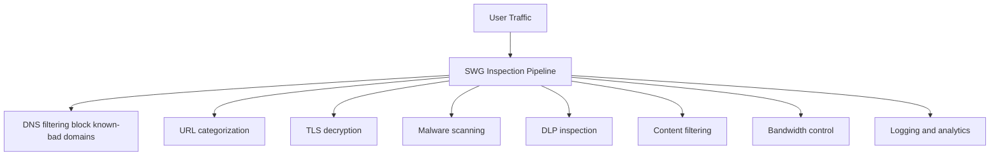
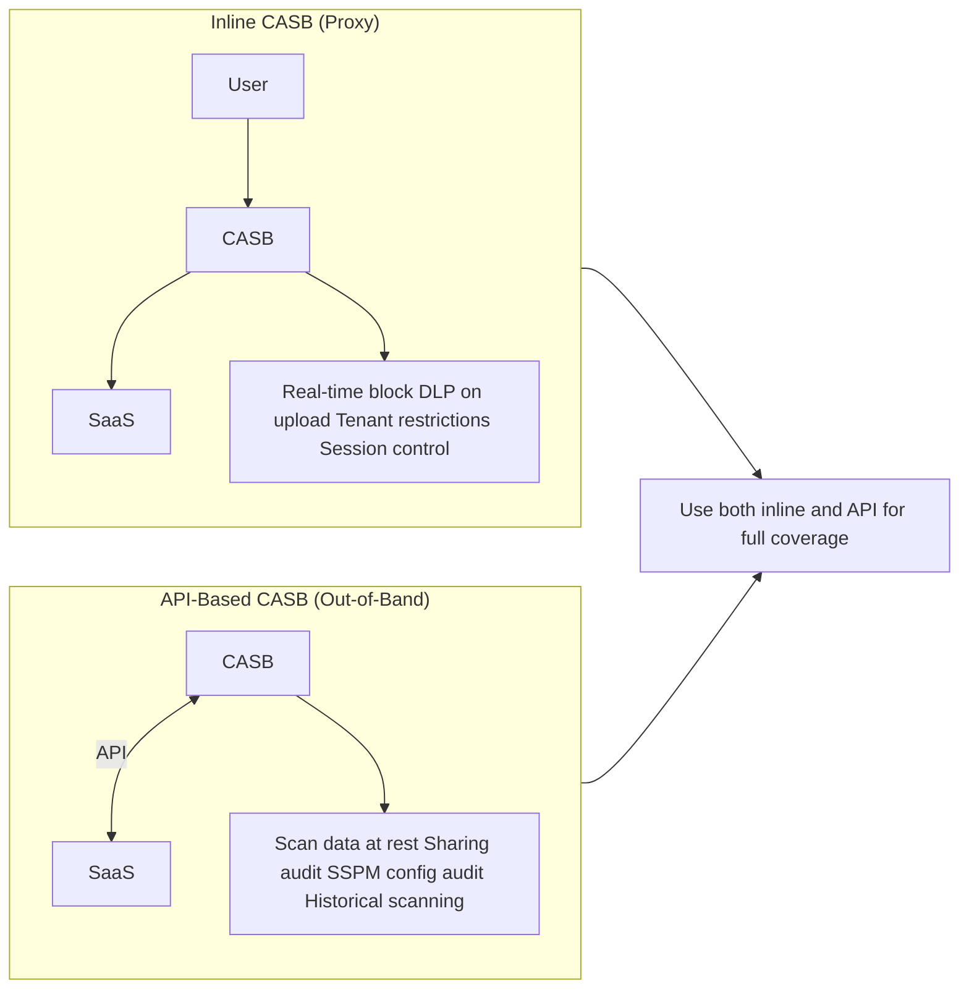
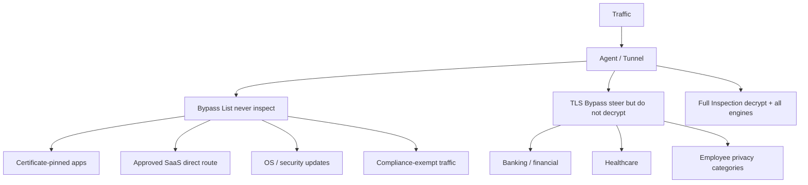

# Skill: Secure Web Gateway (SWG) & Cloud Access Security Broker (CASB)

## Purpose

Design and implement Secure Web Gateway and CASB solutions that protect users accessing internet resources and SaaS applications. This skill covers URL filtering, TLS inspection, malware prevention, shadow IT discovery, DLP enforcement, SaaS security posture management, and integration with existing proxy infrastructure.

## Core Knowledge

### Secure Web Gateway (SWG) — Fundamentals

A Secure Web Gateway inspects and enforces policy on all internet-bound traffic from users, regardless of their location. Cloud-delivered SWG replaces on-premises proxy appliances (Blue Coat, Squid, Zscaler Appliance) with globally distributed inspection points.

**Core SWG Functions:**



**URL Filtering:**
- Category-based blocking (gambling, malware, adult content)
- Custom allow/block lists for organizational policy
- Risk-based scoring (newly registered domains, phishing probability)
- Tenant restrictions (allow only corporate Office 365 tenant)
- Cloud app categorization (sanctioned vs unsanctioned SaaS)
- Safe search enforcement (Google, Bing, YouTube)

**TLS Inspection (SSL Decryption):**

Modern web traffic is 95%+ encrypted. Without TLS inspection, SWG is limited to DNS/IP-level controls.

```
Original Flow:   User ←──TLS──► Website
Inspected Flow:  User ←──TLS──► SWG ←──TLS──► Website
                          (decrypt, inspect, re-encrypt)
```

TLS inspection architecture:
1. SWG presents its own CA-signed certificate to the user
2. User's device trusts the SWG CA (deployed via GPO/MDM)
3. SWG decrypts traffic, inspects content, re-encrypts to destination
4. Full visibility into URLs, headers, content, file uploads/downloads

**TLS Inspection Considerations:**

*Certificate pinning challenges:*
- Some applications pin certificates and reject SWG-issued certs
- Banking apps, healthcare portals, government sites often pin
- Solution: Maintain bypass lists for pinned certificate domains
- Monitor for new pinned apps that break after TLS inspection enabled

*Must-bypass categories:*
- Financial/banking applications (certificate pinning)
- Healthcare portals (HIPAA, patient data sensitivity)
- Government sites (certificate pinning, compliance)
- EDR/security agent communications
- Certificate revocation (OCSP/CRL) traffic
- OS update services (Windows Update, Apple Software Update)

*Compliance considerations:*
- Some jurisdictions restrict TLS interception (employee privacy)
- GDPR: Inform users that traffic is inspected
- PCI-DSS: Never store decrypted cardholder data
- Employee personal traffic: Consider bypass for personal categories

**Malware Scanning:**
- Signature-based detection (known malware hashes)
- Behavioral analysis (sandbox detonation of unknown files)
- Machine learning models (zero-day detection)
- File type blocking (executables, scripts, archives)
- Cloud sandbox integration (detonate before delivery)
- Inline vs out-of-band scanning (latency vs thoroughness)
- Patient zero protection (retroactive alerts for newly-flagged files)

### Cloud Access Security Broker (CASB) — Fundamentals

CASB provides visibility and control over SaaS application usage, protecting data and enforcing policy across cloud services.

**CASB Deployment Modes:**



**Inline CASB (Forward Proxy):**
- Deployed in the traffic path (often integrated with SWG)
- Real-time enforcement: block uploads, restrict actions
- Applies tenant restrictions (block personal O365 accounts)
- Requires traffic steering (agent, PAC file, or GRE tunnel)
- Can enforce adaptive access policies (read-only for unmanaged devices)
- Latency-sensitive: must be fast or users notice

**API-Based CASB (Out-of-Band):**
- Connects to SaaS via management APIs (Graph API, Salesforce API)
- Scans existing data at rest in SaaS tenants
- Discovers shared files, external collaborators, policy violations
- No traffic steering required — works independently
- Cannot block in real-time (reactive: quarantine after detection)
- SaaS Security Posture Management (SSPM): audit SaaS configs

**Shadow IT Discovery:**

Process to identify and classify all SaaS usage:
1. Analyze firewall/proxy logs for cloud service traffic
2. CASB catalogs 30,000+ cloud services with risk scores
3. Score each service: security, compliance, functionality
4. Classify: Sanctioned (approved), Tolerated (monitored), Unsanctioned (blocked)
5. Provide alternatives: Block unsanctioned but recommend sanctioned equivalent

Shadow IT signals:
- DNS queries to known SaaS domains
- SNI (Server Name Indication) in TLS handshakes
- HTTP User-Agent strings (app-specific)
- OAuth token grants (app registrations in Microsoft Entra ID)
- API call patterns from managed SaaS (e.g., O365 → third-party)

**Data Loss Prevention (DLP) via CASB:**
- Content inspection: Detect sensitive data patterns (SSN, credit cards, PHI)
- Context-aware: Who is sharing? To whom? Which app? Managed device?
- Actions: Block, quarantine, encrypt, notify, coach (user education popup)
- Exact data match: Compare against database of known sensitive records
- Document fingerprinting: Detect forms and templates with sensitive fields
- OCR: Scan images and screenshots for sensitive text

**SaaS Security Posture Management (SSPM):**
- Audit SaaS configuration against CIS benchmarks
- Detect misconfigurations: public sharing enabled, weak auth
- Monitor for configuration drift
- Examples: O365 SPO external sharing, Salesforce session settings
- Remediation guidance or automated fix (with approval)

### Integration with Existing Proxy Infrastructure

**Migration from on-premises proxy:**

Phase approach:
1. Deploy cloud SWG in parallel (audit/monitor mode)
2. Redirect pilot group traffic to cloud SWG
3. Validate: URL categories match, bypass rules work, no breakage
4. Migrate policy rules from legacy proxy (often 1000s of rules)
5. Consolidate redundant rules (legacy often has years of accumulation)
6. Expand to all users, decommission on-premises proxies

**PAC file considerations:**
- Legacy environments often use PAC files for proxy auto-configuration
- Cloud SWG can use PAC files as a transitional steering mechanism
- Agent-based steering is preferred (more reliable than PAC)
- Some environments need PAC files for unmanaged devices
- PAC file complexity: Avoid nested conditions; keep simple

**Explicit proxy vs transparent proxy:**
- Explicit: Client configured to use proxy (PAC/WPAD/manual)
- Transparent: Traffic intercepted in-path (WCCP, PBR, inline)
- Cloud SWG typically uses agent (tunnel mode) — neither explicit nor transparent
- For branch offices without agents: GRE/IPsec tunnel to SWG cloud

### Bypass Rules and Exceptions Management

**Bypass architecture:**



**Bypass management best practices:**
- Start with TLS inspection enabled, add bypasses reactively
- Document every bypass with business justification
- Review bypass list quarterly (remove stale entries)
- Use category-based bypasses where possible (not IP/domain lists)
- Monitor bypassed traffic for anomalies (bypasses are blind spots)
- Separate bypass decisions: network bypass vs TLS bypass vs DLP bypass

## Vendor-Specific Details

### Microsoft Defender for Cloud Apps (MDA)

**Architecture:**
- API-based CASB connecting to O365, Azure, AWS, GCP, Salesforce, Box, etc.
- Inline via Conditional Access App Control (reverse proxy)
- Integrated with Microsoft 365 Defender suite
- Uses Microsoft Entra ID Conditional Access as the policy engine

**Key capabilities:**
- Shadow IT discovery via Cloud Discovery (firewall log analysis or Defender for Endpoint)
- Conditional Access App Control: session-level controls (block download, watermark, read-only)
- File policies: Scan O365/SharePoint/OneDrive for sensitive content
- Activity policies: Alert on mass download, unusual login, privilege escalation
- App governance: Monitor OAuth apps registered in Microsoft Entra ID
- SaaS Security Posture Management for connected apps

**Design patterns:**
- Enable Cloud Discovery using Defender for Endpoint integration (no log upload needed)
- Use Conditional Access App Control for reverse proxy mode (session policies)
- Connect apps via API connectors for at-rest scanning
- Create file policies for DLP (detect PII in SharePoint/OneDrive)
- Alert on impossible travel, mass deletions, suspicious OAuth grants

**Limitations:**
- Conditional Access App Control requires Microsoft Entra ID (not third-party IdP directly)
- Session controls limited to browser access (native apps may bypass)
- Some SaaS APIs have rate limits affecting scan speed
- Custom app onboarding requires manual configuration

### Zscaler Internet Access (ZIA)

**Architecture:**
- Cloud-native SWG with 150+ global data centers
- Zscaler Client Connector agent steers all traffic to nearest ZIA node
- Single-pass inspection engine: decrypt → inspect → re-encrypt in one pass
- Nano-segmentation for cloud-to-cloud traffic

**Key capabilities:**
- Full SSL inspection at scale (handle enterprise traffic volumes)
- Advanced threat protection: sandboxing (Cloud Sandbox), IPS, ATP
- URL filtering with 6+ billion daily transactions training ML models
- Cloud DLP with EDM (exact data match) and IDM (indexed document matching)
- Cloud Firewall (Layer 3/4 + Layer 7 app control)
- Bandwidth Control (throttle/block categories like streaming)
- Browser Isolation (render risky sites in disposable containers)
- Cloud CASB integrated (inline + API via separate CASB module)
- Digital Experience Monitoring (Zscaler Digital Experience — ZDX)

**Design patterns:**
- Deploy ZIA with Client Connector for all managed endpoints
- Use GRE/IPsec tunnels from branch routers for unmanaged devices
- Enable SSL inspection broadly, add bypasses as needed
- Layer policies: Global → Location → Department → User
- Use Cloud Sandbox for zero-day protection (all unknown executables)
- Pair with ZPA for private app access (unified Zscaler platform)

**ZIA traffic flow:**
1. Client Connector intercepts DNS + HTTP(S) traffic
2. Steered to nearest ZIA data center (anycast DNS)
3. User authenticated (SAML cookie or agent auth)
4. Policy evaluated (user, group, location, device posture)
5. TLS decrypted (if enabled for this category/destination)
6. Content inspected (URL filter → AV → Sandbox → DLP)
7. Connection allowed or blocked with user notification
8. Traffic forwarded to destination (direct or via ZIA egress)

### Palo Alto Prisma SaaS Security

**Architecture:**
- Part of Prisma SASE platform
- SaaS Security API for out-of-band scanning
- SaaS Security Inline for real-time control (via Prisma Access)
- Integrated with Prisma Access SWG + ZTNA

**Key capabilities:**
- Multi-mode CASB: Inline (Prisma Access) + API (next-gen API)
- SaaS Security Posture Management (SSPM) for misconfiguration detection
- Integrated DLP engine (unified with network DLP)
- ML-based data classification (not just regex patterns)
- Application governance (OAuth app visibility and control)

**Design patterns:**
- Deploy Prisma Access as unified SWG + ZTNA + CASB inline
- Connect SaaS apps via API for at-rest scanning (O365, G-Suite, Box)
- Enable SSPM to audit SaaS configs against CIS benchmarks
- Use inline DLP for upload/download control
- Unified policy across network firewall + CASB (single DLP engine)

### Netskope Platform

**Architecture:**
- NewEdge network: purpose-built global PoP network
- Netskope Client (agent) for traffic steering
- Cloud Exchange for integration (CTE, CRE, CTO modules)
- Zero Trust Engine for real-time inline decisions

**Key capabilities:**
- Patented Cloud XD technology: deep inspection of cloud app activity
- Instance-aware controls (distinguish corporate O365 vs personal O365)
- Real-time coaching: educate users about policy without hard blocking
- Advanced DLP with ML classifiers and exact data match
- Cloud Confidence Index (CCI): risk scoring for 50,000+ cloud apps
- Threat Protection: inline anti-malware, sandbox, RBI
- SSPM for top SaaS apps
- User and Entity Behavior Analytics (UEBA)

**Design patterns:**
- Deploy Netskope Client for inline protection (all users, all traffic)
- Enable Cloud Confidence Index for automated shadow IT risk scoring
- Use real-time coaching for user education during transition
- API protection for Office 365, Google Workspace, Salesforce, Box
- Instance-aware policies: Allow corporate Box, block personal Box
- Integrate with CrowdStrike, SentinelOne for unified device posture

**Netskope differentiators:**
- Data-centric approach: Netskope excels at data protection/DLP
- Instance awareness: Unique ability to distinguish app instances
- Coaching: User education without hard blocking reduces friction
- NewEdge: Every PoP has full compute (no traffic tromboning)

## Decision Framework

### SWG Deployment Decision Matrix

| Requirement | Cloud-Only SWG | Hybrid (Cloud + On-Prem) | On-Prem Only |
|-------------|---------------|--------------------------|--------------|
| Remote workers | ✅ Ideal | ✅ Good | ❌ Requires VPN |
| Branch offices | ✅ Direct-to-cloud | ✅ Local breakout options | ✅ Local |
| Latency-sensitive | ⚠️ PoP-dependent | ✅ Local for some | ✅ No hop |
| Air-gapped networks | ❌ Not possible | ⚠️ Limited | ✅ Required |
| Scale (100K+ users) | ✅ Elastic | ✅ Good | ⚠️ Hardware limits |
| Operational overhead | Low | Medium | High |

### CASB Mode Selection

| Use Case | Inline CASB | API CASB | Both |
|----------|-------------|----------|------|
| Block sensitive uploads | ✅ Real-time | ❌ After the fact | ✅ |
| Scan existing cloud data | ❌ Future only | ✅ Historical | ✅ |
| Restrict SaaS actions | ✅ Session control | ⚠️ Limited | ✅ |
| Shadow IT discovery | ✅ Live traffic | ⚠️ Log analysis | ✅ |
| SSPM (config audit) | ❌ Not applicable | ✅ API-based | ✅ |
| Unmanaged devices | ⚠️ Reverse proxy | ❌ No visibility | ⚠️ |
| Comprehensive DLP | ✅ In-motion | ✅ At-rest | ✅ |

### TLS Inspection Decision Criteria

| Factor | Inspect | Bypass |
|--------|---------|--------|
| General web browsing | ✅ | |
| Banking/financial sites | | ✅ (cert pinning) |
| SaaS with DLP needs | ✅ | |
| Healthcare portals | | ✅ (compliance) |
| Unknown/uncategorized | ✅ | |
| Security tool traffic | | ✅ (agent comms) |
| Streaming/CDN (high volume) | ⚠️ Consider bypass | ⚠️ |
| Personal traffic (if applicable) | | ✅ (privacy laws) |

### Key Design Questions

1. What percentage of traffic is encrypted (TLS)? (Answer: likely 95%+)
2. Which SaaS apps are sanctioned? How many unsanctioned are in use?
3. What data classification scheme exists? (Public, Internal, Confidential, Restricted)
4. Are there regulatory requirements for data inspection (PCI, HIPAA, GDPR)?
5. Do you need to support unmanaged/BYOD devices through the SWG?
6. What is the current proxy infrastructure? Can it be decommissioned?
7. How many custom URL categories or allow/block lists exist?
8. Is there an existing DLP program? What patterns/classifiers are defined?
9. What is the acceptable latency overhead for TLS inspection?
10. Do you need instance-level controls (block personal cloud accounts)?

---
**Analysis only — verify against vendor documentation before applying.**
