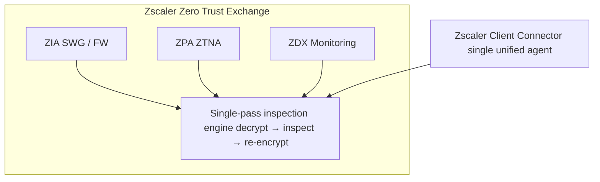
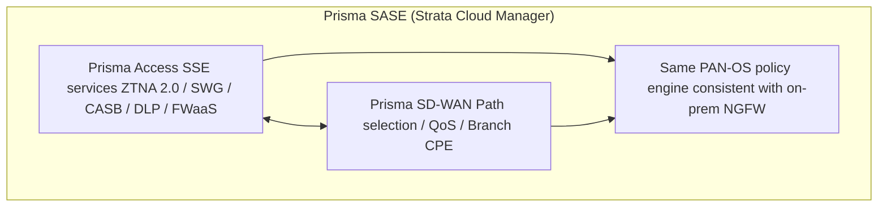
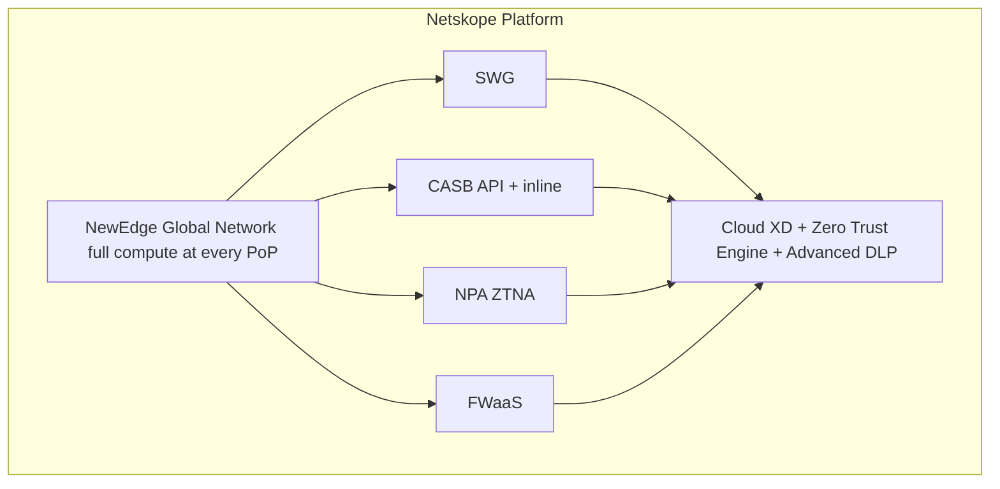

# Skill: SASE/SSE Vendor Comparison

## Purpose

Provide objective, architecture-aware comparison of leading SASE and SSE vendors to support vendor selection decisions. This skill covers vendor strengths, architectural differentiators, ideal use cases, decision criteria, and proof-of-concept evaluation frameworks. The goal is to help organizations select the right platform based on their specific requirements, existing infrastructure, and strategic direction.

## Core Knowledge

### Market Landscape

The SASE/SSE market is divided into vendors that provide:
- **Full SASE (Network + Security):** Single vendor for SD-WAN + SSE
- **SSE-Only:** Security services without integrated SD-WAN
- **SD-WAN + Partner Security:** SD-WAN vendor partnering with SSE provider

Gartner defines separate Magic Quadrants for SSE and SD-WAN, recognizing that most enterprises evaluate them separately even when pursuing a converged SASE vision.

### Vendor Deep Dives

---

### Zscaler (ZIA + ZPA + ZDX)

**Company Overview:**
- Founded 2007, purpose-built cloud security
- No hardware legacy — cloud-native from day one
- Largest inline security cloud: 150+ data centers globally
- Processes 300+ billion daily transactions (threat intelligence scale)

**Platform Components:**
- **Zscaler Internet Access (ZIA):** SWG, FWaaS, CASB (inline), DLP, sandboxing
- **Zscaler Private Access (ZPA):** ZTNA for private applications
- **Zscaler Digital Experience (ZDX):** Digital experience monitoring
- **Zscaler for Branch (formerly ZPA Branch Connector):** Branch site access
- **Zscaler Deception:** Honeypots and decoys for threat detection
- **Zscaler Workload Communications:** Workload-to-workload zero trust

**Architecture:**

**Strengths:**
- Cloud-native architecture — no appliance baggage
- Massive threat intelligence from inline visibility at scale
- Single agent (Client Connector) for all services
- Proven at massive scale (Fortune 100 deployments)
- Strong ZTNA (ZPA was early leader in ZTNA category)
- AI/ML-driven security with continuously updated models
- Consistent user experience regardless of location

**Considerations:**
- No native SD-WAN — relies on partners (Aruba, VMware, etc.)
- Premium pricing (among the most expensive in category)
- Limited customization of inspection engines
- Dependent on Zscaler cloud — no on-premises option
- Some organizations uncomfortable routing all traffic through third party
- Branch connectivity requires separate SD-WAN vendor

**Ideal for:**
- Remote-first organizations with cloud-heavy workloads
- Enterprises prioritizing best-in-class SSE over integrated SD-WAN
- Organizations replacing legacy proxy + VPN simultaneously
- Companies with large distributed workforces (10K+ remote users)

---

### Palo Alto Networks Prisma SASE

**Company Overview:**
- Legacy NGFW leader extending to cloud-delivered security
- Acquired CloudGenix (SD-WAN), Prisma Access (cloud security)
- Unified under Strata Cloud Manager (SCM)
- Significant investment in AI (Precision AI)

**Platform Components:**
- **Prisma Access:** SWG, ZTNA 2.0, CASB, FWaaS, DLP, RBI
- **Prisma SD-WAN (CloudGenix):** Branch connectivity and path selection
- **Autonomous DEM (ADEM):** Digital experience monitoring
- **Strata Cloud Manager:** Unified management across NGFW + SASE
- **Cortex integration:** XDR, XSOAR, XSIAM for SOC workflows

**Architecture:**

**Strengths:**
- ZTNA 2.0: Continuous trust, inline inspection, all protocols
- App-ID technology: Application identification regardless of port
- Unified policy: Same PAN-OS policy model as on-premises NGFWs
- Integrated SD-WAN: Single vendor for full SASE
- Cortex ecosystem: Tight SOC integration (XDR, XSOAR)
- Breadth: Covers more security use cases than most competitors
- Strong for organizations already using Palo Alto NGFWs

**Considerations:**
- Complexity: Broad platform can be overwhelming to operationalize
- Prisma SD-WAN (CloudGenix) is less mature than dedicated SD-WAN vendors
- Higher cost than alternatives (especially with full suite licensing)
- GlobalProtect agent can have interoperability challenges
- Migration from on-premises NGFW to Prisma Access not always seamless
- Multiple acquisitions = ongoing integration work

**Ideal for:**
- Organizations with existing Palo Alto NGFW investment
- Enterprises wanting single-vendor full SASE (network + security)
- Security teams requiring deep inline inspection (ZTNA 2.0)
- Companies prioritizing SOC integration (Cortex ecosystem)

---

### Netskope

**Company Overview:**
- Founded 2012 with data-centric cloud security focus
- Built NewEdge network (purpose-built PoP infrastructure)
- Known for CASB leadership and DLP excellence
- Strong analyst positioning in SSE (Gartner Leader)

**Platform Components:**
- **Netskope Intelligent SSE:** SWG, CASB, ZTNA (NPA), FWaaS, RBI
- **NewEdge Network:** 70+ regions, every PoP has full compute
- **Advanced Analytics:** UEBA, Cloud XD technology
- **Netskope Cloud Exchange (CE):** Integration modules (CTE, CRE, CTO)
- **Netskope Private Access (NPA):** ZTNA for private applications
- **Borderless SD-WAN:** Recently added SD-WAN capability

**Architecture:**

**Strengths:**
- Best-in-class CASB and DLP (data-centric security leader)
- Cloud XD: Deep visibility into cloud app activity (instance-aware)
- Instance awareness: Distinguish corporate vs personal app instances
- NewEdge: Purpose-built global network (no public cloud dependency)
- Real-time coaching: User education without hard blocking
- Cloud Confidence Index (CCI): 50,000+ app risk scores
- UEBA: Behavioral analytics integrated into policy
- Gentle migration: Coaching and advisory mode reduces user friction

**Considerations:**
- SD-WAN capability is newer (less proven than Cisco/VMware/Fortinet)
- ZTNA (NPA) is solid but not as feature-rich as Zscaler ZPA
- Smaller scale than Zscaler's transaction processing volume
- Less mature firewall-as-a-service compared to Palo Alto
- Network security capabilities (FWaaS) evolving
- Primarily SSE — full SASE requires additional networking solution

**Ideal for:**
- Data protection-focused organizations (DLP/CASB priority)
- Companies with significant SaaS sprawl and shadow IT challenges
- Enterprises needing instance-level controls (personal vs corporate)
- Organizations valuing user experience (coaching, low friction)

---

### Cisco (Umbrella + SD-WAN / Secure Connect)

**Company Overview:**
- Largest networking vendor with broad security portfolio
- Cisco+ Secure Connect: Unified SASE combining Umbrella + Viptela
- Meraki SD-WAN for SMB/mid-market
- ThousandEyes for path intelligence

**Platform Components:**
- **Cisco Umbrella:** DNS security, SWG, CASB, DLP, RBI
- **Cisco Secure Access (formerly Duo + others):** ZTNA
- **Cisco SD-WAN (Viptela):** Enterprise SD-WAN
- **Meraki SD-WAN:** Cloud-managed SMB SD-WAN
- **ThousandEyes:** Internet and cloud intelligence
- **Cisco+ Secure Connect:** Unified SASE platform

**Strengths:**
- Integrated networking + security (end-to-end Cisco stack)
- DNS-layer security: Early detection of threats at DNS resolution
- Massive installed base: Easy upsell for existing Cisco customers
- Viptela SD-WAN: Mature, enterprise-proven SD-WAN
- Meraki: Simplest management for SMB/distributed enterprises
- ThousandEyes: Unmatched internet path visibility
- XDR integration (Cisco SecureX → Cisco XDR)

**Considerations:**
- Multiple platforms still being unified (Umbrella, Duo, SD-WAN)
- SSE capabilities not as deep as Zscaler/Netskope in some areas
- CASB is functional but not best-in-class for DLP
- Integration between products can feel bolted-together
- SWG TLS inspection scale still growing
- Licensing complexity (multiple SKUs across products)
- Ongoing product consolidation/rebranding creates confusion

**Ideal for:**
- Existing Cisco networking customers (ISR, ASR, Catalyst, Meraki)
- Organizations wanting single vendor for networking + security + SD-WAN
- Companies with Cisco SD-WAN (Viptela/Meraki) already deployed
- Enterprises valuing DNS-layer security and internet intelligence

---

### Microsoft (Entra Private Access + Internet Access)

**Company Overview:**
- Microsoft's SSE entry (Global Secure Access) launched 2023
- Integrates with Microsoft Entra ID (largest enterprise IdP)
- Part of Microsoft Entra product family
- Leverages Microsoft's global network backbone

**Platform Components:**
- **Microsoft Entra Private Access:** ZTNA for private apps (VPN replacement)
- **Microsoft Entra Internet Access:** SWG for internet traffic
- **Global Secure Access Client:** Unified endpoint agent
- **Conditional Access:** Policy engine (100+ signals)
- **Microsoft Defender for Cloud Apps:** CASB (API-based)
- **Microsoft Purview:** DLP and information protection

**Strengths:**
- Deepest Microsoft Entra ID integration (identity is the perimeter)
- Conditional Access: Most advanced context-based policy engine
- Licensing depends on current Microsoft Entra Suite, Microsoft Entra Private Access, and Microsoft Entra Internet Access entitlements; verify current pricing and bundles before assuming inclusion: https://www.microsoft.com/en-us/security/business/microsoft-entra-pricing
- Microsoft global network: Low-latency backbone for O365 traffic
- No additional IdP integration needed for Microsoft-centric orgs
- Rapid innovation pace from Microsoft security team
- Natural fit for Microsoft 365-heavy environments

**Considerations:**
- Newest entrant — still maturing feature set
- SWG capabilities not yet on par with Zscaler/Netskope
- Limited third-party IdP support (Microsoft Entra ID-centric)
- CASB (MDA) is strong but separate from Global Secure Access
- SD-WAN: No native offering (use Azure vWAN or partner)
- Limited non-Microsoft app ecosystem coverage in ZTNA
- Feature gaps: RBI, advanced DLP inline still developing
- May not satisfy best-in-class requirements for regulated industries

**Ideal for:**
- Microsoft-centric organizations (M365, Azure, Entra ID)
- Companies wanting to consolidate on Microsoft security stack
- Organizations already invested in Microsoft licensing, after verifying current Entra Suite / Private Access / Internet Access entitlements
- Quick-win ZTNA for Microsoft Entra ID-authenticated applications
- Complementary layer alongside best-of-breed SSE

---

### Fortinet (FortiSASE)

**Company Overview:**
- Leader in network security (FortiGate NGFW)
- FortiSASE extends FortiOS to cloud-delivered model
- Unified Security Fabric across all form factors
- ASIC-accelerated hardware for on-premises performance

**Platform Components:**
- **FortiSASE:** Cloud-delivered SWG, ZTNA, CASB, FWaaS, DLP
- **FortiGate SD-WAN:** Integrated NGFW + SD-WAN at branch
- **FortiClient:** Unified endpoint agent (VPN, ZTNA, EDR)
- **FortiManager/FortiAnalyzer:** Centralized management and analytics
- **FortiGuard:** Threat intelligence services

**Strengths:**
- Unified FortiOS across on-premises and cloud (single policy language)
- Cost-effective: Competitive pricing vs Zscaler/Palo Alto
- Integrated SD-WAN + NGFW at branch (single appliance)
- Security Fabric: Automated response across all Fortinet products
- Strong branch hardware performance (ASIC acceleration)
- Good fit for organizations with existing Fortinet investment
- Simplified operations for Fortinet-skilled teams

**Considerations:**
- Cloud infrastructure not as extensive as Zscaler/Netskope (fewer PoPs)
- CASB/DLP capabilities less mature than Netskope/Zscaler
- Cloud-native architecture less proven at hyperscale
- ZTNA features evolving (behind Zscaler ZPA and Prisma)
- FortiSASE PoP count lower than Zscaler's 150+ data centers
- Some advanced SSE features still being developed
- Best for Fortinet shops; less compelling as net-new platform

**Ideal for:**
- Existing Fortinet customers (FortiGate, FortiManager, FortiAnalyzer)
- Cost-conscious organizations needing integrated SASE
- Branches needing combined SD-WAN + NGFW (single box)
- Organizations wanting unified on-premises + cloud security policy

---

### Cloudflare One

**Company Overview:**
- Global edge network combining Zero Trust services with application and network connectivity.
- Strong fit for organizations already using Cloudflare for DNS, CDN, WAF, or application delivery.

**Platform Components:**
- **Cloudflare Gateway:** SWG, DNS filtering, RBI, DLP, and network firewall controls.
- **Cloudflare Access:** ZTNA for private and SaaS applications.
- **Magic WAN / Magic Firewall:** Network connectivity and cloud-delivered L3/L4 policy.
- **CASB:** SaaS posture and data exposure visibility for supported applications.

**Strengths:**
- Large global edge footprint and strong web/application delivery integration.
- Agent, clientless, and tunnel-based deployment options.
- Attractive for internet-facing app protection plus workforce access consolidation.

**Considerations:**
- Validate depth of CASB/DLP and regulated-industry controls against requirements.
- SD-WAN replacement scope depends on current Magic WAN capabilities and partner design.
- Verify current feature availability by region and plan.

**Ideal for:**
- Organizations already invested in Cloudflare edge services.
- Teams wanting to converge app delivery, Zero Trust access, DNS security, and internet egress controls.

---

### Cato Networks

**Company Overview:**
- Converged SASE provider with private global backbone, SD-WAN edge, and cloud security stack delivered as one service.
- Strong single-vendor option for branch-heavy organizations modernizing MPLS, VPN, and security appliances together.

**Platform Components:**
- **Cato SASE Cloud:** SWG, FWaaS, ZTNA, CASB-related controls, threat prevention, and DLP capabilities.
- **Cato Socket / IPsec connectivity:** Branch and cloud connectivity into Cato PoPs.
- **Client access:** Endpoint client for remote users.
- **Management application:** Unified policy, routing, and analytics.

**Strengths:**
- Integrated networking + security operations with one policy model.
- Strong branch transformation story for replacing MPLS and distributed appliances.
- Simplified operations for lean infrastructure teams.

**Considerations:**
- Verify advanced CASB/DLP depth against specialist SSE vendors.
- Validate PoP proximity, data residency, and backbone performance for all regions.
- Existing SD-WAN investments may reduce the benefit of a full-stack replacement.

**Ideal for:**
- Distributed enterprises seeking a single-vendor SASE backbone.
- Organizations prioritizing operational simplicity across branch, remote user, and cloud connectivity.

---

## Decision Framework

### Vendor Selection Criteria Matrix

| Criteria | Weight (Example) | Zscaler | Palo Alto | Netskope | Cisco | Microsoft | Fortinet | Cloudflare One | Cato Networks |
|----------|------------------|---------|-----------|----------|-------|-----------|----------|----------------|---------------|
| SWG/URL Filtering | High | ★★★★★ | ★★★★☆ | ★★★★★ | ★★★☆☆ | ★★★☆☆ | ★★★☆☆ | ★★★★☆ | ★★★★☆ |
| ZTNA | High | ★★★★★ | ★★★★★ | ★★★★☆ | ★★★☆☆ | ★★★★☆ | ★★★☆☆ | ★★★★☆ | ★★★★☆ |
| CASB/DLP | High | ★★★★☆ | ★★★★☆ | ★★★★★ | ★★★☆☆ | ★★★★☆ | ★★★☆☆ | ★★★☆☆ | ★★★☆☆ |
| SD-WAN (native) | Medium | ☆☆☆☆☆ | ★★★★☆ | ★★★☆☆ | ★★★★★ | ☆☆☆☆☆ | ★★★★★ | ★★★☆☆ | ★★★★★ |
| Global PoP coverage | High | ★★★★★ | ★★★★☆ | ★★★★☆ | ★★★★☆ | ★★★★★ | ★★★☆☆ | ★★★★★ | ★★★★☆ |
| Ease of deployment | Medium | ★★★★☆ | ★★★☆☆ | ★★★★☆ | ★★★☆☆ | ★★★★★ | ★★★★☆ | ★★★★☆ | ★★★★☆ |
| Cost (TCO) | Medium | ★★☆☆☆ | ★★☆☆☆ | ★★★☆☆ | ★★★☆☆ | Verify current entitlements | ★★★★☆ | ★★★☆☆ | ★★★☆☆ |
| Existing infra fit | Varies | N/A | PAN-OS | N/A | Cisco | Microsoft | Fortinet | Cloudflare | Cato |

*(Stars are illustrative — actual scoring should be based on specific requirements, PoC evidence, and current vendor documentation.)*

### Decision Criteria Deep Dive

**1. Existing Infrastructure:**
- Palo Alto NGFWs → Prisma SASE (unified policy, familiar operations)
- Cisco routers/SD-WAN → Cisco Secure Connect (ecosystem integration)
- Fortinet FortiGates → FortiSASE (FortiOS consistency)
- Microsoft 365/Azure → Microsoft Entra (identity integration, licensing)
- No existing vendor loyalty → Evaluate Zscaler/Netskope on merit

**2. Scale and Performance:**
- 50K+ concurrent users → Zscaler (proven hyperscale)
- Global presence required → Zscaler, Palo Alto, Microsoft (PoP density)
- Latency-sensitive workloads → Verify PoP proximity for all vendors

**3. Security Depth:**
- Data protection priority → Netskope (CASB/DLP leadership)
- Inline threat inspection → Palo Alto (App-ID, ZTNA 2.0)
- Broad threat prevention → Zscaler (scale-driven ML models)
- Microsoft ecosystem → Microsoft (Defender, Purview, Sentinel)

**4. Budget:**
- Enterprise (unlimited budget) → Zscaler or Palo Alto
- Mid-market (cost-conscious) → Fortinet or Cisco
- Microsoft licensing already in place → verify current Entra Suite / Private Access / Internet Access entitlements before modeling Microsoft as a lower-cost option
- Per-user vs per-appliance → Cloud vendors (per-user) vs hardware (CapEx)

**5. Operational Maturity:**
- Lean IT team → Microsoft or Cisco (familiar ecosystems)
- Dedicated security team → Zscaler, Netskope, Palo Alto
- MSSP-managed → Zscaler or Fortinet (MSSP-friendly architectures)

### Proof-of-Concept (PoC) Evaluation Framework

**PoC Duration:** 4–8 weeks typical

**Phase 1 — Setup (Week 1):**
- Deploy vendor agent to pilot group (50–100 users)
- Configure identity provider integration
- Define 3–5 pilot applications for ZTNA
- Enable basic SWG policy (audit mode)
- Establish baseline metrics (latency, user experience)

**Phase 2 — Functionality Testing (Weeks 2–4):**

| Test Category | Key Tests |
|--------------|-----------|
| ZTNA | Private app access, MFA challenge, device posture, session timeouts |
| SWG | URL filtering accuracy, TLS inspection, malware detection rate |
| CASB | Shadow IT discovery count, DLP detection accuracy, false positives |
| Performance | Page load time delta, tunnel establishment speed, failover time |
| Agent | Resource consumption (CPU/RAM), stability, auto-update, conflicts |
| Administration | Policy deployment speed, RBAC, logging, reporting quality |
| Integration | IdP (SAML/OIDC), SIEM (log format), MDM (device posture) |

**Phase 3 — Stress Testing (Weeks 4–6):**
- Scale to 500+ users
- Test during peak hours
- Simulate WAN degradation (failover behavior)
- Test bypass scenarios (what breaks if SASE is down?)
- Validate compliance logging (audit trail completeness)

**Phase 4 — Evaluation (Weeks 6–8):**
- Compile results against weighted scoring matrix
- Gather user feedback (pilot group satisfaction)
- Calculate TCO (licensing + operations + integration)
- Assess vendor support quality during PoC
- Reference checks (similar industry/size customers)

**PoC Scoring Template:**

| Category (Weight) | Vendor A | Vendor B | Vendor C |
|-------------------|----------|----------|----------|
| Security Efficacy (25%) | /10 | /10 | /10 |
| User Experience (20%) | /10 | /10 | /10 |
| Administration (15%) | /10 | /10 | /10 |
| Integration (15%) | /10 | /10 | /10 |
| Performance (10%) | /10 | /10 | /10 |
| Cost/TCO (10%) | /10 | /10 | /10 |
| Vendor Support (5%) | /10 | /10 | /10 |
| **Weighted Total** | **/10** | **/10** | **/10** |

### Common Deployment Patterns by Scenario

**Scenario 1: Microsoft-centric enterprise, fast deployment:**
→ Microsoft Entra (Private + Internet Access) + existing Azure vWAN
→ Add Netskope or Zscaler for advanced CASB/DLP if needed

**Scenario 2: Security-first, large distributed workforce:**
→ Zscaler (ZIA + ZPA + ZDX) + partner SD-WAN (Aruba, VMware)
→ Best-in-class SSE, proven at scale

**Scenario 3: Unified vendor, existing NGFW investment (Palo Alto):**
→ Prisma SASE (Prisma Access + Prisma SD-WAN)
→ Consistent PAN-OS policy, Cortex SOC integration

**Scenario 4: Cost-optimized, existing Fortinet branches:**
→ FortiSASE + FortiGate SD-WAN
→ Unified FortiOS, lower cost than Zscaler/Palo Alto

**Scenario 5: Data protection priority, heavy SaaS usage:**
→ Netskope SSE + separate SD-WAN (Cisco, VMware, or Aruba)
→ Best-in-class DLP/CASB with instance awareness

**Scenario 6: Cisco networking shop seeking SASE:**
→ Cisco Secure Connect (Umbrella + Viptela SD-WAN)
→ Single vendor, leverages existing Cisco skills and hardware

---
**Analysis only — verify against vendor documentation before applying.**
