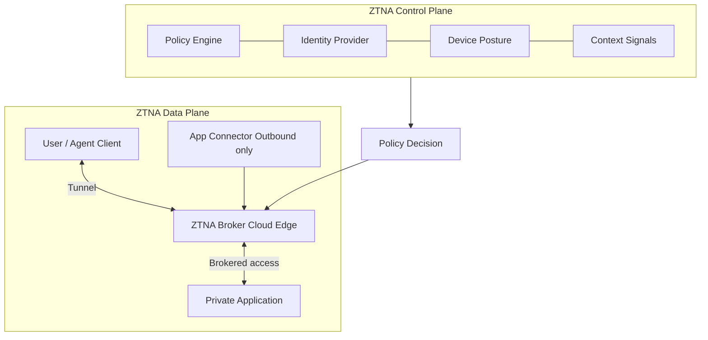
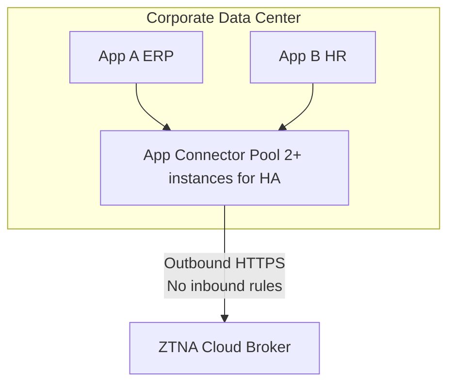
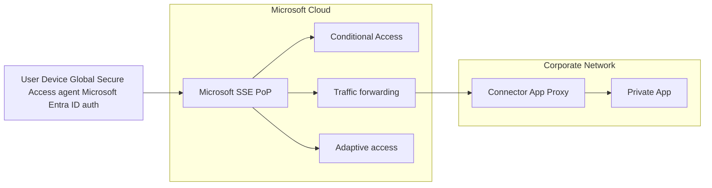

# Skill: Zero Trust Network Access (ZTNA) Design

## Purpose

Design and implement Zero Trust Network Access architectures that replace traditional VPN with identity-aware, application-level access. This skill covers ZTNA principles, architecture patterns, vendor-specific designs, device posture integration, and migration strategies from legacy perimeter-based access models.

## Core Knowledge

### ZTNA Foundational Principles

Zero Trust Network Access eliminates the concept of a trusted network perimeter. Instead of granting broad network access after VPN authentication, ZTNA enforces:

**Never Trust, Always Verify:**
- Every access request is authenticated and authorized regardless of source location
- Network location (corporate LAN, VPN, coffee shop) does not confer trust
- Authentication is continuous, not just at session establishment
- Trust is earned per-transaction, not inherited from network segment

**Least Privilege Access:**
- Users receive access only to specific applications they need
- No lateral movement capability — connecting to App A grants zero access to App B
- Access scope is the application, not the network subnet
- Privileges are time-bound and context-dependent

**Assume Breach:**
- Design as if attackers are already inside the network
- Microsegment everything — blast radius of compromise is minimized
- Log and inspect all traffic, including east-west
- Continuous monitoring for anomalous behavior

**Explicit Verification:**
- Decisions based on all available data points: identity, device, location, time, behavior
- Multi-factor authentication as baseline
- Device health is a required input to access decisions
- Risk scores dynamically adjust access permissions

### ZTNA Architecture Model



Key architectural elements:
- **ZTNA Broker:** Cloud-based service that mediates all connections. Users never directly connect to applications.
- **App Connector:** Lightweight VM/container deployed near applications. Initiates outbound-only connections to the ZTNA broker (no inbound firewall rules needed).
- **Policy Engine:** Evaluates all signals (identity, device, context) to make allow/deny decisions in real time.
- **Trust Signals:** Identity (who), device (what), location (where), time (when), behavior (how).

### Identity-Based Access vs Network-Based Access

**Traditional Network-Based Access (VPN):**
```
User → VPN → Corporate Network → Any resource on subnet
```
- Access = network connectivity
- Once authenticated, user has Layer 3 reachability to entire subnet
- Lateral movement trivial after initial compromise
- Firewall rules based on IP addresses (not identity)
- Static — same access regardless of context

**ZTNA Identity-Based Access:**
```
User → ZTNA Agent → Broker → Specific Application (only)
```
- Access = application-level permission
- Authentication grants access to defined apps only
- No Layer 3 connectivity to underlying network
- Policies based on user identity, group, role
- Dynamic — access adjusts based on risk signals

### ZTNA 1.0 vs ZTNA 2.0

**ZTNA 1.0 (First Generation):**

Characteristics:
- Access decision made at connection initiation
- Trust is binary: allow or deny at session start
- Once connected, session runs without re-evaluation
- Coarse-grained app segmentation (IP:port-based)
- "Allow and ignore" model — no inspection of traffic content
- Limited to TCP applications (no UDP support in some implementations)
- No inline DLP or threat inspection

Limitations:
- Does not detect compromised sessions after initial auth
- Cannot enforce policies on data movement within allowed sessions
- Stolen tokens grant persistent access until session timeout
- No visibility into application-layer behavior

**ZTNA 2.0 (Continuous Trust Assessment):**

Characteristics:
- Continuous trust verification throughout the session
- Device posture re-evaluated periodically (not just at connect)
- User behavior analyzed for anomalies during session
- Inline threat inspection (malware, exploits) on all traffic
- DLP enforcement within allowed application sessions
- Granular app-level segmentation (sub-application functions)
- Supports all ports and protocols (TCP, UDP, ICMP)

Architecture differences:
- Real-time risk scoring that can revoke access mid-session
- Deep packet inspection even for encrypted intra-app traffic
- Integration with UEBA (User and Entity Behavior Analytics)
- Step-up authentication triggered by risk elevation
- Continuous device compliance checking (drift detection)

### App Connectors and App Segmentation

**App Connector Architecture:**

App connectors are the bridge between the ZTNA cloud and private applications:



Design considerations:
- Deploy minimum 2 connectors per application group for HA
- Connectors initiate outbound-only connections (port 443)
- No inbound firewall rules required — reduced attack surface
- Place connectors in same network segment as applications
- Size connectors based on concurrent session count
- Separate connector groups for different security zones (prod/dev)
- Use DNS-based service discovery or static IP mapping

**App Segmentation Strategy:**

Granularity levels (from coarse to fine):
1. **Application-level:** Access to entire application (e.g., SAP)
2. **Function-level:** Access to specific modules (e.g., SAP Finance vs SAP HR)
3. **Action-level:** Read-only vs read-write to specific data sets
4. **Data-level:** Enforce DLP on sensitive fields within applications

Segmentation best practices:
- Start with application-level segmentation (quick wins)
- Group related applications into segments (e.g., "Finance Apps")
- Define access by role: Finance team → Finance segment
- Never grant "all apps" access — enumerate explicitly
- Use wildcards cautiously (*.internal.corp may be too broad)
- Implement time-based access for maintenance windows

### Device Posture Assessment

Device posture is a critical trust signal in ZTNA. Access decisions should incorporate:

**Mandatory Posture Checks:**
- OS version and patch level (within N days of latest)
- Disk encryption enabled (BitLocker, FileVault)
- Endpoint protection active (EDR agent running)
- Firewall enabled
- Screen lock configured

**Enhanced Posture Checks:**
- Certificate-based device identity (managed device)
- Domain-joined status
- Compliant with MDM policy (Intune, JAMF, Workspace ONE)
- No jailbreak/root detected (mobile)
- DLP agent active
- Specific software installed/not installed

**Posture-Based Policy Example:**
```
IF user = "finance_team"
  AND device_posture = "fully_compliant"
  AND location != "high_risk_country"
THEN allow access to "Finance ERP" (full)

IF user = "finance_team"
  AND device_posture = "partially_compliant"
THEN allow access to "Finance ERP" (read-only, with watermark)

IF device_posture = "non_compliant"
THEN block access, redirect to remediation portal
```

## Vendor-Specific Designs

### Microsoft Entra ID (formerly Azure AD) Conditional Access + Microsoft Entra Private Access

Microsoft's ZTNA approach integrates with the Microsoft Entra ID identity platform:

**Components:**
- **Microsoft Entra Private Access:** Replaces traditional VPN for private apps
- **Microsoft Entra Internet Access:** SSE for internet-bound traffic
- **Conditional Access:** Policy engine evaluating 100+ signals
- **Global Secure Access client:** Unified agent for Private + Internet Access

**Architecture:**


**Key design patterns:**
- Leverage existing Microsoft Entra ID groups and Conditional Access policies
- Use Private Access connectors (evolution of App Proxy connectors)
- Supports TCP and UDP protocols (not just HTTP like App Proxy)
- Integrates with Microsoft Defender for Endpoint device posture
- Token-based authentication eliminates credential exposure
- Quick Wins: Start with per-app assignment for sensitive apps
- Coexistence: Run alongside existing VPN during migration

**Conditional Access policy structure for ZTNA:**
- Require compliant device OR Entra hybrid-joined
- Require MFA for all private app access
- Block access from non-compliant devices (or limit to browser-only)
- Require terms of use acceptance for sensitive apps
- Session controls: sign-in frequency, persistent browser restrictions

### Zscaler Private Access (ZPA)

**Architecture:**
- **ZPA Public Service Edges (formerly ZPA Broker):** Hosted in Zscaler cloud
- **App Connectors:** Deployed in customer data centers/clouds
- **Zscaler Client Connector:** Agent on user endpoints
- **ZPA Policy Engine:** Central policy management

**Design patterns:**
- Deploy app connectors in pairs per data center
- Use Server Groups to cluster connectors by location
- Define Application Segments with specific FQDN + ports
- Leverage Browser Access for clientless HTTP/HTTPS apps
- Use Machine Tunnel for pre-logon device authentication (Windows)
- Segment by environment: Production, Staging, Development
- Microsegment by application team ownership

**ZPA traffic flow:**
1. User requests access to app.internal.corp
2. ZPA client intercepts DNS request
3. Client authenticates to ZPA cloud (SAML/OIDC via IdP)
4. ZPA evaluates posture + policy
5. ZPA creates inside-out tunnel: Client → ZPA Cloud ← App Connector
6. Brokered connection: Client never has direct IP to app server
7. Session monitored continuously for posture changes

**Advanced ZPA features:**
- App Protection (inline WAF for private apps)
- Deception (honeypots integrated into ZPA)
- Isolation (browser isolation for risky access scenarios)
- Privileged Remote Access (for admin/SSH/RDP with recording)

### Palo Alto Prisma Access ZTNA

**Architecture:**
- **Prisma Access Cloud:** Global PoP network
- **ZTNA Connector:** On-premises app connector
- **GlobalProtect Agent:** Endpoint client
- **Prisma Access Policy:** Centralized in Strata Cloud Manager

**Design patterns:**
- GlobalProtect provides both remote access and always-on protection
- ZTNA 2.0: Continuous monitoring with inline App-ID inspection
- Support for all ports/protocols (not just HTTP)
- Integration with Cortex XDR for advanced device posture
- Service connections for site-to-site (branch/DC to Prisma cloud)
- Explicit Application segmentation via App-ID technology

**Unique differentiators:**
- App-ID technology identifies applications regardless of port/protocol
- Content inspection within ZTNA sessions (threat, DLP)
- Autonomous Digital Experience Management (ADEM) for UX monitoring
- Same policy engine as on-premises NGFW (PAN-OS)
- Supports legacy protocols (RDP, SSH, thick-client apps)

### AWS Verified Access

**Architecture:**
- **Verified Access Instance:** Regional service in AWS
- **Verified Access Endpoints:** Map to internal ALB/ENI targets
- **Trust Providers:** IdP + Device management (CrowdStrike, Jamf, etc.)
- **Verified Access Groups:** Policy containers with Cedar policy language

**Design patterns:**
- AWS-native ZTNA for applications hosted in AWS
- No agent required — browser-based access via HTTPS
- Cedar policy language for fine-grained, attribute-based access
- Integrates with AWS WAF for application-layer protection
- Best for HTTP/HTTPS applications (no TCP/UDP support currently)
- Use for contractor/partner access to AWS-hosted apps

**Limitations:**
- HTTP/HTTPS only (no RDP, SSH, thick-client)
- AWS-only (cannot protect on-premises or multi-cloud apps)
- No endpoint agent = no device posture from device itself
- Relies on third-party trust providers for device signals

### Migration from Traditional VPN to ZTNA

**Assessment phase:**
1. Inventory all applications accessed via VPN
2. Classify by protocol: HTTP/S, RDP, SSH, thick-client, custom
3. Identify user groups and their app access patterns
4. Document current VPN policy (split-tunnel, full-tunnel)
5. Map dependencies between applications (does accessing A require B?)
6. Identify quick wins: web apps with simple access patterns

**Migration waves:**

**Wave 1 — Low-risk web applications:**
- Internal portals, wikis, ticketing systems
- HTTP/HTTPS only, well-understood access patterns
- Low user count, tech-savvy users (IT team)
- Validate: Authentication flow, SSO, session handling

**Wave 2 — Business applications:**
- ERP, CRM, HRIS, finance systems
- May include thick-client components
- Broader user base, require training/communication
- Validate: All protocols work, performance acceptable

**Wave 3 — Infrastructure access:**
- SSH to servers, RDP to admin workstations
- Database access (SQL clients)
- Requires privileged access management consideration
- Validate: Session recording, JIT access, MFA step-up

**Wave 4 — Legacy and complex applications:**
- Multi-tier apps with inter-component dependencies
- Custom protocols, non-standard ports
- May require application modernization
- Validate: Full functionality, fallback plan

**Coexistence strategy:**
- Run VPN and ZTNA in parallel during migration
- Use DNS to steer specific apps to ZTNA while rest uses VPN
- Gradually shrink VPN scope (remove apps from VPN split-tunnel)
- Final step: VPN only as emergency fallback, then decommission

## Decision Framework

| Factor | VPN (Legacy) | ZTNA 1.0 | ZTNA 2.0 |
|--------|-------------|-----------|-----------|
| Access model | Network-level | App-level (connect-time) | App-level (continuous) |
| Trust model | Location-based | Identity-based (static) | Identity-based (dynamic) |
| Lateral movement | Possible | Prevented | Prevented + detected |
| Data inspection | None | None | Inline DLP + threat |
| Device posture | At connect only | At connect only | Continuous |
| Protocol support | All | TCP (varies) | All |
| User experience | VPN connect/disconnect | Seamless | Seamless |
| Scalability | Limited by concentrator | Cloud-native | Cloud-native |

### Key Design Questions

1. What percentage of your workforce is remote vs office-based?
2. Which applications are HTTP/HTTPS vs thick-client/custom protocol?
3. Do you need to support BYOD/unmanaged devices?
4. What is your identity provider (Microsoft Entra ID, Okta, Ping, etc.)?
5. Do you have compliance requirements for traffic inspection?
6. What is the acceptable latency increase for ZTNA overhead?
7. Do you need session recording for privileged access?
8. How many application segments do you envision (10s, 100s, 1000s)?
9. What is your device management maturity (MDM, EDR, certificate-based)?
10. Do you need to support IoT/OT devices that cannot run agents?

---
**Analysis only — verify against vendor documentation before applying.**
