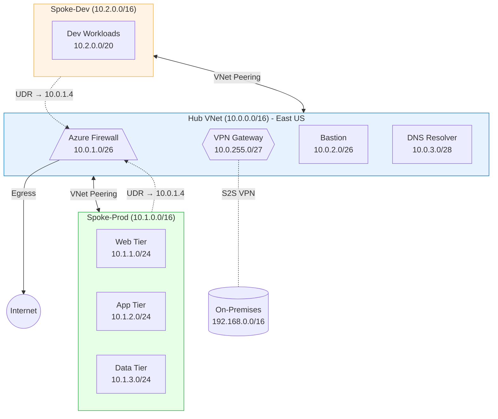
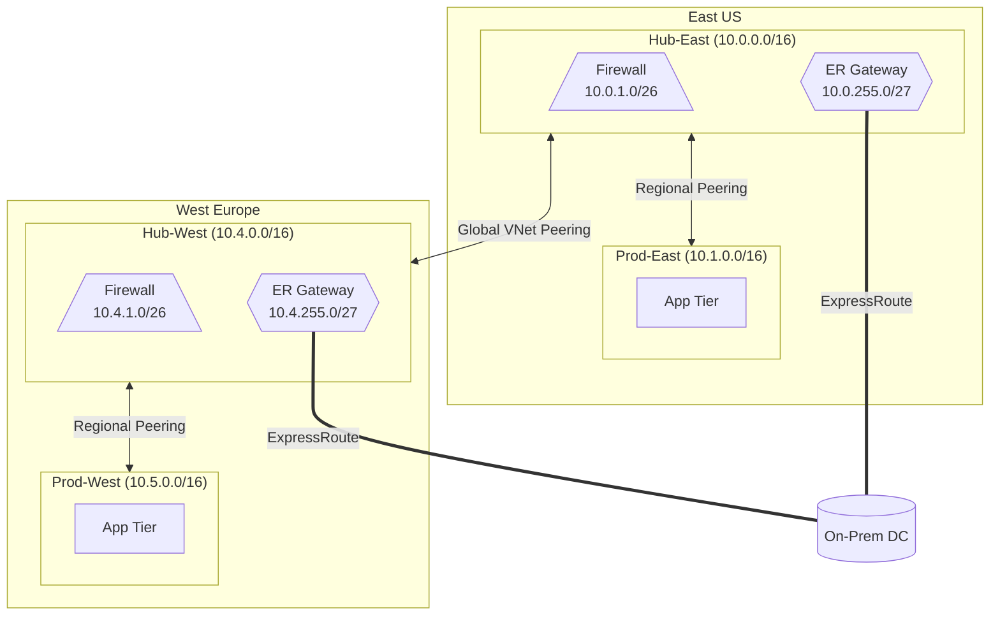
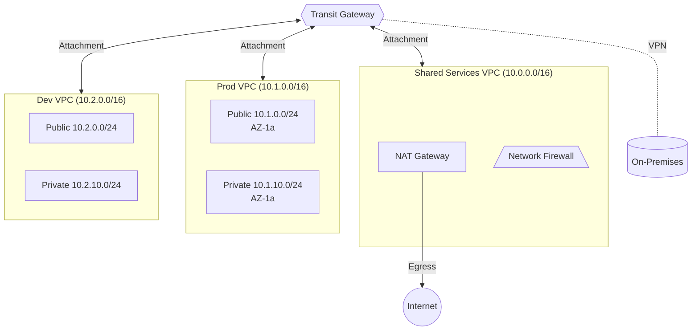

# Skill: Network Diagram Generation

## Purpose

This skill generates Mermaid flowchart diagrams from network topology descriptions. It defines standard node shapes, labeling conventions, and reusable templates for common cloud network architectures.

## Core Knowledge

### Standard Node Shapes

Use consistent Mermaid shapes to represent network components:

| Component | Mermaid Shape | Syntax | Example |
|-----------|--------------|--------|---------|
| VNet / VPC | Subgraph | `subgraph id["Label"]` | `subgraph hub["Hub VNet (10.0.0.0/16)"]` |
| Subnet | Rectangle | `id["Label"]` | `web["Web Subnet 10.1.1.0/24"]` |
| Firewall / NVA | Trapezoid | `id[/"Label"\]` | `fw[/"Azure Firewall 10.0.1.4"\]` |
| Gateway | Hexagon | `id{{"Label"}}` | `gw{{"VPN Gateway 10.0.255.4"}}` |
| Load Balancer | Stadium | `id(["Label"])` | `lb(["ALB - Web Tier"])` |
| On-Premises | Cylinder | `id[("Label")]` | `onprem[("On-Prem DC 192.168.0.0/16")]` |
| Internet | Circle | `id(("Label"))` | `inet(("Internet"))` |
| VM / Instance | Rectangle | `id["Label"]` | `vm1["Web VM 10.1.1.10"]` |

### Connection Types

| Connection | Mermaid Syntax | Use For |
|------------|---------------|---------|
| VNet/VPC Peering | `A <-->|"VNet Peering"| B` | Bidirectional peering |
| VPN Tunnel | `A -.-|"S2S VPN / IPsec"| B` | Encrypted tunnel (dashed line) |
| ExpressRoute / Direct Connect | `A ===|"ExpressRoute"| B` | Dedicated private connection (thick line) |
| Traffic flow (one-way) | `A -->|"HTTPS"| B` | Directed traffic |
| Route / UDR | `A -.->|"UDR 0.0.0.0/0"| B` | Route pointing to next hop (dashed arrow) |

### Labeling Conventions

1. **Always include CIDR ranges** in VNet/VPC and subnet labels: `"Web Subnet 10.1.1.0/24"`
2. **Include IP addresses** for key appliances: `"Azure Firewall 10.0.1.4"`
3. **Label connections** with the type and protocol: `|"VNet Peering"|`, `|"S2S VPN"|`
4. **Use region annotations** for multi-region diagrams: include region in the subgraph title
5. **Color coding** (where supported): use `style` directives for hub (blue), prod (green), dev (orange)

### Template: Hub-Spoke Topology

### Template: Multi-Region with Global Peering

### Template: AWS Transit Gateway

### Generation Workflow

When generating a diagram from a user's network description:

1. **Identify all networks** — List every VNet/VPC with its CIDR and region.
2. **Identify subnets** — List subnets within each network with their CIDRs and purposes.
3. **Identify appliances** — Firewalls, gateways, load balancers, bastion hosts with their IPs.
4. **Map connections** — Peering, VPN, ExpressRoute, internet egress paths.
5. **Select layout direction** — Use `graph TB` (top-to-bottom) for hierarchical layouts, `graph LR` (left-to-right) for pipeline/flow layouts.
6. **Apply styling** — Color-code by environment (prod/dev/staging) or by region.
7. **Validate** — Ensure every labeled CIDR matches the address plan, no orphaned nodes exist, and connection types are accurate.

### Tips for Readable Diagrams

- **Limit depth to 2 levels** — VNet/VPC as subgraph, subnets as nodes inside. Don't nest subgraphs within subgraphs beyond this.
- **Use ` ` for line breaks** in labels to avoid overly wide nodes.
- **Group related subnets** visually (web/app/db tiers in a vertical stack within a subgraph).
- **For large topologies (10+ VNets)**, create multiple diagrams: one overview (VNets as single nodes, no subnet detail) and per-VNet detail diagrams.
- **Include a legend** as a comment block above the diagram explaining shape conventions.

## References

- Mermaid flowchart syntax: https://mermaid.js.org/syntax/flowchart.html
- Azure architecture diagrams: https://learn.microsoft.com/azure/architecture/networking/
- AWS architecture icons and diagrams: https://aws.amazon.com/architecture/icons/

**Analysis only — not a substitute for vendor documentation review.**
