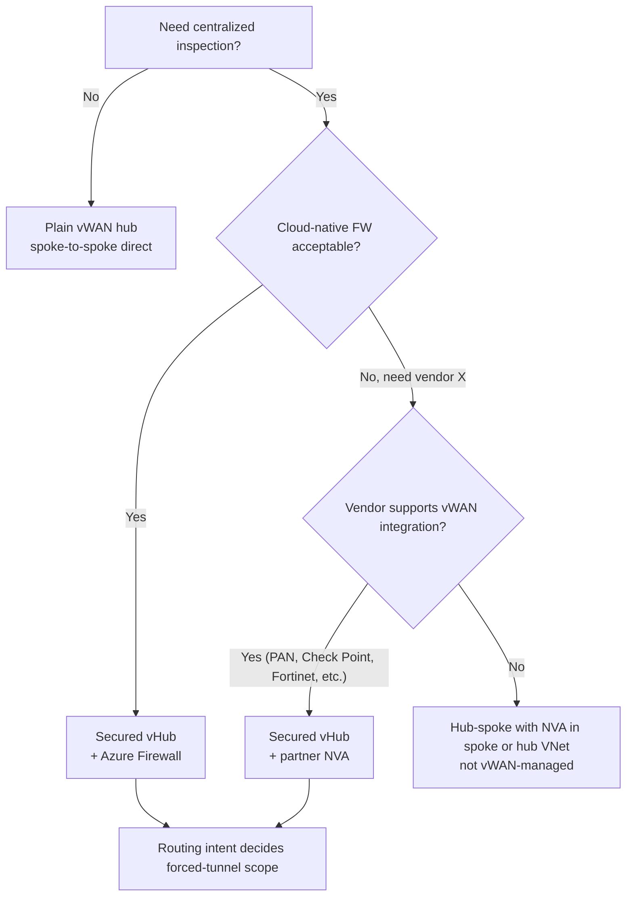
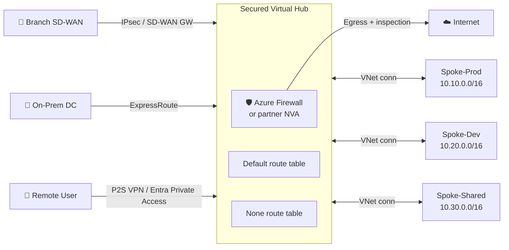
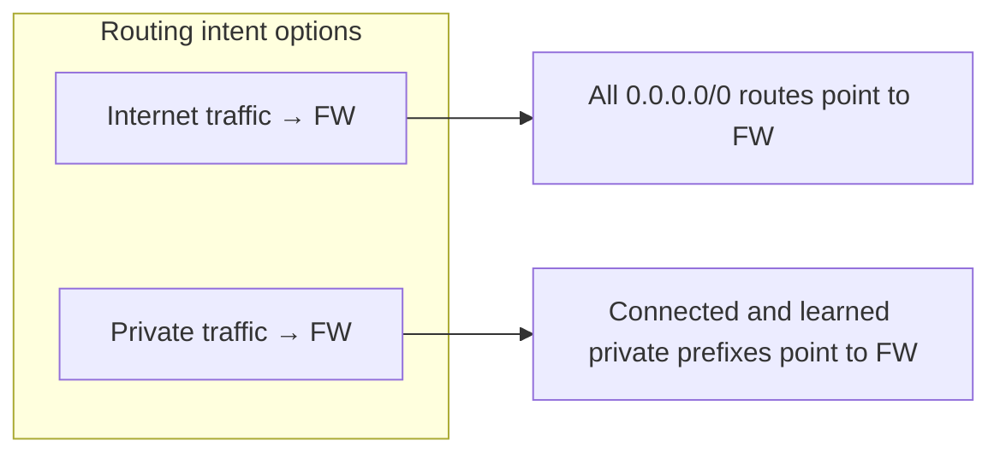

# Skill: Secured Virtual Hub Design (Azure Virtual WAN)

> Pairs with `vwan_skill_vwan_design` (overall vWAN topology), `vwan_skill_routing_intent` (intent-based routing), `vwan_skill_nva_integration` (third-party NVAs), and `fw_skill_policy_design` (firewall rule design). Use this skill to design **Secured Virtual Hubs** — vWAN hubs with integrated firewall inspection. Analysis only.

## Purpose

Design Azure Virtual WAN deployments where traffic between branches, VNets, internet, and on-premises is inspected by a firewall in the hub itself (Azure Firewall or supported third-party NVA), with **routing intent** managing forced-tunneling without manual route tables.

A secured vHub is the recommended pattern when:
- You need centralized inspection without operating standalone hub VNets and UDRs.
- Multiple workloads share a hub and each needs egress inspection.
- You want a managed firewall data path (SLA-backed) rather than HA NVA pairs you operate.

---

## When to choose Secured vHub vs alternatives



Trade-offs vs hub-spoke-with-NVA:

| Aspect | Secured vHub | Classic hub-spoke + NVA |
|---|---|---|
| Operational overhead | Low (managed data path) | High (NVA HA, patching, capacity) |
| Throughput per hub | Azure FW Premium: 30+ Gbps; partner NVAs: vendor-specific | Limited by NVA SKU and VMSS scale |
| Customization | Lower (vendor parity gap) | Highest |
| BGP / DPDK / SR-IOV | Not directly user-controlled | Full control |
| Cost | Hub + FW + Routing intent | NVA VM + LB + cross-zone bandwidth |
| Cross-region transit | Native via hub-to-hub | Manual peering / global peering |

---

## Reference architecture



Key elements:

- **One regional hub** per Azure region; up to 30 hubs per vWAN (raise via support).
- **Hub address space**: use /22 or larger for Azure Firewall secured hubs; /24 applies only to non-firewall hubs. Verify current sizing requirements in Azure hub settings: https://learn.microsoft.com/en-us/azure/virtual-wan/hub-settings.
- **Connections**: VPN sites, ExpressRoute circuits, VNet connections, P2S configs — all attach to the hub.
- **Firewall**: Azure Firewall (Standard, Premium, or Basic) **or** a supported third-party NVA (Palo Alto Cloud NGFW, Check Point CloudGuard, Fortinet FortiGate, Cisco vMX, Versa, ZScaler, etc.).

---

## Routing intent (the heart of secured vHub)

Routing intent replaces manual UDRs with declarative policy: "All internet-bound traffic → firewall" and/or "All private traffic between connected VNets, branches, VPN sites, and ExpressRoute circuits → firewall". The hub generates the routes automatically across all connections.



Three deployment modes:

1. **Internet only** — egress to internet inspected; spoke-to-spoke and spoke-to-on-prem unchanged.
2. **Private only** — east-west and hybrid inspected; internet egress uses default (direct from spoke if SNAT'd, or via UDR you define).
3. **Both** — fully inspected hub; the recommended default for new builds.

**Rule of thumb**: pick one mode and stick with it for the hub. Mixing is supported but rare and adds operational complexity. Hand off cross-hub planning to `vwan_skill_routing_intent`.

---

## Sizing & SKU selection

### Azure Firewall in vHub

| Aspect | Standard | Premium | Basic |
|---|---|---|---|
| TLS inspection | No | Yes | No |
| IDPS | No | Yes | No |
| Web categories / URL filter | No | Yes | No |
| Throughput per FW | 30 Gbps | 30 Gbps (with TLS adds CPU) | 250 Mbps |
| Pricing | $$ | $$$ | $ |
| When | Most workloads | Compliance / advanced threat | Dev/test only |

Scale-out: Azure Firewall is autoscaling within a hub up to ~50 IPs / ~30 Gbps. For higher throughput, split across multiple hubs (per region or per workload class).

### Partner NVA in vHub

- Available SKUs per vendor; check Marketplace. Typical: 2-vCPU through 16-vCPU per instance, deployed as VMSS managed by the partner.
- Throughput depends on vendor — published "vWAN Hub" datasheets are authoritative.
- TLS inspection / IDPS / DLP availability is vendor-specific.

---

## Designing the rule set

Even though routing intent steers everything to the firewall, **the firewall still needs explicit rules** — secured vHub does not auto-permit east-west.

Minimum rule classes:

```yaml
- name: spoke-to-spoke-tier-allow
  source: spoke-prod-app-asg
  destination: spoke-prod-db-asg
  ports: [5432, 6379]
  action: allow

- name: spoke-to-internet-corp-services
  source: any-spoke
  destination: fqdn:[*.microsoft.com, *.azure.com]
  ports: [443]
  action: allow

- name: spoke-to-onprem-shared-services
  source: any-spoke
  destination: 192.168.0.0/16
  ports: [53, 88, 389, 445, 636]
  action: allow

- name: onprem-to-spoke-jumphost-only
  source: 192.168.10.0/24
  destination: spoke-prod-jumphost-asg
  ports: [22, 3389]
  action: allow

- name: default-deny
  source: any
  destination: any
  ports: [any]
  action: deny + log
```

Use **Azure Firewall Policy** with hierarchy: tenant-wide base policy → regional policy → per-hub policy override. Lets you publish once and inherit everywhere. Hand off rule generation to `fw_skill_policy_design` and `fw_skill_config_gen`.

---

## Forced-tunneling on-prem

If you advertise a `0.0.0.0/0` default from on-prem (via ExpressRoute or VPN), you may want some workloads to egress via on-prem and others via the cloud firewall:

- **Default vHub behavior with private intent**: spokes send everything to FW; FW then learns `0.0.0.0/0` from on-prem and forwards there.
- **For "internet via cloud FW" + "private via on-prem"**: configure routing intent's internet rule to point to FW; FW egresses directly.
- **Selective scopes**: use a static route on the connection's route table or a Custom Route Group to override for specific prefixes. Complexity rises quickly — keep this minimal.

---

## High availability & DR

- **Within a region**: Azure Firewall and partner NVAs in vHub are zone-redundant by default (Standard/Premium tiers) — pin to specific zones if required.
- **Cross-region**: peer hubs via **Hub-to-Hub** (default in vWAN). Internet egress can stay local (per-region FW) or be centralized via a single hub with a Global Reach-style design.
- **Failover testing**: simulate by failing one FW instance (preview only — managed service) or use Chaos Studio in non-prod.
- **Backup**: Firewall policy exports via ARM template / Bicep + Git; rules are source-of-truth in Git, not in the portal.

---

## Observability

Mandatory streams to Log Analytics:

- **Azure Firewall logs**: AzureFirewallNetworkRule, AzureFirewallApplicationRule, AzureFirewallNatRule, AzureFirewallThreatIntelLog, AzureFirewallIDPSLog (Premium).
- **vWAN diagnostic logs**: GatewayDiagnosticLog, IKEDiagnosticLog, RouteDiagnosticLog, TunnelDiagnosticLog.
- **Effective routes** snapshot daily — store the output of `az network vhub get-effective-routes` to detect drift.
- **Hit-count telemetry**: Policy Analytics on the Firewall Policy.

Sample KQL — top denied 5-tuples in last 1h:

```kql
AzureDiagnostics
| where Category == "AzureFirewallNetworkRule"
| where msg_s contains "Deny"
| extend src = extract(@"from (\S+)", 1, msg_s),
         dst = extract(@"to (\S+)", 1, msg_s),
         proto = extract(@"(TCP|UDP|ICMP)", 1, msg_s)
| where TimeGenerated > ago(1h)
| summarize hits = count() by src, dst, proto
| top 50 by hits desc
```

---

## Cost considerations

Per-hub steady-state costs include:

- Hub processing units (HPU) — base + per-Gbps.
- Connection units per VNet/branch.
- Firewall: deployment cost + per-Gbps data processed.
- Routing intent: no extra charge, but traffic that traverses the FW data path is billed.
- Cross-region hub-to-hub: bandwidth charges in both directions.

Sanity check before approval:

```text
Approx monthly = base_hub_cost
               + Σ(connection_cost_i for each connection)
               + firewall_fixed_per_hour × 730
               + firewall_data_processed_GB × $/GB
               + cross_region_egress_GB × $/GB
```

Hand off to `price_skill_firewall_pricing` and `price_skill_egress_architecture` for accurate quoting.

---

## Common pitfalls

- **Spokes peered directly to spokes outside vWAN** — bypasses the hub firewall silently. Audit with `Get-AzVirtualNetworkPeering` and remove direct peerings unless explicitly intended.
- **Inspecting Private Endpoint traffic** — PE traffic stays on Microsoft backbone and isn't seen by Azure Firewall by default. Need `Force Tunneling` + UDR on the PE subnet or **Private Endpoint Network Policies** with explicit routes — covered in `pl_skill_endpoint_design`.
- **Routing intent vs custom route tables collision** — when intent is enabled, custom route tables are restricted. Plan before enabling intent in a live hub.
- **Address-space overlap** — vWAN supports overlapping spoke address spaces only with NAT on the firewall (Premium / partner) or via separate hubs.
- **Crossing Azure Subscription boundaries** — RBAC permissions on the hub vs Firewall Policy are separate; mismatches lead to "Forbidden" errors on deploy.
- **Migration from classic hub-spoke** — moving live workloads requires sequenced re-peering, IP unchanged, monitoring rollback. Pre-stage in a parallel hub if downtime budget is tight.

---

## Verification checklist

- [ ] Routing intent mode chosen (internet / private / both) and documented.
- [ ] Default deny + explicit allow rule set drafted in Firewall Policy (hierarchical).
- [ ] All spokes connected via vWAN VNet connection — no rogue direct peerings.
- [ ] Hub address space is /22 or larger for Azure Firewall secured hubs (/24 only for non-firewall hubs), with no overlap with any spoke or on-prem range.
- [ ] Firewall SKU sized for forecast throughput (peak + 30% headroom).
- [ ] Logging to Log Analytics enabled; Policy Analytics on.
- [ ] Effective-routes baseline captured and stored for drift detection.
- [ ] Private endpoint traffic strategy decided.
- [ ] On-prem advertised prefixes filtered to avoid default-route surprises.
- [ ] DR plan: cross-region hub peering tested; rule policy in Git with CI/CD.
- [ ] Rollback plan documented; pre-deploy snapshot of routing tables and policy.

---

## References

- Virtual WAN Secured Hub: https://learn.microsoft.com/azure/firewall-manager/secured-virtual-hub
- Routing intent and routing policies: https://learn.microsoft.com/azure/virtual-wan/how-to-routing-policies
- Azure Firewall in vWAN: https://learn.microsoft.com/azure/firewall-manager/vhubs-and-vnets
- NVA partners supported in vWAN: https://learn.microsoft.com/azure/virtual-wan/about-nva-hub
- Virtual WAN FAQ & limits: https://learn.microsoft.com/azure/virtual-wan/virtual-wan-faq

**Analysis only — verify against vendor documentation before applying.**
